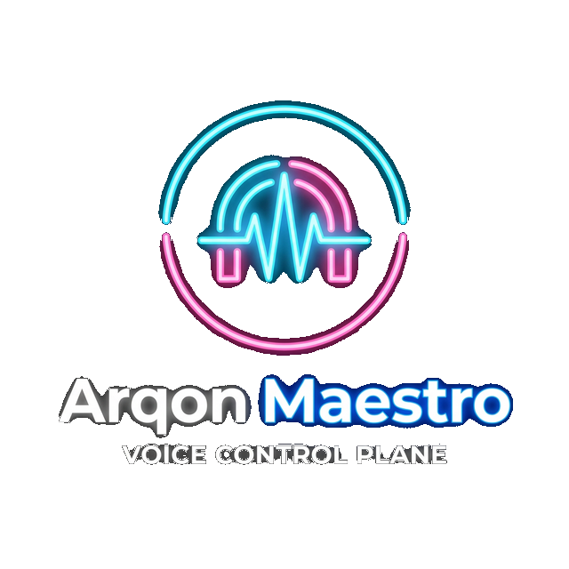

# Arqon Maestro

<span align="center">
  
</span>

Arqon Maestro is the high-performance **Universal Voice Plane** for the Arqon ecosystem. 

It provides a full-duplex, zero-latency feedback loop that transforms human speech into deterministic system actions through **O(0) skill execution**, **Address-First routing**, and **Constitutive Integrity** gating.

The purpose of Arqon Maestro is straightforward:

- **Universal Voice Control**: Give the Arqon ecosystem a unified, low-latency voice interface.
- **Address-First Intelligence**: Use Canonical Fingerprint Hashing (CFH) to resolve semantic intent at the edge, skipping heavy LLM reasoning for known tasks.
- **Constitutive Reliability**: Ensure every voice-driven action is grounded in truth through IntegriGuard adjudication and ACE governance.
- **Subconscious Execution**: Native integration with ArqonMCP and ArqonSense for sub-millisecond skill dispatch.

## What Arqon Maestro Does

Arqon Maestro listens to spoken commands, resolves them into Semantic Address Space (SAS) pointers, and routes actions through a hardened trust boundary.

In practice, that means it can help with:

- **Zero-Latency Coding**: Writing and revising code using cached, high-accuracy voice skills.
- **Predictive Navigation**: Navigating files and editors using client-side intent resolution.
- **Governed Execution**: Issuing high-risk actions that are automatically sandboxed and verified by ArqonSentinel.
- **Episodic Continuity**: Maintaining situational awareness of your workflow via ArqonContinuum.
- **Ambient Thinking**: Delegating complex architectural tasks to ArqonLattice for background search and optimization.

## Key Capabilities

- Real-time microphone capture from the desktop client
- Speech-to-text pipeline for spoken coding commands
- Command interpretation for source-code edits
- Context-aware editor operations through plugins
- Voice-driven workflow execution across tool boundaries
- Desktop app built with Electron
- VS Code integration via the extension in [`vscode-plugin`](./vscode-plugin)
- Support for local and remote backend endpoints
- Training and model architecture artifacts preserved in the repository

## Typical Workflow

1. Start the Arqon Maestro desktop app.
2. Focus the relevant editor or tool context.
3. Toggle listening.
4. Speak a command such as `new line`, `go to definition`, `add function`, or another supported workflow action.
5. Arqon Maestro captures audio, resolves a transcript, interprets intent, and applies the action through the active integration layer.

## Why It Matters

Arqon Maestro matters because the Arqon ecosystem needs a common interaction model that is:

- fast enough for real development work
- expressive enough for code and tool control
- reusable across multiple Arqon projects
- natural for human operators

Accessibility remains an important benefit, but it is not the primary framing. The core value is broader: Arqon Maestro makes voice a first-class control surface for the ecosystem.

## Repository Layout

| Component | Path | Purpose |
| --- | --- | --- |
| Desktop client | Electron client directory | Electron app, microphone capture, UI, streaming |
| Core service | Core service directory | Main command-processing service |
| Speech engine | Speech engine directory | Speech recognition service |
| Code engine | Code engine directory | Transcript-to-code interpretation models |
| VS Code extension | [`vscode-plugin`](./vscode-plugin) | Editor integration |
| Project docs | [`docs`](./docs) and root `*.md` files | Architecture, troubleshooting, training, rebranding |

## Architecture

The high-level request flow is:

1. The desktop client captures microphone audio.
2. Audio frames are streamed to `core`.
3. `core` coordinates with the speech engine to produce transcripts.
4. The code engine interprets transcripts into structured coding actions.
5. The active editor plugin applies the result.

Related docs:

- [ARCHITECTURE.md](./ARCHITECTURE.md)
- [RUN_COMMANDS.md](./RUN_COMMANDS.md)
- [TROUBLESHOOTING.md](./TROUBLESHOOTING.md)
- [TRAINING.md](./TRAINING.md)
- [LEGACY_INTERNAL_RENAME_TODO.md](./LEGACY_INTERNAL_RENAME_TODO.md)

## Runbook: Qwen3 Dictation Sidecar + Legacy Fallback

Use this when dictation shows `sidecar_unreachable` or warmup failures.

### 1) Check / start / warm Qwen3 sidecar

```bash
cd ~/Projects/arqon/ArqonMaestro/maestro/client/src/main/stt/sidecars
MAESTRO_QWEN3_PYTHON_PATH=~/miniconda3/envs/helios-gpu-118/bin/python ./sidecar_manager.sh preflight qwen3
MAESTRO_QWEN3_PYTHON_PATH=~/miniconda3/envs/helios-gpu-118/bin/python ./sidecar_manager.sh start qwen3
MAESTRO_QWEN3_PYTHON_PATH=~/miniconda3/envs/helios-gpu-118/bin/python ./sidecar_manager.sh warmup qwen3
MAESTRO_QWEN3_PYTHON_PATH=~/miniconda3/envs/helios-gpu-118/bin/python ./sidecar_manager.sh status
```

If startup fails, inspect:

```bash
tail -n 120 /tmp/qwen3_sidecar.log
```

### 2) If sidecar is down, use hard fallback immediately

In the app, click `Fallback to Kaldi/Legacy`.

Expected behavior now:
- switches dictation provider to legacy
- clears backend issue banner
- keeps/starts listening for dictation

### 3) Common blocker

If logs show `No module named 'vllm'`, install `vllm` in the same Python environment used by `MAESTRO_QWEN3_PYTHON_PATH`.

## Runbook: Qwen3 Bridge Mode Hardening (No Sidecar)

Use this to validate the local bridge contract (`sidecarMode=local`) before live dictation sessions.

```bash
cd ~/Projects/arqon/ArqonMaestro/maestro/client
export MAESTRO_QWEN3_BRIDGE_PATH=~/Projects/arqon/arqon-maestro-asr/scripts/maestro_qwen3_bridge.py
export MAESTRO_QWEN3_PROJECT_ROOT=~/Projects/arqon/arqon-maestro-asr
export MAESTRO_QWEN3_MODEL_PATH=~/Projects/arqon/arqon-maestro-asr/models/upstream/Qwen3-ASR-0.6B
export MAESTRO_QWEN3_PYTHON_PATH=~/miniconda3/envs/helios-gpu-118/bin/python
./scripts/qwen3_bridge_hardening.sh
```

What this checks:
- bridge `--help` contract
- empty stdin -> structured `{"ok": false, "error": "empty_audio"}`
- malformed WAV stdin -> structured `audio_format_invalid`
- missing model path -> structured failure JSON
- sequential/parallel schema stability checks

If this script fails, treat it as a gate failure for Qwen3 bridge-mode dictation until fixed.

## Supported Operation Modes

### Cloud-backed mode

This is the simplest way to run the app during development if your config points to a working remote endpoint.

See [RUN_COMMANDS.md](./RUN_COMMANDS.md) for the current launch command.

### Local mode

Arqon Maestro also retains the original multi-service local architecture, but local mode is more demanding. A complete local voice stack requires:

- `core`
- `speech-engine`
- `code-engine`

See [RUN_COMMANDS.md](./RUN_COMMANDS.md) for the exact commands and current local-mode caveats.

## Current State

This repository is an active modernization and recovery effort. The project has already been brought back to a working state in several important areas:

- Electron startup no longer stalls on a permanent `Loading...` screen
- branding has been moved to `Arqon Maestro` across the user-facing surface
- Linux microphone capture and streaming have been repaired
- the voice pipeline has been debugged back into a working state

Some deeper internal rename work and local-packaging work still remain. Those are being tracked explicitly rather than hidden.

## Development Notes

- User-facing branding is `Arqon Maestro`
- Some legacy internal identifiers still remain for compatibility and migration purposes
- Config compatibility exists for both legacy and renamed settings paths
- The repository includes preservation material for models, training, and architecture
- The long-term direction is ecosystem integration through a shared voice interface layer

## Documentation Map

- [RUN_COMMANDS.md](./RUN_COMMANDS.md): practical run commands
- [TROUBLESHOOTING.md](./TROUBLESHOOTING.md): startup and runtime troubleshooting
- [MICROPHONE_TROUBLESHOOTING.md](./MICROPHONE_TROUBLESHOOTING.md): microphone and voice-path notes
- [CURRENT_ISSUES.md](./CURRENT_ISSUES.md): actively tracked problems
- [REBRANDING.md](./REBRANDING.md): rebrand tracking
- [TRANSFER_PACK.md](./TRANSFER_PACK.md): project handoff context
- [VISION.md](./VISION.md): broader direction

## Why This Project Exists

Arqon Maestro exists to give Arqon a unified, voice-native interaction layer.

It is the piece that turns speech into a practical control plane for:

- development
- navigation
- execution
- orchestration
- cross-tool interaction

The short version:

- voice coding matters
- voice control matters beyond coding alone
- local-first developer tooling matters
- ecosystems need coherent interaction layers
- this codebase is worth preserving and extending

## Credits

Arqon Maestro exists because voice-native developer tooling and voice-native system control are worth preserving, improving, and making usable in practice.
