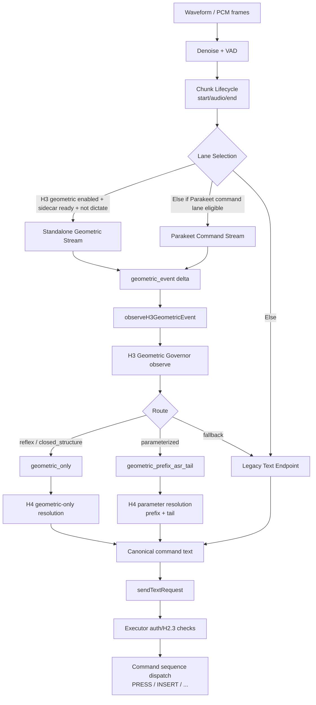
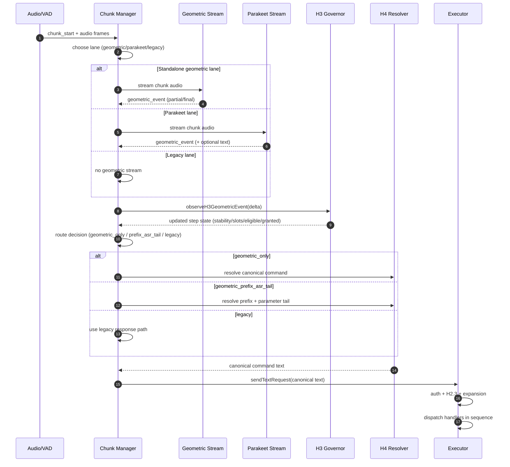

# RAIL + Manifold Walkthrough

This walkthrough explains the current runtime control flow for command lane execution with emphasis on:

- `geometric_event` deltas
- H3 governor state updates (RAIL trajectory)
- lane selection and fail-closed behavior
- where text-bridge still exists today

## 1) One-line Mental Model

`audio -> geometric delta stream -> H3 incremental state update -> route/resolve -> executor dispatch`

The system is delta-driven. It does not fully recompute command state from scratch on each step.

## 2) End-to-End Control Flow

## 3) `geometric_event` Delta Schema

Current normalized event fields:

- `source: "spectral_manifold"`
- `regionId`
- `commandClass: reflex | closed_structure | parameterized | unknown`
- `parameterType: numeric | open | null`
- `confidence` (clamped 0..1)
- `frameCount` (rounded int)
- `timestampMs`
- optional metadata: `commandId`, `atlasSchema`, `atlasVersion`, `atlasBacked`

Interpretation:

- This is the **delta packet** for RAIL updates.
- Delta source is geometric detector inference over chunk audio, not a transcript parser.

## 4) Lane / Swimlane Workflow

## 5) Where RAIL is Maintained

RAIL state is maintained per chunk as an incremental trajectory:

- each `geometric_event` applies a state update
- governor keeps structural/slot history and finalization signals
- route and resolution use this current state

This is why behavior is semi-smooth:

- mostly continuous due to incremental updates
- with discrete boundaries at route/threshold transitions

## 6) Important Current Reality

The pipeline is geometric/delta-driven up to resolution, but execution still uses a text bridge:

- geometric output is resolved into canonical command text
- canonical text is sent through `sendTextRequest(...)`
- executor then dispatches command objects

So the architecture is close to full geometric cutover, but not fully text-bridge-free yet.

## 7) Toggle Matrix (Practical)

- `H3_GEOMETRIC_ENABLED` controls geometric authority path.
- `MAESTRO_FORCE_LEGACY_COMMAND_LANE=1` forces legacy command lane.
- Parakeet mode and readiness affect whether Parakeet command stream is used when geometric lane is not active.

Effective priority in current chunk start logic:

1. standalone geometric lane (if enabled/ready)
2. else parakeet command lane (if eligible)
3. else legacy

## 8) Suggested Next Step for H24

If the goal is full non-transcript cutover:

1. emit canonical **command objects** directly from H4 resolve
2. dispatch to executor without `sendTextRequest(...)`
3. keep text bridge as fallback mode only

That change isolates transcript dependency and makes RAIL the primary execution spine.
