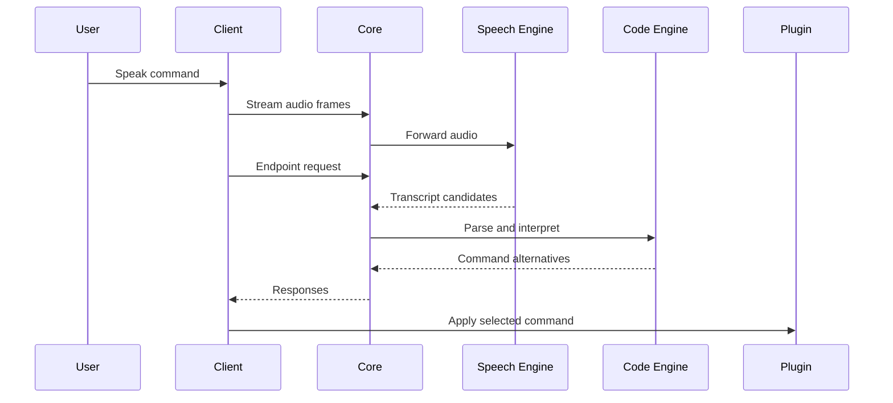

# Online Request Lifecycle

This doc describes the lifecycle of a single Arqon Maestro voice command and how various services interact with each other.

## Sequence Overview

## Why This Matters

This flow is the backbone of the system. Most runtime failures can be localized by identifying which stage of this sequence is not completing.

The Arqon Maestro client is an Electron application that streams audio data from your system's microphone. When Arqon Maestro is enabled, Arqon Maestro opens a stream to your system microphone, and frames of audio (of around 20ms in size) are continuously passed through a Voice Activity Detection (VAD) model. When the VAD detects speech, a new audio chunk is started, and audio data from your microphone is continuously streamed to a service called `core`. As `core` receives audio data from the client, it forwards that data to the `speech-engine` service, also via a stream. Eventually, the VAD detects that you've stopped speaking, and the audio chunk (and stream) ends. (The `speech-recorder` library does most of the heavy lifting here.)

At that point, the client sends an `endpoint request` to `core`, which asks `core` for the transcript corresponding to that audio chunk. This endpoint request also includes the current source file you're editing, which is retrieved by sending a message to the active plugin via the Arqon Maestro Protocol. When `core` receives the endpoint request, it forwards it to the `speech-engine` and receives back a list of transcripts.

The list of transcripts is then sent to `code-engine` to be parsed with the `transcript-parser` model. In response, `code-engine` returns a list of (serialized) trees representing a list of command alternatives.

`core` receives those trees and runs the command visitor on each node in the tree in order to process each command. For instance, the `add` node will use a `selector` to find where the code should be inserted; then, a request would be made to `code-engine` to translate the description of code (e.g., "function called foo") into syntactically valid code. Or, a `go to` command will use a `selector` to determine a new cursor position in the file.

`core` then sends back a list of command sequences back to the client. Meanwhile, the client has a separate, longer timeout that's used to determine when you've finished speaking a command. For instance, suppose you have an audio sequence that looks like this: "add a function called" (pause to think) "get name". We don't want to process "add a function called" as a command, since you weren't finished with your thought. But, we do want to show responsive, live results in the Arqon Maestro UI, and so we don't want to wait too long before sending an endpoint request. So, two chunks are sent to `core`, and only after the client hits its longer timeout is the command actually executed. That means we essentially have a race: does the client decide you're done speaking first, or does the server respond first? In practice, it's much more common that the server has already sent its response, and the client is just making sure that you're actually done speaking.

The client then communicates using the Arqon Maestro Protocol to the plugin corresponding to the app that's focused. The plugin then responds to the given command, which might include replacing the source, moving the cursor, or other operations. At that point, the command has completed!

## Failure Points

- no chunk start: microphone or VAD layer
- no transcripts: stream or speech-engine layer
- no alternatives: code-engine or interpretation layer
- no applied action: active-app or plugin routing layer
