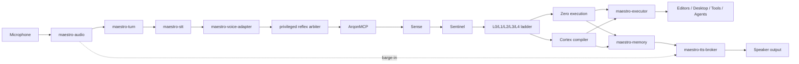

# Ultimate VOS Reference Architecture

This document captures the target architecture for Arqon Maestro as the universal Voice OS substrate for the Arqon ecosystem.

It is intentionally a living design document. It records the current strategic shape, the target-state runtime boundaries, and the architectural decisions that should guide iteration. It does not claim that every component described here is already implemented.

## Purpose

Arqon Maestro should not evolve into a generic voice assistant.

It should evolve into a voice-native operating substrate with:

- a deterministic reflex lane for fast, validated commands
- a cognitive lane for agentic reasoning and multi-step orchestration
- ArqonMCP as the centralized command fabric and policy core
- constitutive integrity gates before high-impact execution
- a swappable shell, speech, and voice-output stack
- multi-agent voice identity as a first-class UX and systems concern

## Design Principles

1. Voice is an OS control fabric, not a chatbot skin.
2. Deterministic execution outranks fashionable model-centric design.
3. The hot path stays local, low-latency, and interruption-safe.
4. Speech input, reasoning, and voice output are separate contracts.
5. No single vendor, shell, or TTS engine may become a hard lock-in.
6. Agent identity includes voice identity.
7. High-impact actions fail closed when truth or policy is uncertain.
8. ArqonMCP is the unified control plane, but hot execution should remain distributable.
9. MCP may be JSON-RPC at the edge, but internal Arqon contracts should trend protobuf-first.

## Maestro Identity

Arqon Maestro should be treated as an AGO whose identity is the Voice Operating System.

Its job is to answer:

- how speech becomes command
- how spoken command becomes governed action
- how wake, barge-in, dictation, and mode switching behave
- how users operate software, code, and tools by voice

This is a narrower and stronger identity than "assistant."

Architectural rule:

- Maestro is the spoken operating substrate
- it should not collapse into a generic personal assistant

## Maestro And Nexus

If Arqon Nexus emerges as the intelligent personal assistant AGO, then the clean relationship is:

- `Maestro = the Voice Operating System`
- `Nexus = the intelligent personal assistant`

These should be modeled as sibling AGOs and co-processors on Arqon Bus.

Maestro should own:

- the hot voice-operating path
- interruption-safe command handling
- spoken operating grammar
- deterministic execution handoff

Nexus should own:

- personal context
- assistant continuity
- long-horizon planning
- contextual suggestions
- agentic guidance

Architectural rule:

- Nexus must not swallow Maestro
- Maestro must not try to absorb the whole assistant role

The clean division is:

`Maestro speaks, hears, commands, and operates.`
`Nexus knows, assists, remembers, and guides.`

## Current Anchors

This reference architecture is grounded in the current repository and runtime evidence:

- legacy local voice path through `core`, `speech-engine`, and `code-engine`
- Arqon Bus transport on `9100`
- ArqonMCP integration as the intended skill and command substrate
- address-first routing and CFH work already documented in the voice plane
- integrity handshake and fail-closed review behavior
- control-plane coordinator with idempotency and arbitration
- provider-based TTS abstraction with Kokoro sidecar direction

These anchors must be preserved while the system evolves.

## Architectural Thesis

The core split is:

- `Reflex Lane`: fast, deterministic, grammar-driven, interrupt-safe
- `Cognitive Lane`: planner-driven, tool-using, memory-aware, slower

The system should route every utterance into one of a small number of execution classes:

- reflex command
- structured command
- cognitive request
- dictation
- ignore / ambient

This classification boundary is one of the main moats of the system.

## Revised Architectural Core

The correct future-state framing is not:

```text
voice stack -> tools
```

It is:

```text
voice ingress plane -> ArqonMCP -> execution fabric -> speech / UI response
```

ArqonMCP should be treated as:

- the command fabric
- the routing authority
- the governance boundary
- the skill and version registry
- the provenance and rollback spine

Voice is therefore a front-end plane feeding a governed execution kernel.

## Top-Level Runtime



## Service Map

### `maestro-shell`

Owns the desktop shell, system tray behavior, permissions UX, active-app awareness, settings, and operator-facing control surfaces.

Target direction:

- migrate from Electron to Tauri shell
- keep a thin shell layer
- move hot-path runtime concerns out of the shell

Why:

- Electron is a useful recovery shell and shipping vehicle
- Tauri is a better long-term shell for a hardened local Voice OS because it reduces runtime bulk and aligns better with a Rust-heavy systems core

Architectural rule:

- shell migration must not rewrite the voice runtime contracts
- shell is a host, not the brainstem

### `maestro-audio`

Owns:

- microphone capture
- PCM framing
- timestamps
- device selection
- gain normalization
- optional denoise / echo cleanup

This should be treated as a hot-path systems component and should trend Rust-native.

### `maestro-turn`

Owns:

- speech start / stop inference
- turn completion
- interruption detection
- barge-in
- cancel / stop priority handling
- distinction between dictation pauses and command completion

This is a first-class service, not a helper.

Weak turn logic makes a voice system feel stupid even when the models are strong.

### `maestro-stt`

Owns speech recognition under at least two explicit profiles:

- `command-fast`
- `dictation-accurate`

Future optional profiles:

- `noisy-environment`
- `low-power`
- `secure-speaker-verified`

Architectural rule:

- STT is a provider contract, not a single permanent engine choice

### `maestro-voice-adapter`

Owns the translation from speech output into a structured ingress envelope for ArqonMCP.

It should attach:

- transcript
- partials
- acoustic confidence
- session id
- speaker id when available
- mode
- timestamp range
- interruption flag
- dictation versus command hypothesis
- probable route hint

Architectural rule:

- voice input should enter ArqonMCP as structured metadata, not as naked text

### `privileged reflex arbiter`

Owns the smallest and fastest class of privileged voice reflexes:

- stop
- cancel
- undo
- mute
- sleep
- wake
- pause
- resume
- push-to-talk controls
- mode switches

Architectural rule:

- these should not pay the full skill-routing cost
- this is the shortest possible path in the system

### `ArqonMCP`

Owns the centralized command fabric.

It should be treated as the core operating substrate of Maestro rather than as a side integration.

Core responsibilities:

- MCP ingress and request lifecycle
- internal command-envelope normalization
- routing policy
- skill discovery and version selection
- provenance and rollback hooks
- deterministic execution preference
- escalation to Cortex only when needed

Architectural rule:

- ArqonMCP is logically centralized for policy and semantics
- hot execution may still be distributed and cached locally

### `Sense`

Owns low-overhead request shaping and contract attachment.

Responsibilities:

- `AgentEnvelope`
- `BindingContract`
- routing hints
- latency budgets
- LLM allowance flags
- confirmation and reversibility requirements

### `Sentinel`

Owns constitutional safety and governance enforcement.

Responsibilities:

- capability checks
- cost and rate policy
- destructive action policy
- environment-state gating
- speaker / operator authorization checks where required

### `speed ladder`

Owns tiered routing through:

- `L0`: exact cache
- `L1`: SAS / Reflex address lookup
- `L2`: pattern FSM
- `L3`: classifier
- `L4`: Cortex compiler

Architectural rule:

- tiers should be treated as provenance sources, not just accuracy hacks

### `maestro-router`

Owns the top-level user-intent classes before and around ArqonMCP ingress:

- wake / addressed-to-system
- reflex command
- structured command
- cognitive request
- dictation
- ambient ignore

Architectural rule:

- the router must prefer address-first resolution and deterministic grammar paths before escalating to cognitive reasoning

This lane should classify command, dictation, and conversation distinctly rather than collapsing them into one routing path.

### `maestro-reflex`

Owns grammar-driven and address-first resolution on the deterministic path that feeds ArqonMCP and the execution plane.

This lane should absorb what is currently strongest in Serenade and extend it into broader OS control.

### `maestro-cortex`

Owns:

- multi-step planning
- explanation
- tool composition
- research
- agentic task execution
- delegation across named agents

Architectural rule:

- this lane must not sit in front of all commands
- it is invoked when needed, not by default

### `maestro-integrity`

Owns constitutive review of actions that may be:

- destructive
- high-trust
- security-sensitive
- externally consequential

The existing fail-closed action review pattern should remain the standard.

### `maestro-coordinator`

Owns:

- arbitration under contention
- per-agent fairness
- idempotency
- retries
- dead-lettering
- fail-closed refusal when backend authority is unavailable

This becomes more important as the system gains more agents and more voice-triggered concurrency.

### `maestro-executor`

Owns actuation across three classes:

- editor executor
- desktop executor
- tool / agent executor

Each class should have its own rollback and approval semantics.

### `maestro-memory`

Owns:

- session continuity
- episodic memory
- operator preferences
- agent state snapshots
- provenance
- evidence trails
- reversible checkpoints

This is where the Voice OS becomes persistent and trustworthy rather than stateless and theatrical.

### `maestro-tts-broker`

Owns:

- provider selection
- streaming TTS playback
- fallback policy
- interruption-safe playback
- voice identity resolution
- persona / voice routing rules

Architectural rule:

- the OS must not be tied to one TTS engine

Kokoro may be a premier default, but the broker contract is the durable asset.

## ArqonMCP Core Flow

Within ArqonMCP, the preferred flow should be:

```text
voice envelope
-> MCP ingress
-> internal protobuf envelope
-> Sense
-> Sentinel
-> privileged reflex check if still applicable
-> L0 exact
-> L1 SAS
-> L2 pattern FSM
-> L3 classifier
-> L4 Cortex if contract allows
-> Zero / executor
-> provenance + rollback trace
-> UI/TTS/memory update
```

This is the actual command kernel of the Voice OS.

## Process Boundaries

The runtime should be separated into four zones.

### 1. Desktop Host Zone

- `maestro-shell`
- plugin bridge
- operator settings UI

### 2. Hot Path Local Runtime

- `maestro-audio`
- `maestro-turn`
- `maestro-voice-adapter`
- `privileged reflex arbiter`
- `maestro-router`
- `maestro-reflex`
- `maestro-tts-broker`

This zone must remain responsive under load and should minimize dependency sprawl.

### 3. Governed Execution Zone

- `ArqonMCP`
- `Sense`
- `Sentinel`
- `maestro-integrity`
- `maestro-coordinator`
- `maestro-executor`
- `maestro-memory`

This zone owns truth, policy, arbitration, and reversibility.

### 4. Heavy / Swappable Compute Zone

- `maestro-stt`
- `maestro-cortex`
- TTS providers
- optional diarization / denoise / voice-cloning tooling

These components may evolve independently as long as they satisfy the contracts above them.

## Primary Message Flows

### Reflex Command

```text
audio -> turn detection -> fast STT -> voice adapter -> privileged reflex arbiter -> ArqonMCP deterministic ladder -> executor -> short acknowledgment
```

Examples:

- `undo that`
- `open terminal`
- `run cargo build`
- `focus editor`

### Cognitive Request

```text
audio -> turn detection -> accurate STT -> voice adapter -> ArqonMCP -> Sense -> Sentinel -> L4 Cortex if allowed -> executor -> voiced response
```

Examples:

- `compare these modules and refactor the parser safely`
- `explain this error and propose the least risky fix`

### Dictation

```text
audio -> turn detection tuned for dictation -> accurate STT -> voice adapter -> dictation route -> editor executor
```

### Barge-In

```text
audio during playback -> interruption detection -> immediate TTS stop -> router prioritizes cancel/override/reflex
```

## Internal Protocol Rule

External MCP compatibility may require JSON-RPC at the edge.

Internal Arqon transport should convert as early as possible into a protobuf envelope and should stay protobuf-first afterward.

Why:

- stronger schema contracts
- lower serialization overhead
- cleaner Rust/Python interoperability
- better auditability and replay
- clearer event evolution over time

## Command Modes

The Voice OS should maintain explicit top-level modes:

- asleep
- listening
- command
- dictation
- coding
- conversational
- secure
- presentation
- silent-acknowledgment

Mode state should affect:

- routing
- allowed skills
- TTS behavior
- confirmation requirements
- accepted speakers and security posture

## Confirmation And Reversibility

Confirmation and undo should be platform primitives, not ad hoc skill behavior.

Every skill should declare:

- reversible or not
- rollback strategy
- rollback window
- compensation action
- confirmation tier

Suggested confirmation tiers:

- none
- implicit
- spoken
- typed
- secure / privileged

The phrase `undo that` should work as broadly as possible across the platform.

## Skill Families And Versioning

Normal routing should not go directly to raw versioned skills.

It should go through:

```text
IntentKey -> SkillFamily -> ActiveVersionSelector -> VersionedSkill
```

Each `SkillFamily` should carry:

- stable skill id
- active version pointer
- canonical address
- exemplar address set
- alias address set
- slot skeleton signatures
- parameter schema
- policy metadata

This allows append-only versioning, rollback, and audit without making routing brittle.

## Routing Confidence

SAS should not be forced to imitate cosine similarity.

Confidence should instead be a routing-provenance object built from evidence such as:

- tier that matched
- exact versus alias hit
- parameter completeness
- speaker and mode compatibility
- historical execution success
- active version status
- policy fit
- contract compliance

This produces a better `ZERO/HYBRID/CORTEX` decision than pretending every route is a similarity score.

## Shell Strategy: Electron To Tauri

This should be treated as an explicit architectural migration, not a cosmetic rewrite.

### Decision

The long-term shell target is Tauri.

### Why

- better fit for a Rust-heavy systems core
- lower shell overhead
- cleaner long-term posture for a local-first desktop Voice OS
- less pressure to keep runtime-critical logic in Node/Electron land

### Migration Constraints

1. Preserve current working voice path while migrating.
2. Keep bus contracts stable.
3. Keep settings compatibility during transition.
4. Do not fuse shell migration with a full runtime rewrite.
5. Move hot-path logic into reusable services first, then swap shells.

### Migration Shape

Phase 1:

- treat Electron as compatibility shell
- isolate shell-specific concerns from voice runtime services

Phase 2:

- move audio, turn-taking, and TTS broker responsibilities behind stable local contracts

Phase 3:

- introduce Tauri shell over the same contracts

Phase 4:

- retire Electron once feature and operational parity are proven

## Voice Output Strategy: Multi-Voice By Design

This must be a first-class architecture decision.

The OS should never assume a single canonical voice.

### Core Voice Identity Model

Voice output should be resolved through three separate concepts:

1. `provider`
- the engine that synthesizes speech
- examples: Kokoro, fallback provider, future providers

2. `voice`
- a concrete voice asset offered by a provider
- examples: `af_heart` or another provider-specific speaker ID

3. `persona`
- a higher-level semantic identity mapped to an actual provider voice
- examples: `default_system`, `architect_agent`, `research_agent`, `sentinel_agent`

The OS should route by persona, not by raw provider voice IDs.

### Required Voice Classes

The architecture should explicitly support:

- one user-selected default voice for common non-agentic communication
- a library of agent voices for named agents
- optional context-specific voices for alerts, confirmations, and critical warnings

Examples:

- default system voice
- architect voice
- operator / governance voice
- research voice
- memory / continuity voice
- warning / sentinel voice

### Policy

The user should control:

- default common voice
- voice pack enablement
- per-agent voice overrides
- whether certain categories use distinct voices or collapse to the default

The system should control:

- safe fallback when a preferred voice is unavailable
- consistency of named agent voice identity across sessions
- enforcement of voice routing rules for critical event categories

### Architectural Rule

Agent voices are not a cosmetic add-on.

They are part of:

- cognitive legibility
- multi-agent coordination UX
- trust separation
- fast recognition of who is speaking

If multiple agents operate in a shared spoken environment, each one should be audibly distinguishable.

## TTS Broker Contract

Every TTS provider integrated into the Voice OS should satisfy as many of these as possible:

- local or local-sidecar execution
- streaming chunk output
- low time-to-first-audio
- interruption-safe playback
- deterministic request IDs
- telemetry hooks
- voice enumeration
- stable voice identifiers
- configurable timeout and fallback policy

### Required TTS Broker Capabilities

- `speak(message, persona, priority, interruptible)`
- `stop(playback_id)`
- `listProviders()`
- `listVoices(provider)`
- `resolvePersona(persona)`
- `setDefaultVoice(voice_profile_id)`
- `setAgentVoice(agent_id, voice_profile_id)`

### Voice Profile Registry

The system should maintain a registry of voice profiles with fields such as:

- `voice_profile_id`
- `provider`
- `voice_id`
- `persona_tags`
- `style_tags`
- `latency_class`
- `quality_class`
- `available`
- `fallback_voice_profile_id`

This registry is the correct place to support a large voice library without coupling the OS to one provider.

## Multi-Agent Voice Policy

Each named agent should be able to speak with its own assigned persona voice.

That implies:

- voice identity is part of agent registration
- the routing layer can request a response from a specific agent persona
- the TTS broker resolves persona to a live provider voice
- fallback preserves distinction where possible

Example:

```text
user_default -> calm neutral voice
architect_agent -> analytical voice
research_agent -> exploratory voice
sentinel_agent -> terse warning voice
memory_agent -> reflective continuity voice
```

The user may still choose to collapse all agent voices to the default voice, but that should be a preference, not the system default.

## Voice Packs

The architecture should support installable or declarative voice packs.

A voice pack should be able to provide:

- provider mappings
- recommended persona assignments
- quality / latency metadata
- fallback chains
- preview samples

This allows the Voice OS to grow a large voice library without hardcoding all voices into the core runtime.

## Hard Architectural Requirements

The target system should preserve the following:

1. Reflex/cognitive split
2. Fail-closed governance for high-impact actions
3. Swappable shell
4. Swappable STT
5. Swappable TTS
6. Multi-agent voice identity
7. Replayability and evidence trails
8. Strong rollback paths
9. Local-first hot path
10. Deterministic routing before agentic escalation

## Near-Term Evolution Priorities

1. Promote this architecture into an explicit roadmap and implementation plan.
2. Define stable local contracts for audio, turn detection, routing, and TTS broker behavior.
3. Design the Tauri migration around those contracts instead of around UI rewrites.
4. Introduce persona-based voice routing and a voice profile registry.
5. Expand the TTS abstraction from provider switching into full voice-library management.
6. Harden barge-in and turn-taking as first-class runtime behavior.

## Open Design Questions

These questions should be refined in follow-up iterations:

- what exact service boundary should exist between shell and hot-path runtime?
- should the TTS broker run in-process with the shell or as its own local service?
- how should voice packs be packaged, versioned, and signed?
- how much of the voice profile registry belongs in user config versus system config?
- when multiple agents speak in sequence, what arbitration and interruption rules apply?
- what latency budget is acceptable for agent-voice responses versus reflex acknowledgments?
- how should secure or privileged modes change accepted speakers, voices, and approval flows?

## Summary

Arqon Maestro should become a Voice OS substrate with:

- a thin desktop shell, ultimately Tauri-based
- a local hot path for audio, turn-taking, routing, and speech output
- deterministic reflex execution
- governed cognitive execution
- a provider-agnostic voice layer
- a large persona-driven voice library for agents

The system should not be optimized around one shell or one model.

It should be optimized around durable contracts, fast local operation, constitutive reliability, and unmistakable multi-agent voice identity.
