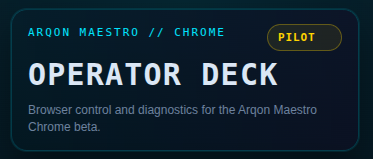
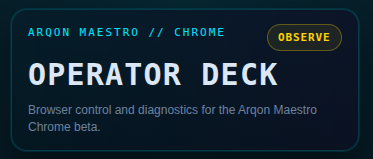
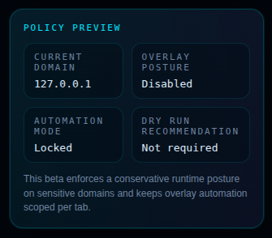

# 🛡️ Automation Modes

Arqon Maestro uses **Automation Modes** to balance user control with operational safety. Depending on the sensitivity of the active page or the current security policy, Maestro may automatically adjust its interaction posture.

---

## 🏗️ The Four Modes

Maestro operates in one of four distinct modes, which determine which commands are permitted and how the system interacts with the page DOM.

| Mode | Capability | Typical Use Case |
| :--- | :--- | :--- |
| **PILOT** | **Full Control**. All mutating and non-mutating commands are enabled. | Standard browsing, internal tools, and trusted documentation sites. |
| **ASSIST** | **Safe-Execution**. Interaction logic is limited to non-mutating actions (e.g., scrolling, showing overlays). | Sites with high-sensitivity data where accidental actions should be avoided. |
| **OBSERVE**| **Limited Read-Only**. The extension maintains connection but restricts interaction overlays. | Private dashboards or mixed-content pages. |
| **LOCKED** | **Total Restriction**. No automation or interaction allowed. | Banking, login pages, and payment gateways. |

---

## 📍 Visual Indicators

Maestro provides clear visual signals of your current interaction posture in both the **Operator Deck** and the **Operator Surface**.

### 1. Panel Header (Top)
The header at the top of the interface prominently displays the active mode next to the system label (`ARQON MAESTRO // CHROME`). This indicator changes color and text based on the effective mode.

=== "Pilot"
    

=== "Assist"
    

=== "Observe"
    

=== "Locked"
    

*Visual comparison of Pilot, Assist, Observe, and Locked indicators in the header.*

### 2. Policy Preview (Bottom)
In the **Operator Surface** (Sidebar), the **Policy Preview** panel at the very bottom provides a detailed breakdown of the effective domain posture.

*Detailed policy view in the Operator Surface showing Automation Mode: Locked.*

---

## 🔄 Mode Transitions

Maestro transitions between modes based on a combination of automatic safety triggers and user-defined policies.

- **Automatic Triggering**: Maestro uses an internal safety registry to automatically drop into **Assist** or **Locked** mode when it detects sensitive patterns (e.g., URLs containing `/billing/`, `/checkout/`, or `/login`).
- **Domain Policies**: You can customize the default behavior for specific domains in your [Global Configuration](../operations/configuration.md).
- **Security Guardrails**: These modes ensure that voice commands cannot accidentally trigger high-risk actions on sensitive pages without explicit overrides.

## 🔗 Mode Authority and Desktop Sync

Automation mode is **app/window scoped**.

- Chrome mode is set from the extension UI.
- Desktop runtime consumes this mode and synchronizes to the focused app context before command authorization.
- The desktop shell should not remain in a stale mode when Chrome mode changes.
