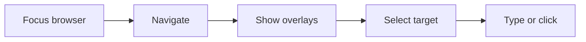

# Browser Getting Started

Arqon Maestro can control browser workflows directly, not just code editors. That includes tab management, navigation, clicking visible content, and targeting overlays for dense pages.

> Video placeholder: first browser workflow with overlays.

## First Browser Test

1. Focus your browser.
2. Turn listening on.
3. Say `new tab`.
4. Say `open stackoverflow dot com`.
5. Say `inputs`.
6. Say a number such as `one`.
7. Say `type python reverse string`.
8. Say `press enter`.

## Why Browser Control Matters

This is part of the Arqon ecosystem control-plane story:

- fetch reference material
- navigate docs
- search issue trackers
- move between research and implementation without dropping voice control

## Browser Flow

## Related Pages

- [Browser Navigation](navigation.md)
- [Links and Inputs](links-and-inputs.md)
- [Editing Text and Code in Browser Surfaces](editing-text-and-code.md)
