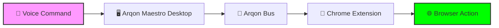
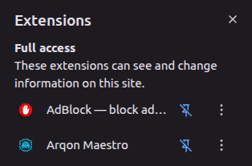
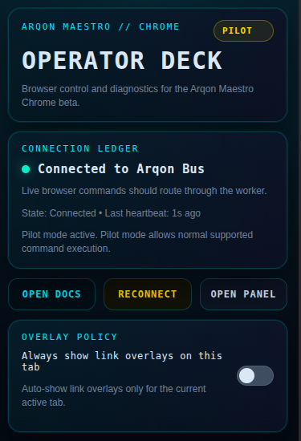
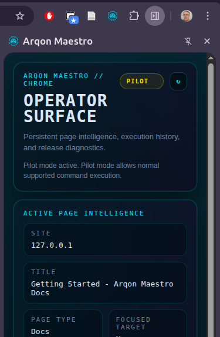
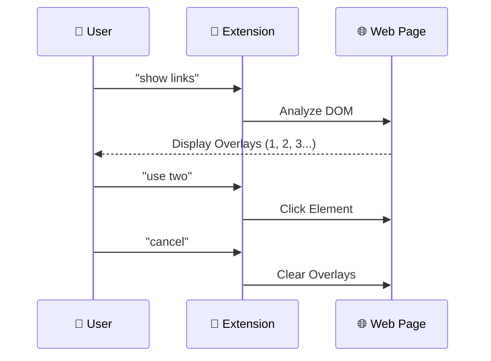

# 🚀 Browser Getting Started: The Ultimate Guide

Welcome to the Arqon Maestro browser control layer! This guide is designed for novices and first-time users to get up and running with voice-first browser navigation and interaction.

## 🏁 Overview

Arqon Maestro isn't just for code editors—it's a full-stack control plane for your entire browser workflow. Whether you're fetching reference material, navigating dense documentation, or managing dozens of tabs, Maestro puts the web at your command.

### How it Works

Maestro translates your voice into precise browser actions through a secure local transport layer called **Arqon Bus**.

---

## 🛠️ Installation

Until the Arqon Maestro extension is fully approved on the Chrome Web Store, we recommend using the Serenade extension as a temporary bridge, or loading our beta source directly.

=== "Standard (Temporary)"
    1. Visit the [Serenade Extension Page](https://marketplace.visualstudio.com/items?itemName=serenade.serenade).
    2. Follow the install links to the web store.
    3. **Pin the extension**: For easy access, click the puzzles icon (Extensions) in your Chrome toolbar and click the pin icon next to **Arqon Maestro**.
    4. Ensure your Arqon Maestro Desktop app is running.

*Pinning the extension ensures the Operator Deck is always one click away.*

=== "Developer / Beta"
    1. Navigate to the `maestro-chrome-extension` repository.
    2. Run `npm install` and `npm run build`.
    3. In Chrome, go to `chrome://extensions`.
    4. Enable **Developer Mode** (top right).
    5. Click **Load unpacked** and select the extension root folder.
    6. **Pin the extension**: Click the puzzle icon in the Chrome toolbar and pin Arqon Maestro.

> [!IMPORTANT]
> Always reload your browser tabs after installing or updating the extension to ensure the content scripts are correctly injected.

---

## 🕹️ Surface Mastery

The Arqon Maestro extension provides two primary interfaces to help you stay in control.

### 1. The Operator Deck (Popup)
Click the extension icon for the "Cockpit" view. This is your quick health check for the system. [Learn more about the Operator Deck](operator-deck.md).

*The Operator Deck shows your connection status, active page, and effective mode.*

### 2. The Operator Surface (Sidebar)
Open the sidebar for a deep dive into page intelligence and a live ledger of every command executed. [Learn more about the Operator Surface](operator-surface.md).

*The Operator Surface provides detailed diagnostics and a history of browser interactions.*

---

## 🗣️ Voice Commands

Maestro uses a "Show and Select" model for most interactions.

### The Interaction Loop

### Core Command Set

| Category | Voice Command | Result |
| :--- | :--- | :--- |
| **Inspection** | `show links` | Numbers all clickable links and buttons. |
| | `show inputs` | Numbers all text boxes and form fields. |
| | `show code` | Numbers all code blocks for copying. |
| **Action** | `use <n>` | Activates the target with number `<n>`. |
| | `cancel` | Removes all overlays from the page. |
| **Navigation** | `back` / `forward` | Moves through your tab history. |
| | `reload` | Refreshes the current page. |
| | `go to <site>` | Navigates to a specific URL (e.g., "go to google dot com"). |
| **Tabs** | `next tab` / `previous tab` | Cycle through your open tabs. |
| | `close tab` | Closes the active tab immediately. |

---

## 🧪 Advanced Usage & SPAs

Maestro is built for modern web applications.

### React & Single Page Apps (SPAs)
Maestro performs a deep DOM analysis to find interactive elements even in complex React or Vue applications. For sites that use specialized editors like **Monaco** (VS Code Web), **Ace**, or **CodeMirror**, Maestro hooks directly into their APIs to provide stable text editing.

### 🛡️ Safety & Policy
Maestro respects your privacy and security. 

- **Sensitive Pages**: Commands like `use <n>` are automatically blocked on login, billing, and payment pages to prevent accidental actions.
- **Modes**: Maestro may switch from `Pilot` to `Assist` mode automatically when on a sensitive domain.

---

## 📚 Next Steps

- Learn about [Browser Navigation](navigation.md)
- Deep dive into [Links and Inputs](links-and-inputs.md)
- Master [Editing Text and Code](editing-text-and-code.md) in the browser.
