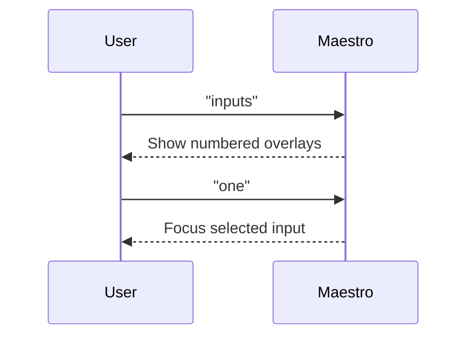

# Links And Inputs

When a page has too many clickable elements to target reliably by visible text alone, Arqon Maestro can expose numbered overlays.

> Video placeholder: links and inputs overlay targeting.

## Overlay Commands

- `links`
- `inputs`

Once the overlays are visible, choose the target by number:

- `one`
- `two`
- `three`

## When To Use Overlays

Use them when:

- a page has many similar links
- the visible text is ambiguous
- you need a quick way to focus a search box or form input

## Overlay Interaction Pattern

