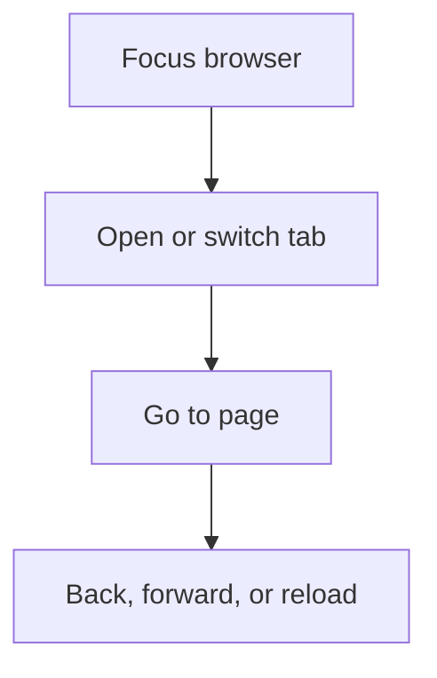

# Browser Navigation

Arqon Maestro supports direct browser navigation commands for tab movement and page traversal.

> Video placeholder: browser tab and page navigation.

## Common Commands

- `focus chrome`
- `new tab`
- `close tab`
- `open stackoverflow dot com`
- `back`
- `forward`
- `reload`

## Navigation Strategy

Use browser commands when you want to stay in voice control while moving across reference material, internal Arqon tools, or operational dashboards.

## Command Flow

