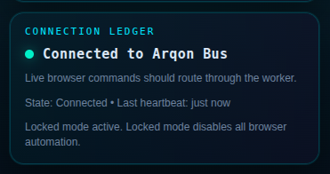
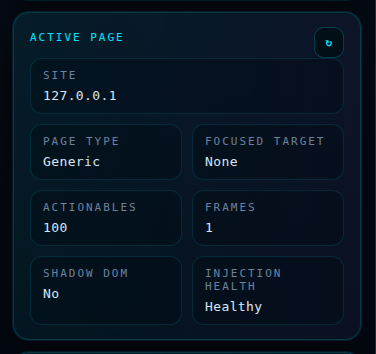
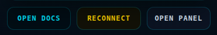
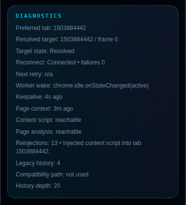
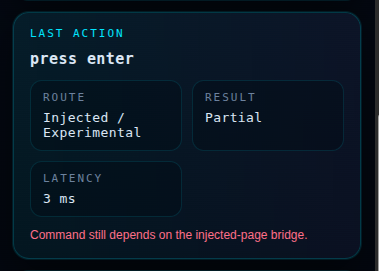

# 🕹️ The Operator Deck (Popup)

The **Operator Deck** is the "Cockpit" of the Arqon Maestro browser extension. It is designed for quick interactions, health checks, and high-level status monitoring.

## 🎯 Purpose

Use the Operator Deck to:
- Instantly verify your connection to Arqon Bus.
- Check which mode is currently active (e.g., Pilot vs. Assist).
- Manage your local interaction policy for the current tab.
- Quickly access deeper diagnostics or documentation.

---

## 🏗️ Section Breakdown

### 1. Connection Ledger
This section provides real-time status of your link to the Arqon Maestro stack.

- **Status Dot**: Green indicates a healthy connection to the Arqon Bus.
- **Routing**: Confirms commands are routing through the extension worker.
- **Heartbeat**: Shows the latency and state of the last signal received.

### 2. Active Page Intelligence
A real-time snapshot of the page currently being analyzed by Maestro.

- **Site & Title**: Confirms the target domain and page name.
- **Actionables**: Tally of clickable elements detected on the page.
- **Injection Health**: Confirms the content scripts are successfully running.

### 3. Quick Controls
Global actions to manage your session and the extension UI.

- **Open Docs**: Jump directly to the documentation.
- **Reconnect**: Manually refresh the connection if interrupted.
- **Open Panel**: Slide out the **Operator Surface** (Sidebar) for deep diagnostics.

### 4. Internal States (Diagnostics)
Deep metrics for the underlying transport and command execution.

- **Targeting**: Details on the resolved tab and frame ID.
- **Watchdog**: Tracks reinjection activity and worker wake-ups.
- **Last Action**: Detailed breakdown of the most recent command, including route, result, and latency.

### 5. Overlay Policy
A per-tab toggle to **Always show link overlays**. When enabled, Maestro will automatically highlight interactive elements upon navigation, without needing a voice command.

---

## 💡 Pro Tips

- **Pin for Power**: Pin the extension to your Chrome toolbar so you can toggle the Operator Deck with a single click.
- **Mode Intelligence**: If the mode says "Assist" but you requested "Pilot", check the [Safety & Policy](getting-started.md#safety--policy) section—you might be on a sensitive domain.
