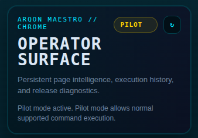
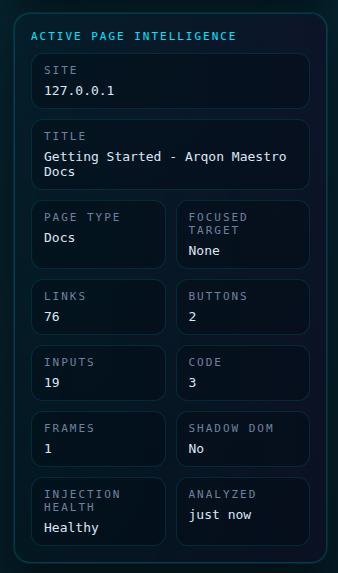
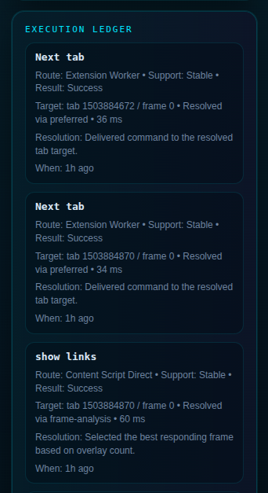
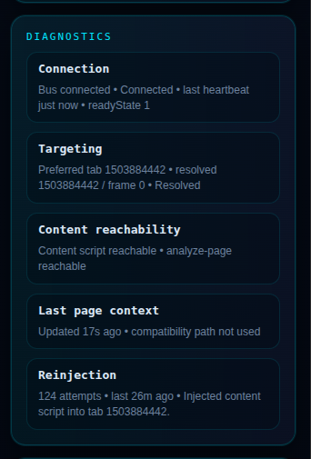
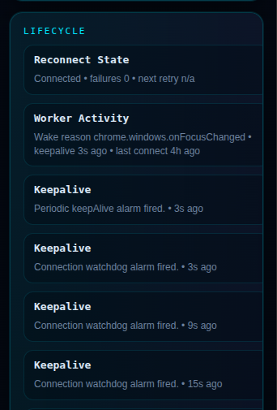
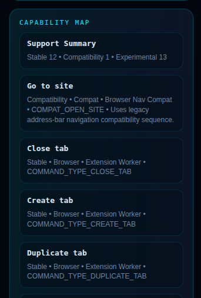
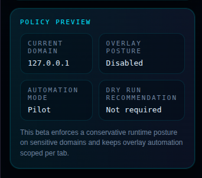

# 🛠️ The Operator Surface (Sidebar)

The **Operator Surface** is the detailed operational and diagnostic hub for Arqon Maestro. While the Deck (Popup) is for quick checks, the Surface is where you go to understand *why* and *how* the system is interacting with a page.

---

## 🏗️ Panel-by-Panel Guide

### 1. Header & Status
The command center at the top. It confirms the system is targeting Chrome and displays the current **Effective Mode**.

### 2. Active Page Intelligence
This panel shows exactly what Maestro "sees" on the current page. It is invaluable for debugging why a certain link or input might not be showing up.

- **Site & Title**: Confirms the target page.
- **Element Counts**: Real-time tally of Links, Buttons, Inputs, and Code blocks detected.
- **Injection Health**: Confirms the Arqon content scripts are successfully running.

### 3. Execution Ledger
A live, vertical history of every command processed by the extension.

Each entry shows:

- **Route**: How the command was delivered (e.g., `Extension Worker`, `Content Script Direct`).
- **Support**: Calibration of the command (Stable vs. Experimental).
- **Result**: Success or failure status.
- **Timings**: Execution and resolution latency in milliseconds.

### 4. Diagnostics
Deep metrics for the underlying transport and targeting logic.

- **Connection**: WebSocket readyState and heartbeat history.
- **Targeting**: Details on which tab and frame ID are currently being controlled.
- **Reinjection**: Tracks keep-alive attempts to stay resilient against browser "cold starts".

### 5. Lifecycle
A ledger of internal system events that keep the extension alive and connected.

- **Worker Activity**: Why the service worker was woken up (e.g., focus change).
- **Watchdog**: Confirmation of the periodic connection checks.

### 6. Capability Map
The full source of truth for every command Maestro can execute on the current page.

- **Support Summary**: Tally of Stable, Compatibility, and Experimental commands currently available.
- **Detailed Calibration**: Scroll through specific commands (e.g., `go to site`, `close tab`) to see their Route and Calibration details.
- **Route Visibility**: Understand whether a command uses a `Browser Nav Compat` route or a direct `Extension Worker` route.

### 7. Policy Preview
The current domain policy and automation posture.

- **Current Domain**: Confirms the site being analyzed.
- **Overlay Posture**: Shows if auto-show is enabled or disabled.
- **Automation Mode**: Confirms the effective mode (e.g., Pilot).
- **Dry Run Recommendation**: Indicates if a dry run is recommended for the current context.

---

## 🎯 When to use the Surface

- **Debugging**: If "show links" is missing a target, check the **Intelligence** panel to see if the element count matches your expectation.
- **Performance**: Monitor the **Execution Ledger** to see if specific routes are experiencing high latency.
- **Stable Control**: Use **Diagnostics** to verify that Maestro is targeting the correct tab/frame in multi-window setups.
