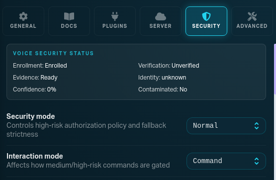
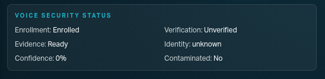
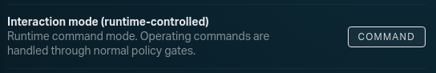
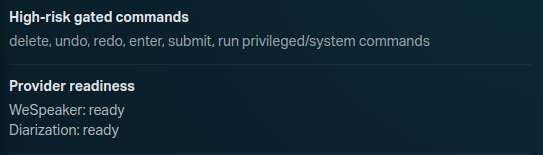
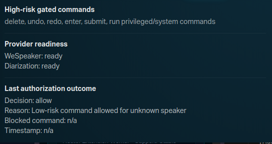
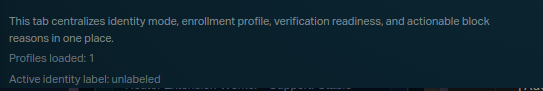

# Voice Enrollment and Security

Voice Enrollment decides whether Maestro can trust the current speaker for high-risk commands.

Commands like `delete`, `undo`, `redo`, `enter`, and `submit` depend on this trust path.

## Design Update (Current UX)

Enrollment is now split into two surfaces:

- `WIZARD` tab: primary setup and enrollment flow
- `SECURITY` tab: runtime status, policy diagnostics, and maintenance actions

This fixes the old problem where users had to infer setup from diagnostics-only controls.

## Setup Banner Behavior

If enrollment is not fully set up, the Security panel shows this block:

```text
VOICE ENROLLMENT SETUP NEEDED
This machine is not fully enrolled yet. High-risk commands may confirm or block until enrollment is active.

Set your enrollment profile name
Click Start Enrollment
Click Test Verification and check Last authorization outcome
```

Banner visibility rule:

- show only when enrollment is not active (`not enrolled`, `revoked`, or `suspended`)
- hide automatically when enrollment becomes active

## Where To Configure

Open:

1. Desktop app
2. `Settings`
3. `WIZARD` for setup
4. `SECURITY` for runtime diagnostics

## Enrollment Wizard (Primary Flow)

Use `WIZARD` as the main first-run and reenrollment path.

### Step 1: Consent

Acknowledge that local voice-biometric enrollment data is used for authorization gating.

### Step 2: Preflight

Confirm:

- WeSpeaker provider is ready
- diarization provider is ready
- contamination state is clean

If preflight is degraded, fix provider/room issues before capture.

### Step 3: Capture Enrollment

- set enrollment profile name
- click `Open Voice Wizard` and read the prompted sentences
- complete the guided modal
- wait for enrollment status to become active

### Step 4: Verify

- after guided completion, Maestro auto-runs verification
- confirm `Last authorization outcome` is populated
- you can still click `Test Verification` manually if needed

### Step 5: Complete

Once enrollment is active, use Security tab for policy/runtime observability.

## Security Tab (Runtime Console)

Security is not the primary first-run enrollment flow.

It is the operational console for:

- live identity state
- policy strictness (`Normal`, `Shared Room`, `Secure`, `Restricted`)
- runtime interaction mode (read-only)
- provider readiness
- last authorization decision and reason

### Security snapshots











## Security Modes (Practical Meaning)

- `Normal`: balanced default for trusted solo use
- `Shared Room`: tighter policy for multi-speaker contamination risk
- `Secure`: stricter verification and less permissive fallback
- `Restricted`: strongest fail-closed behavior for risky actions

## Interaction Mode Clarification

Interaction mode is runtime-controlled and read-only in Security.

Users should not manually toggle security settings to switch between command/dictation behavior.

## Fast Troubleshooting

### Symptom: high-risk commands are blocked or keep confirming

Check in order:

1. Enrollment status is active
2. Preflight/provider readiness is healthy
3. contamination is not detected
4. interaction mode is appropriate for what you are doing
5. last authorization outcome reason text

Then:

- run `Test Verification`
- if needed, run `Re-enroll`
- if state is stale or corrupt, run `Reset Enrollment` then re-enroll

## Related Docs

- [Policy](./policy.md)
- [Browser and System Control](../guides/browser-and-system-control.md)
- [Maestro Master Plan](../vos/maestro-master-plan.md)
- [Voice Identity Security Architecture](../vos/maestro-voice-identity-security-architecture.md)
- [Actuation Policy Engine](../vos/maestro-actuation-policy-engine.md)
