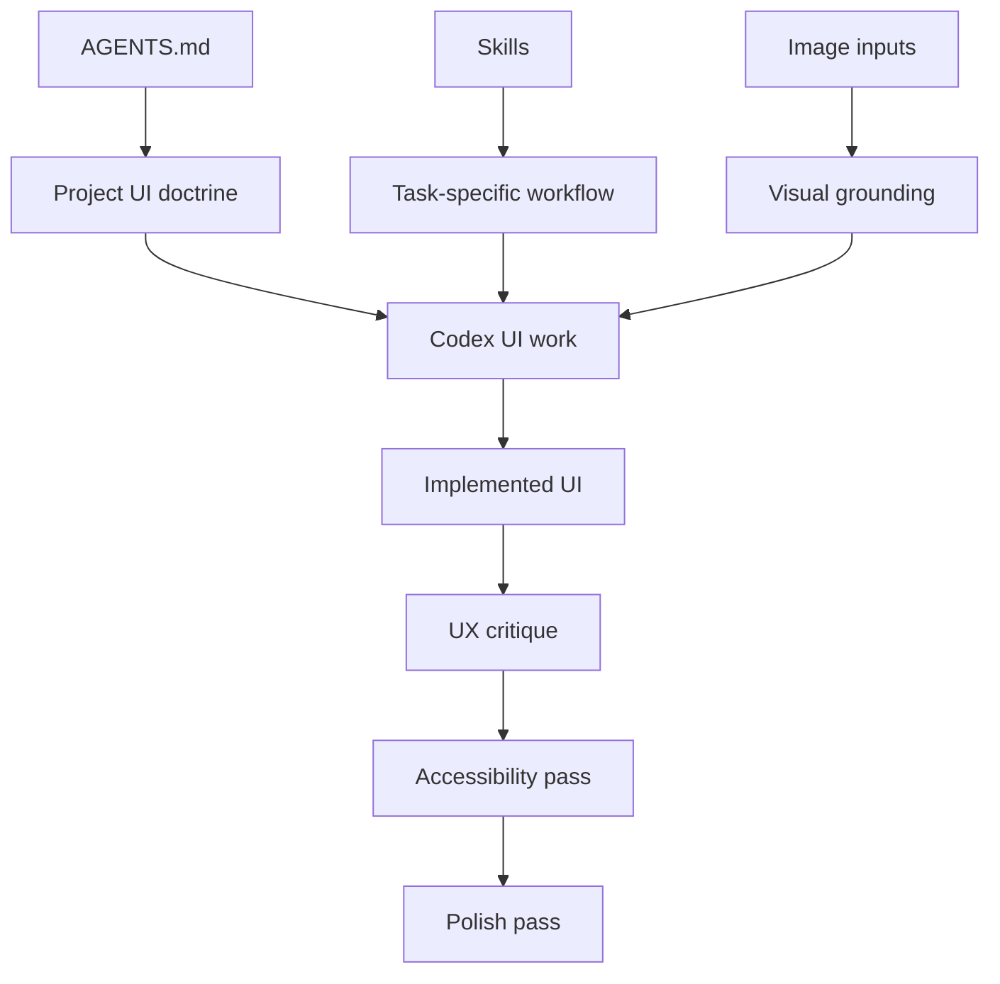
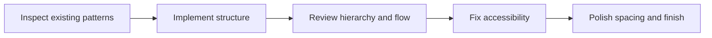
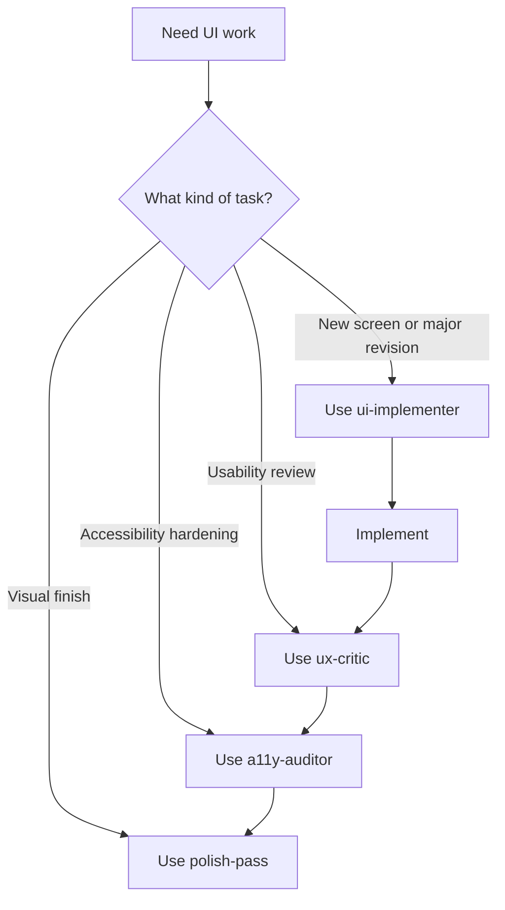

# Codex UI/UX Workflow

This guide explains how to use Codex in this repository for strong UI and UX work using:

- repo-level `AGENTS.md`
- project-local skills
- screenshot or mock inputs
- staged implementation, review, accessibility, and polish passes

This is the practical workflow layer on top of the local skill setup already present in `.codex/skills/`.

## Purpose

The goal is not to turn Codex into a generic design generator.

The goal is to make Codex behave like a disciplined UI implementation and review agent that:

- follows the repo's design doctrine
- reuses the existing stack and patterns
- stays accessibility-aware
- produces reviewable, production-ready changes

## Workflow Stack



## Repo Structure

The expected project layout is:

```text
your-project/
├── AGENTS.md
└── .codex/
    └── skills/
        ├── ui-implementer/
        │   └── SKILL.md
        ├── ux-critic/
        │   └── SKILL.md
        ├── a11y-auditor/
        │   └── SKILL.md
        └── polish-pass/
            └── SKILL.md
```

## What Each Layer Does

### `AGENTS.md`

Use `AGENTS.md` as the permanent design constitution for the repository.

It should define:

- design principles
- stack defaults
- UX expectations
- accessibility rules
- implementation constraints
- review behavior

Use it for stable policy, not one-off tasks.

### Skills

Use skills for narrow, repeatable workflows:

- `ui-implementer`: build or revise UI
- `ux-critic`: review hierarchy, friction, and usability
- `a11y-auditor`: review semantics, focus, labels, and keyboard behavior
- `polish-pass`: tighten spacing, alignment, responsiveness, and finish

### Image Inputs

Use screenshots, mocks, or target references when the visual result matters.

This gives Codex a concrete target instead of forcing it to infer the full visual structure from text alone.

## Recommended UI Work Sequence

For most UI tasks, use this order:

1. inspect nearby code and existing patterns
2. implement with `ui-implementer`
3. review with `ux-critic`
4. fix accessibility issues with `a11y-auditor`
5. finish with `polish-pass`

### Why This Order Works



If you polish too early, you risk polishing the wrong structure.

If you skip critique, the screen may be visually clean but still weak in hierarchy or interaction flow.

## Skill Roles

### `ui-implementer`

Use this skill when:

- building a new screen
- recreating a mock or screenshot
- making substantive UI revisions

Expected behavior:

- inspect local components and layout patterns first
- infer regions and hierarchy
- implement structure before polish
- preserve responsiveness and accessibility

### `ux-critic`

Use this skill when:

- reviewing an existing screen
- deciding what to improve first
- diagnosing hierarchy, affordance, or information architecture problems

Expected output:

1. high-impact problems first
2. why each problem matters
3. concrete recommended changes
4. the smallest viable improvement path

### `a11y-auditor`

Use this skill when:

- auditing forms, dialogs, menus, tables, or custom controls
- fixing keyboard or focus issues
- tightening semantics and labels

Expected focus:

- semantic HTML
- label and control association
- focus visibility
- keyboard access
- minimal and correct ARIA

### `polish-pass`

Use this skill when:

- the UI already works
- the screen needs final quality improvements
- spacing, balance, and responsiveness need refinement

Expected focus:

- spacing rhythm
- alignment
- typography hierarchy
- visual consistency
- state polish

## Prompt Patterns

### New Screen

```text
Build a settings page for this app.

Use the repo's AGENTS.md and the ui-implementer skill.
Match existing project patterns, keep edits localized, and make it production-ready.
After implementation, run a polish pass.
```

### Existing Screen Improvement

```text
Use the ux-critic skill on this page.
Identify the top 5 hierarchy and usability problems.
Then fix the top 3 with minimal code changes.
Finally run the polish-pass skill.
```

### Accessibility Tightening

```text
Use the a11y-auditor skill on this form and fix all meaningful accessibility issues without changing the visual design more than necessary.
```

### Full Workflow

```text
First inspect existing UI patterns in this repo.
Then use ui-implementer to build the screen.
After that, review it with ux-critic and fix the most important issues.
Then do an accessibility pass.
Finally do a polish pass.
Keep all changes localized and production-ready.
```

## Screenshot-Driven Work

When you have a target screenshot, ask Codex to use it as visual grounding.

### In VS Code

Attach or paste the screenshot, then prompt:

```text
Use the attached screenshot as the target UI.

Use the ui-implementer skill.
Follow the design and visual patterns from this project.
Implement the screen in the existing stack.
Then use ux-critic and polish-pass logic to improve weak hierarchy or spacing where needed.
```

### In CLI

```bash
codex -i screenshot.png "Implement this screen in the current project using the repo's AGENTS.md and ui-implementer skill."
```

To compare two images:

```bash
codex --image current-ui.png,target-ui.png "Compare these and update the current implementation to match the target more closely while preserving the repo's design system."
```

## Practical Rules

- ask Codex to inspect the local design system and nearby components first
- keep `AGENTS.md` stable and high-level
- keep skills narrow and composable
- use screenshots whenever fidelity matters
- separate implementation, critique, accessibility, and polish into distinct passes
- prefer localized changes over broad rewrites unless the task explicitly requires redesign

## Decision Flow



## When Multi-Agent Review Is Worth It

Use multi-agent review only for high-visibility or high-risk UI work such as:

- flagship dashboards
- settings surfaces
- landing pages
- design-system primitives
- complex forms or workflows

Suggested split:

- one agent implements
- one critiques UX
- one audits accessibility
- one performs final polish review

For normal UI tasks, sequential single-agent passes are usually enough.

## Day-To-Day Shortcuts

For building UI:

```text
Use ui-implementer.
```

For improving existing UI:

```text
Use ux-critic, then fix the top issues.
```

For final hardening:

```text
Run a11y-auditor and polish-pass.
```

For screenshot-based implementation:

```text
Use the attached screenshot as target UI and adapt it to this repo's design language.
```

## Bottom Line

The cleanest Codex UI/UX stack is:

- `AGENTS.md` for standing design law
- skills for specialized workflows
- image inputs for visual grounding
- optional multi-agent review for important screens

Used together, these give Codex a much more reliable path to production-quality UI work than a single generic prompt.
