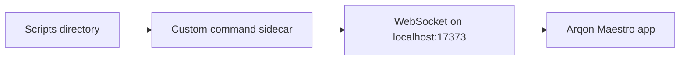

# Custom Commands

Arqon Maestro supports a programmable custom-commands layer backed by a local JavaScript runtime and a WebSocket sidecar.

> Video placeholder: writing and reloading a custom command.

## Where Custom Commands Live

The app creates a scripts directory under the user config path and loads `custom.js` plus any other JavaScript files found there.

The bundled starter file documents the intended API shape and is copied into the config directory automatically on install.

## Scope Builders

The custom-commands runtime exposes a global builder object with scoped entry points for:

- global commands
- app-scoped commands
- language-scoped commands
- extension-scoped commands
- combined app-and-language scopes
- URL-scoped browser commands

These builders let you target commands by:

- application
- language
- file extension
- browser URL

## Command Registration Methods

Available builder methods include:

- `command()`
- `text()`
- `key()`
- `snippet()`
- `hint()`
- `pronounce()`
- `disable()`
- `enable()`

## Runtime Behavior



## Driver Capabilities Exposed To Commands

The sidecar wires helper methods onto the driver, including:

- application focus
- DOM click/focus/blur/copy/scroll
- plugin evaluation
- nested `runCommand()` execution
- key presses
- text insertion

## Reload Model

- the sidecar watches the scripts directory
- changes trigger `reload()`
- commands, hints, and custom words are re-sent to the app

## Example Shape

```js
builder.global().command("make", (api) => {
  api.focusApplication("terminal");
  api.typeText("make clean && make");
  api.pressKey("return");
});
```

This is representative of the supported pattern. For the exact current runtime symbol names, inspect the local sidecar implementation.
