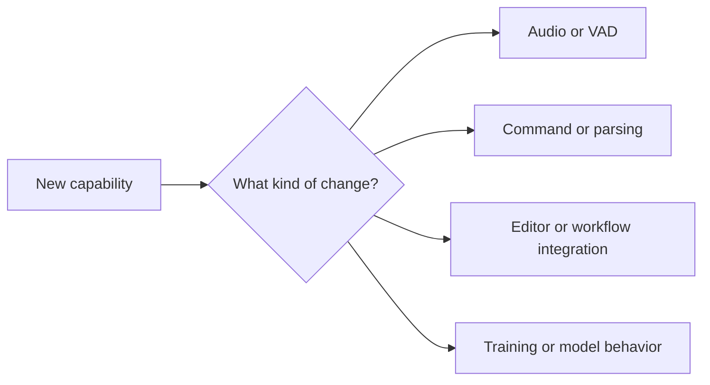

# Extending Maestro

This page is for developers adding new behavior to Arqon Maestro.

## Main Extension Surfaces

- speech and audio pipeline
- command interpretation
- editor/plugin integrations
- workflow routing
- model and training pipeline changes

## Extension Strategy

## Practical Guidance

### If you are changing audio behavior

- validate microphone capture first
- keep chunk lifecycle observable
- verify partial and final endpoint behavior separately

### If you are changing command behavior

- confirm transcript shape first
- verify parsing and selection logic independently
- keep examples and docs in sync with the new command family

### If you are adding integrations

- define the context you need
- define the action surface clearly
- test the active-app and routing assumptions

### If you are changing training/model behavior

- document the data path
- document the expected export artifacts
- keep runtime assumptions aligned with model outputs

## Recommended Workflow

1. identify the layer you are changing
2. add instrumentation before deep edits
3. make the smallest behavior change that proves the path
4. update docs once behavior is confirmed
5. preserve compatibility where possible during migrations

## Related Docs

- [Codebase Layout](../architecture/codebase-layout.md)
- [Request Lifecycle](../architecture/request-lifecycle.md)
- [Generating Data](../models/generating-data.md)
- [Training Models](../models/training-models.md)
