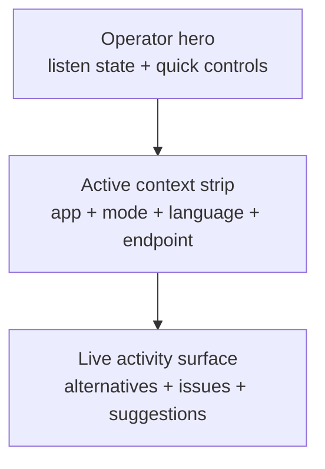
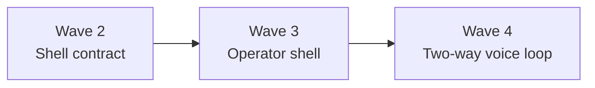

# Operator Shell V1

This document defines the initial Wave 3 target for the Arqon Maestro desktop GUI.

It describes the compact operator shell that should replace the old mini-mode-first product feel without turning Maestro into a large dashboard.

## Objective

Build the first real Maestro operator shell:

- compact
- desktop-like
- fast to read
- honest to current runtime state
- visually aligned with the Arqon ecosystem

The shell should feel like the beginning of the Voice Operating System, not a legacy utility window.

## Product Constraints

Wave 3 keeps these constraints:

- remain roughly the same footprint as the current desktop app
- preserve the current role of the app as a compact operator surface
- do not expand into a multi-pane analytics dashboard
- do not fake transcript, TTS playback, or Kokoro state that the renderer does not yet receive
- keep the current Electron host only as compatibility infrastructure, not as design authority

## Visual Direction

The visual reference is the Arqon Pilot GUI language, adapted for Maestro.

The Wave 3 shell should use:

- dark-first backgrounds
- restrained neon orange accents
- strong panel framing
- technical typography
- compact spacing and readable hierarchy

The intended feeling is:

- moody
- technical
- ecosystem-aligned
- operator-focused

## Shell Layout

The current v1 shell has three main regions:

1. operator hero
2. active-context strip
3. live alternatives and status surface

## Operator Hero

The top region should show the live operating loop at a glance:

- listening or paused state
- listen toggle
- connection status
- settings access
- volume or activity indicator
- short descriptive shell summary

This region should feel like the app's command bridgehead, not just a title area.

## Active Context Strip

The context strip should show:

- active app
- dictate mode when active
- current language or source mode
- endpoint state

This region should answer: "Where is Maestro pointed right now?"

## Activity Surface

The lower region should show the command-response surface that already exists today:

- alternatives
- suggestions
- backend issues
- update notifications
- tutorial or NUX surfaces when active

This region should remain compact and readable under constrained height.

## State Honesty Rules

Wave 3 must not imply runtime capability that does not yet exist in the shell state.

That means:

- do not invent transcript panes unless live transcript state is actually exposed
- do not invent Kokoro playback controls unless live TTS state is actually exposed
- do not invent execution-history models that the renderer does not actually have

The shell should present current live state well before it presents future state aspirationally.

## Relationship To Wave 4

Wave 3 is the shell redesign wave.

Wave 4 is where the richer two-way voice loop becomes the product centerpiece, including clearer spoken-response presentation once the runtime exposes it cleanly.

## Outcome

If Wave 3 is successful, Maestro should already feel materially better to use before any deeper Tauri or voice-loop work lands:

- more intentional
- more ecosystem-aligned
- more operator-readable
- less legacy
- structurally ready for the next wave
