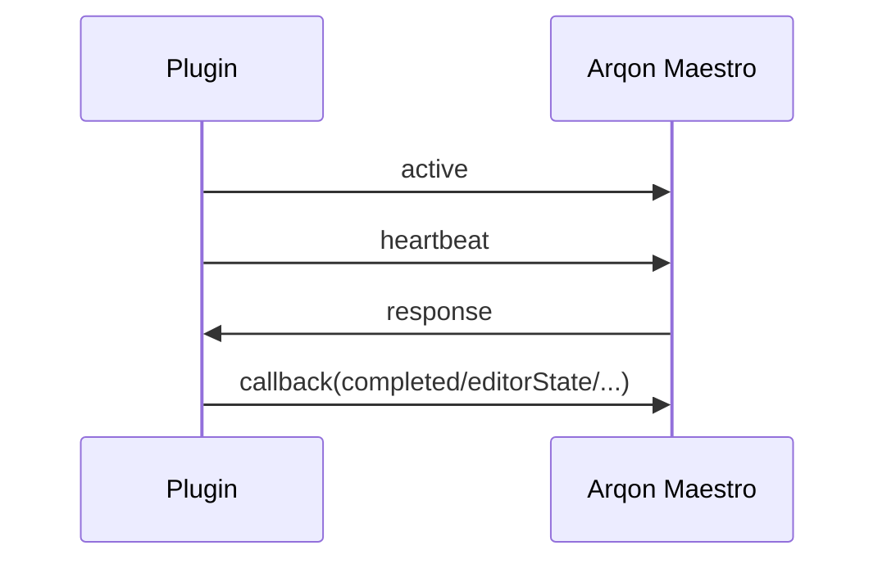

# Protocol Overview

Arqon Maestro communicates with editor plugins over a local WebSocket protocol. This is the integration layer that lets the desktop app ask for editor state and apply structured commands.

> Video placeholder: desktop app to plugin protocol walkthrough.

Port scope:
- plugin/bus protocol: `ws://localhost:9100/`
- core stream endpoint (`/stream/`) is a separate path on `17200`

## Connection Model

The VS Code implementation connects to:

```text
ws://localhost:9100/
```

On connection:

- the plugin marks itself connected
- it sends an `active` message with app name and client id
- it continues sending `heartbeat` messages periodically

## Core Purpose

The protocol is used to:

- announce active editors
- request editor state
- execute command responses
- return callbacks to the desktop app

## Lifecycle



## Related Sources

- [Protocol Messages](protocol-messages.md)
- [Plugin Lifecycle](plugin-lifecycle.md)
- [Request Lifecycle](../architecture/request-lifecycle.md)
