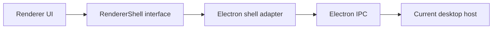
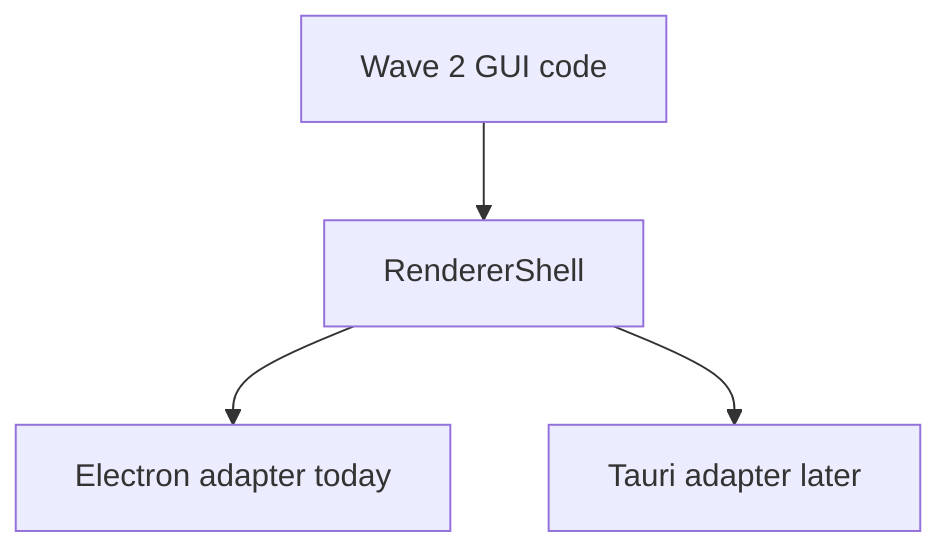

# Renderer Shell Contract

This document defines the Wave 2 renderer-shell boundary for Arqon Maestro.

Its purpose is to keep GUI work anchored to operator-facing state and actions instead of raw Electron IPC details, while preserving the current Electron host as a compatibility path.

## Purpose

The renderer shell contract exists to do three things:

1. isolate raw Electron IPC to a single adapter layer
2. give the renderer a stable UI-facing contract for current Maestro behavior
3. preserve a portability seam for the later Tauri migration

The contract is intentionally practical. It models what the current renderer can really do today without inventing speculative transcript, TTS, or orchestration states that do not yet exist in the live UI path.

## Implementation Location

- `maestro/client/src/renderer/shell/types.ts`
- `maestro/client/src/renderer/shell/electron-shell.ts`
- `maestro/client/src/renderer/shell/index.ts`

## Contract Shape

The renderer sees one shell interface:

- event subscriptions from the host/runtime into the renderer
- action methods from the renderer back to the host/runtime

## Event Surface

The current Wave 2 event surface includes:

- revision-box focus requests
- text-input focus requests
- revision-box state requests and updates
- generic renderer state patches
- route changes
- mini-mode height refresh requests

These are exposed as shell callbacks so the renderer no longer binds directly to Electron event names.

## Action Surface

The current Wave 2 action surface includes:

- toggling listening
- showing settings and selecting settings pages
- changing settings values
- changing language and closing the language switcher
- hiding text input and sending text requests
- updating mini-mode height
- loading tutorials
- NUX controls
- opening custom commands
- opening the log directory
- toggling dictate mode
- requesting accessibility and microphone permission
- setting window state
- showing the language switcher
- starting and stopping local mode
- generating a token

## Operator Model

Wave 2 does not create a fake future operator model. It formalizes the current live GUI concerns that the shell must support:

- listening and paused state
- local loading state
- active mode including dictate mode
- active app and source availability
- endpoint and connectivity state
- alternatives, suggestions, backend issues, and update notifications
- language selection
- settings and onboarding flows
- text input and revision-box support

This is the practical operator model the Wave 3 GUI should build on.

## Portability Rules

The shell contract should be treated as the portability seam for Tauri migration.

That means:

- renderer components should not import Electron directly
- route and window behaviors should be expressed through the shell interface
- future shell swaps should replace the adapter, not the GUI component tree

## Non-Goals

Wave 2 does not attempt to:

- redesign the full GUI
- invent transcript or TTS playback state that the current renderer does not expose
- remove the Electron compatibility host
- rewrite the current runtime stack

## Outcome

Wave 2 makes the next GUI work structurally safer:

- the renderer now depends on a shell contract
- Electron is demoted to an adapter role inside the renderer boundary
- Wave 3 can focus on operator-shell design and implementation rather than more IPC cleanup
