# ArqonMaestro Chrome Extension Implementation Plan

**Version:** 1.0  
**Status:** Draft  
**Target:** Chrome Extension v2.0  

---

## Overview

This document outlines the implementation roadmap for the ArqonMaestro Chrome Extension v2.0. The plan is organized into phases with clear deliverables and dependencies.

---

## Phase 1: Foundation

**Duration:** 1 Week  
**Goal:** Establish extension structure and core connectivity

### Tasks

#### 1.1 Project Setup

- [ ] Create extension directory at repository root: `chrome-extension/`
- [ ] Initialize npm project with `package.json`
- [ ] Set up TypeScript configuration
- [ ] Configure webpack for extension bundling

#### 1.2 Manifest V3

- [ ] Create `manifest.json` with all required fields
- [ ] Define permissions (activeTab, tabs, storage, nativeMessaging)
- [ ] Configure content script matches
- [ ] Set up background service worker

#### 1.3 Popup Implementation

- [ ] Create `popup.html` with status UI
- [ ] Style popup with ArqonMaestro branding (CSS)
- [ ] Implement connection status indicator
- [ ] Add voice toggle button
- [ ] Wire up popup JavaScript

#### 1.4 Background Service Worker

- [ ] Create `background.js` entry point
- [ ] Implement WebSocket client class
- [ ] Add connection state management
- [ ] Handle reconnection logic
- [ ] Set up message routing

#### 1.5 Build System

- [ ] Configure webpack for extension
- [ ] Set up manifest.json copying
- [ ] Configure file watching for dev mode
- [ ] Create build scripts

**Deliverable:** Extension loads in Chrome with popup showing connection status

---

## Phase 2: Core Features

**Duration:** 1 Week  
**Goal:** Implement DOM interaction and overlay systems

### Tasks

#### 2.1 Content Script Framework

- [ ] Create main content script entry point
- [ ] Implement message listener for background commands
- [ ] Set up DOM ready handling
- [ ] Add cleanup on page unload

#### 2.2 DOM Utilities

- [ ] Build element discovery functions
- [ ] Implement XPath generation helpers
- [ ] Create text matching utilities
- [ ] Add attribute readers

#### 2.3 Overlay System

- [ ] Design overlay CSS styles
- [ ] Implement overlay positioning logic
- [ ] Create number rendering system
- [ ] Add click handlers for selections
- [ ] Implement overlay dismissal

#### 2.4 Click-by-Text

- [ ] Build text tokenization
- [ ] Implement element scoring algorithm
- [ ] Add fuzzy matching support
- [ ] Handle edge cases (multiple matches)

#### 2.5 Form Interaction

- [ ] Implement focus management
- [ ] Add text input capabilities
- [ ] Handle special keys (Enter, Tab)
- [ ] Support textarea elements

**Deliverable:** Overlay system functional, click-by-text works on basic pages

---

## Phase 3: Integration

**Duration:** 1 Week  
**Goal:** Connect to Maestro backend and process voice commands

### Tasks

#### 3.1 Protocol Implementation

- [ ] Define message type constants
- [ ] Implement EditorState builder
- [ ] Create command response handlers
- [ ] Add error handling

#### 3.2 EditorState Sync

- [ ] Capture current page URL and title
- [ ] Detect page domain
- [ ] Query open tabs for tab management
- [ ] Send updates on page changes

#### 3.3 Command Execution

- [ ] Parse command responses
- [ ] Route commands to content script
- [ ] Implement navigation commands
- [ ] Handle overlay display commands
- [ ] Execute click/type commands

#### 3.4 Tab Management

- [ ] Implement new tab creation
- [ ] Add tab closing functionality
- [ ] Create tab switching logic
- [ ] Handle tab queries

#### 3.5 Error Handling

- [ ] Add connection error recovery
- [ ] Implement command timeout handling
- [ ] Create user feedback for failures
- [ ] Add logging for debugging

**Deliverable:** Full end-to-end voice control functional

---

## Phase 4: Polish

**Duration:** 1 Week  
**Goal:** Finalize branding, testing, and deployment

### Tasks

#### 4.1 Rebranding

- [ ] Replace Serenade logos with ArqonMaestro
- [ ] Update all text strings
- [ ] Apply Arqon color scheme
- [ ] Migrate storage keys
- [ ] Update extension name

#### 4.2 Settings

- [ ] Add backend endpoint configuration
- [ ] Implement theme preference
- [ ] Add keyboard shortcut customization
- [ ] Create settings persistence

#### 4.3 Testing

- [ ] Unit test core utilities
- [ ] Test on popular websites
- [ ] Verify SPA compatibility
- [ ] Test with complex forms
- [ ] Performance testing

#### 4.4 Documentation

- [ ] Write user getting started guide
- [ ] Document voice commands
- [ ] Create troubleshooting guide
- [ ] Update main Maestro docs

#### 4.5 Deployment

- [ ] Create Chrome Web Store listing
- [ ] Prepare screenshots and descriptions
- [ ] Set up extension ID
- [ ] Submit for review

**Deliverable:** Extension published to Chrome Web Store

---

## Task Dependencies

```mermaid
flowchart LR
    subgraph Phase1
        A1[Project Setup] --> A2[Manifest V3]
        A2 --> A3[Popup UI]
        A3 --> A4[Background Worker]
        A4 --> A5[Build System]
    end
    
    subgraph Phase2
        B1[Content Script] --> B2[DOM Utilities]
        B2 --> B3[Overlay System]
        B3 --> B4[Click-by-Text]
        B4 --> B5[Form Interaction]
    end
    
    subgraph Phase3
        C1[Protocol] --> C2[EditorState]
        C2 --> C3[Command Execution]
        C3 --> C4[Tab Management]
        C4 --> C5[Error Handling]
    end
    
    subgraph Phase4
        D1[Rebranding] --> D2[Settings]
        D2 --> D3[Testing]
        D3 --> D4[Documentation]
        D4 --> D5[Deployment]
    end
    
    A5 --> B1
    B5 --> C1
    C5 --> D1
```



---

## File Creation Checklist

### Phase 1 Files

```
chrome-extension/
├── manifest.json              [NEW]
├── package.json               [NEW]
├── tsconfig.json              [NEW]
├── webpack.config.js          [NEW]
├──│   └── en _locales/
/
│       └── messages.json      [NEW]
├── popup/
│   ├── popup.html             [NEW]
│   ├── popup.css              [NEW]
│   └── popup.js               [NEW]
├── background/
│   ├── background.js          [NEW]
│   ├── websocket.js           [NEW]
│   └── state.js               [NEW]
└── icons/
    ├── icon16.png             [NEW - from Arqon assets]
    ├── icon32.png             [NEW]
    ├── icon48.png             [NEW]
    └── icon128.png            [NEW]
```

### Phase 2 Files

```
chrome-extension/
├── content/
│   ├── content.js             [NEW]
│   ├── overlays.js             [NEW]
│   ├── clicks.js              [NEW]
│   └── dom.js                 [NEW]
└── styles/
    └── overlays.css           [NEW]
```

### Phase 3 Files

```
chrome-extension/
├── shared/
│   ├── protocol.js            [NEW]
│   └── constants.js           [NEW]
```

---

## Technical Decisions

### 1. Manifest Version

**Decision:** Use Manifest V3

**Rationale:**
- Required for new Chrome extensions since 2023
- Service workers replace background pages
- Better performance and security

### 2. Language

**Decision:** JavaScript (ES2022+)

**Rationale:**
- No compilation step required for development
- Easier debugging in Chrome
- Smaller bundle size

### 3. Build Tool

**Decision:** Webpack 5

**Rationale:**
- Already used in vscode-plugin
- Tree shaking for smaller bundles
- Hot reload support

### 4. State Management

**Decision:** Chrome Storage API

**Rationale:**
- Native to Chrome extension platform
- Sync across devices (optional)
- Simple API

---

## Risks and Mitigations

| Risk | Impact | Mitigation |
|------|--------|------------|
| WebSocket disconnection | High | Auto-reconnect with backoff |
| SPA routing | Medium | Listen to history API |
| Dynamic content | Medium | Re-scan on visibility change |
| Extension update breaking changes | Low | Version compatibility checks |
| Chrome policy changes | Low | Follow best practices |

---

## Success Criteria

1. Extension installs from Chrome Web Store
2. WebSocket connects to Maestro backend within 5 seconds
3. Voice toggle responds within 100ms
4. Overlay displays on pages with 100+ links
5. Navigation commands execute successfully
6. Click-by-text finds elements with 90% accuracy on common pages

---

## Related Documents

- [Technical Specification](./SPEC.md)
- [Browser Getting Started](../../browser/getting-started.md)
- [VS Code Extension](./vscode/SPEC.md)
- [Maestro Architecture](../../../ARCHITECTURE.md)

---

*Plan Version: 1.0*  
*Last Updated: 2026-03-10*
