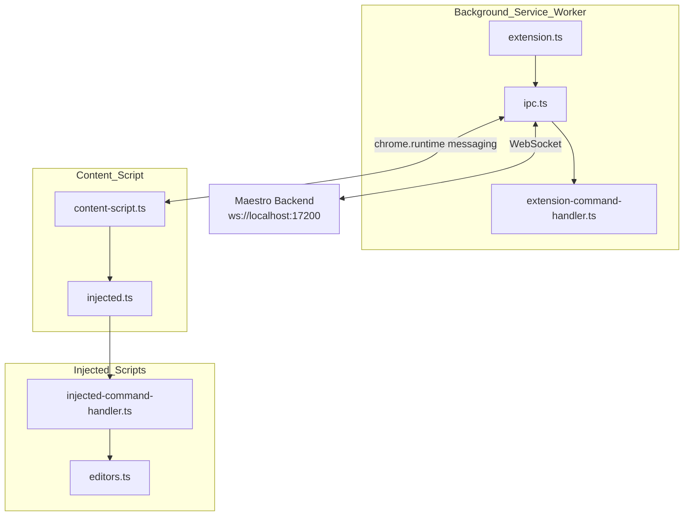

# ArqonMaestro Chrome Extension Technical Specification

**Version:** 2.0 (Major Upgrade - Rebrand from Serenade)  
**Status:** Draft  
**Based on:** https://github.com/serenadeai/chrome (cloned 2026-03-10)

---

## 1. Executive Summary

This document provides the technical specification for the ArqonMaestro Chrome Extension v2.0. This is a major upgrade from the original "Serenade for Chrome" extension, including rebranding to ArqonMaestro and using Chrome's Manifest V3 specification.

### 1.1 Existing Implementation Found

The source code exists at https://github.com/serenadeai/chrome and contains:
- Manifest V3 extension (v2.0.4)
- Full TypeScript source with webpack build
- WebSocket connection to backend at `ws://localhost:17373/`
- Support for Chrome, Edge, and Brave browsers

### 1.2 Goals

- Rebrand from "Serenade" to "ArqonMaestro"
- Update WebSocket port from 17373 to Maestro's port (17200)
- Integrate with ArqonMaestro backend
- Maintain all existing features

---

## 2. Current Architecture (from serenadeai/chrome)

### 2.1 File Structure

```
chrome-extension/
├── manifest.json              # Manifest V3
├── package.json              # Dependencies & build scripts
├── webpack.config.js        # Webpack configuration
├── tsconfig.json            # TypeScript config
├── src/
│   ├── extension.ts          # Background service worker entry
│   ├── ipc.ts               # WebSocket communication
│   ├── extension-command-handler.ts  # Browser API commands
│   ├── content-script.ts     # Content script entry
│   ├── injected.ts           # Injected script entry
│   ├── injected-command-handler.ts  # Page content commands
│   ├── editors.ts            # Editor integrations (Ace, CodeMirror, Monaco)
│   └── popup.ts              # Popup UI
├── img/
│   ├── icon_default/         # Connected state icons
│   └── icon_disconnected/   # Disconnected state icons
└── build/                   # Compiled output
```

### 2.2 Component Architecture



### 2.3 Key Components

#### extension.ts (Background Service Worker)
- Entry point for the extension
- Manages WebSocket connection via IPC class
- Handles keep-alive for service worker
- Listens to browser events (tab activation, window focus, idle state)
- Detects browser type: Chrome, Edge, Brave

#### ipc.ts (Communication Layer)
- WebSocket client connecting to backend
- Default URL: `ws://localhost:17373/` (needs update to 17200 for ArqonMaestro)
- Routes commands between background and content scripts
- Manages connection state
- Updates toolbar icon based on connection status

#### extension-command-handler.ts (Browser API Commands)
Handles commands that require browser API access:
- `COMMAND_TYPE_CLOSE_TAB` - Close current tab
- `COMMAND_TYPE_CREATE_TAB` - Create new tab
- `COMMAND_TYPE_DUPLICATE_TAB` - Duplicate current tab
- `COMMAND_TYPE_NEXT_TAB` - Switch to next tab
- `COMMAND_TYPE_PREVIOUS_TAB` - Switch to previous tab
- `COMMAND_TYPE_SWITCH_TAB` - Switch to specific tab by index
- `COMMAND_TYPE_RELOAD` - Reload current tab

#### injected-command-handler.ts (Page Content Commands)
Handles commands that interact with page content:
- **Navigation**: `COMMAND_TYPE_BACK`, `COMMAND_TYPE_FORWARD`
- **Click**: `COMMAND_TYPE_CLICK` - Click by text or number
- **Overlays**: `COMMAND_TYPE_SHOW` - Show links/inputs/code overlays
- **Editor**: `COMMAND_TYPE_GET_EDITOR_STATE`, `COMMAND_TYPE_UNDO`, `COMMAND_TYPE_REDO`
- **Scroll**: `COMMAND_TYPE_SCROLL` - Scroll directions or to element
- **DOM**: `COMMAND_TYPE_DOM_FOCUS`, `COMMAND_TYPE_DOM_BLUR`, `COMMAND_TYPE_DOM_CLICK`, `COMMAND_TYPE_DOM_COPY`, `COMMAND_TYPE_DOM_SCROLL`

#### editors.ts (Editor Integrations)
Supports multiple web-based code editors:
- **Ace Editor** - Full implementation
- **CodeMirror** - Full implementation  
- **Monaco Editor** - Full implementation (used in VS Code web)
- **Native Input** - textarea and input elements

Each editor implements:
- `active()` - Check if editor is active
- `getEditorState()` - Get source, cursor, filename
- `setSelection()` - Set text selection
- `setSourceAndCursor()` - Set content and cursor position
- `undo()` / `redo()` - Undo/redo operations

#### popup.ts (Popup UI)
Simple popup with:
- "Show clickables" checkbox
- Documentation link
- Reconnect button

---

## 3. Communication Protocol

### 3.1 WebSocket Connection

```typescript
// Current (Serenade)
const URL = "ws://localhost:17373/";

// Should be updated for ArqonMaestro
const URL = "ws://localhost:17200/";
```

### 3.2 Message Format

```typescript
// Outgoing messages
{ message: "active", data: { app: "chrome", id: "chrome" } }
{ message: "heartbeat", data: { app: "chrome", id: "chrome" } }
{ message: "callback", data: { callback: "...", data: {...} } }

// Incoming messages (from backend)
{ message: "response", data: { response: { execute: { commandsList: [...] } }, callback: "..." } }
```

### 3.3 Command Execution Flow

1. Backend sends command via WebSocket
2. `ipc.ts` receives and parses message
3. Commands routed to appropriate handler:
   - Browser API commands → `extension-command-handler.ts`
   - Page content commands → content script → `injected-command-handler.ts`
4. Handler executes command
5. Result sent back via callback

---

## 4. Overlay System

### 4.1 How It Works

When user says `links`, `inputs`, `code`, or `all`:

1. `COMMAND_TYPE_SHOW` is invoked
2. Selector is built based on element type:
   - `links`: `a, button, summary, [role="link"], [role="button"]`
   - `inputs`: `input, textarea, [role="checkbox"], [role="radio"], label, [contenteditable="true"]`
   - `code`: `pre, code`
   - `all`: combination of above
3. Elements in viewport are found
4. Numbered overlays are rendered

### 4.2 Click-by-Text

When user says `click <text>`:
1. XPath is used to find matching elements
2. If single match: auto-click
3. If multiple matches: show overlays for selection
4. If number is spoken: click corresponding overlay

---

## 5. Rebranding Requirements

### 5.1 Name Changes

| Item | Current (Serenade) | Change To (ArqonMaestro) |
|------|-------------------|--------------------------|
| Extension Name | "Serenade" | "ArqonMaestro" |
| Popup Title | "Serenade for Chrome" | "ArqonMaestro for Chrome" |
| Description | "Code with voice. Learn more at https://serenade.ai." | "Code with voice. Learn more at https://arqon.ai." |
| Package Name | serenade-chrome | arqon-maestro-chrome |

### 5.2 Configuration Changes

| Item | Current | Change To |
|------|---------|-----------|
| WebSocket URL | ws://localhost:17373/ | ws://localhost:17200/ |
| Storage Keys | serenade_* | arqon_* |

### 5.3 Visual Updates

- Update all Serenade logos to ArqonMaestro logos
- Update color scheme to Arqon brand colors
- Update documentation links

### 5.4 Files to Modify

1. `manifest.json` - Name, description
2. `package.json` - Name, repository, bugs URL
3. `src/extension.ts` - App name detection (add "arqon")
4. `src/ipc.ts` - WebSocket URL
5. `src/popup.ts` - Documentation URL
6. `img/*` - Icons with Arqon branding
7. All source code comments referring to "Serenade"

---

## 6. Implementation Plan

### Phase 1: Rebranding (Week 1)

- [ ] Copy chrome-extension source to this repository
- [ ] Update manifest.json with ArqonMaestro branding
- [ ] Update package.json
- [ ] Update WebSocket URL from 17373 to 17200
- [ ] Update all Serenade references to ArqonMaestro
- [ ] Replace icons with Arqon branding

### Phase 2: Integration (Week 2)

- [ ] Connect to ArqonMaestro backend
- [ ] Test WebSocket communication
- [ ] Verify command routing
- [ ] Test tab management commands
- [ ] Test overlay system

### Phase 3: Testing (Week 3)

- [ ] Test with Ace Editor
- [ ] Test with CodeMirror
- [ ] Test with Monaco Editor
- [ ] Test native inputs/textareas
- [ ] Test scroll commands
- [ ] Test click-by-text

### Phase 4: Deployment (Week 4)

- [ ] Update version in manifest.json
- [ ] Build extension
- [ ] Package for Chrome Web Store
- [ ] Submit for review

---

## 7. Command Reference

### Browser Commands (Background)

| Command | Function |
|---------|----------|
| `COMMAND_TYPE_CLOSE_TAB` | Close current tab |
| `COMMAND_TYPE_CREATE_TAB` | Create new tab |
| `COMMAND_TYPE_DUPLICATE_TAB` | Duplicate current tab |
| `COMMAND_TYPE_NEXT_TAB` | Switch to next tab |
| `COMMAND_TYPE_PREVIOUS_TAB` | Switch to previous tab |
| `COMMAND_TYPE_SWITCH_TAB` | Switch to specific tab |
| `COMMAND_TYPE_RELOAD` | Reload page |

### Page Commands (Injected)

| Command | Function |
|---------|----------|
| `COMMAND_TYPE_BACK` | Navigate back |
| `COMMAND_TYPE_FORWARD` | Navigate forward |
| `COMMAND_TYPE_CLICK` | Click element by text or number |
| `COMMAND_TYPE_SHOW` | Show element overlays |
| `COMMAND_TYPE_CANCEL` | Clear overlays |
| `COMMAND_TYPE_GET_EDITOR_STATE` | Get editor content |
| `COMMAND_TYPE_UNDO` | Undo last action |
| `COMMAND_TYPE_REDO` | Redo last action |
| `COMMAND_TYPE_SCROLL` | Scroll page |
| `COMMAND_TYPE_SELECT` | Select text |

---

## 8. Technical Details

### 8.1 Dependencies

```json
{
  "dependencies": {
    "findandreplacedomtext": "^0.4.6",
    "uuid": "^8.3.2"
  },
  "devDependencies": {
    "@types/chrome": "^0.0.174",
    "@types/uuid": "^8.3.3",
    "copy-webpack-plugin": "^11.0.0",
    "ts-loader": "^9.2.6",
    "typescript": "^4.5.4",
    "webpack": "^5.65.0",
    "webpack-cli": "^4.9.1"
  }
}
```

### 8.2 Build Commands

```bash
npm install        # Install dependencies
npm run build      # Build for development
npm run watch      # Watch mode
npm run dist       # Build for production + create zip
```

### 8.3 Browser Support

- Chrome 100+
- Edge 100+
- Brave 1.0+

---

## 9. Related Documentation

- [Browser Getting Started Guide](../../browser/getting-started.md)
- [Browser Navigation Commands](../../browser/navigation.md)
- [Links and Inputs Documentation](../../browser/links-and-inputs.md)
- [VS Code Extension](../vscode/SPEC.md)
- [Maestro Protocol Overview](../../development/protocol-overview.md)
- [Rebranding Guide](../../../REBRANDING.md)

---

*Document Version: 2.0*  
*Based on: https://github.com/serenadeai/chrome*  
*Last Updated: 2026-03-10*
