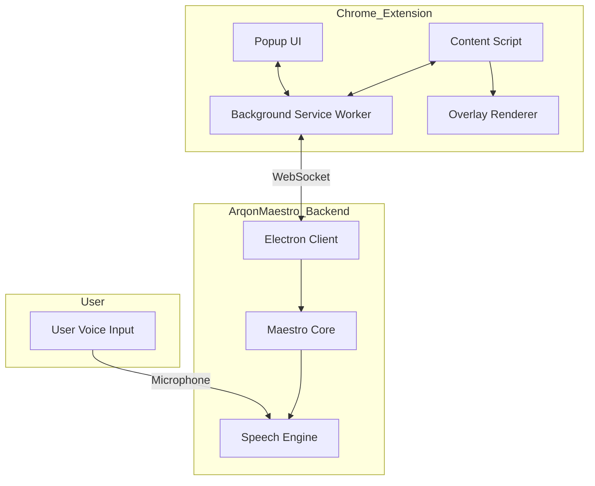
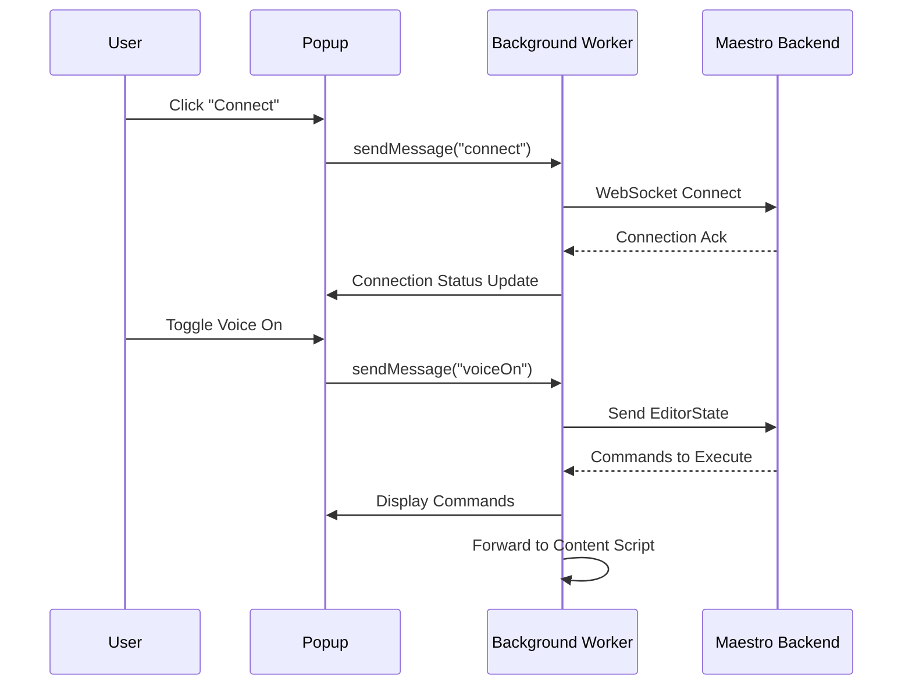

# ArqonMaestro Chrome Extension Technical Specification

**Version:** 2.0 (Major Upgrade)  
**Status:** Draft  
**Last Updated:** 2026-03-10

---

## 1. Executive Summary

This document provides the technical specification for the ArqonMaestro Chrome Extension v2.0. This is a major upgrade from the original "Serenade for Chrome" extension, rebrand to ArqonMaestro, and includes significant architectural improvements using Chrome's Manifest V3 specification.

### 1.1 Goals

- Provide voice-controlled browser workflows for ArqonMaestro users
- Enable hands-free web navigation, form filling, and content interaction
- Integrate seamlessly with the ArqonMaestro backend via WebSocket
- Support multi-monitor and complex web application workflows

### 1.2 Scope

| In Scope | Out of Scope |
|----------|--------------|
| Chrome Browser (desktop) | Firefox/Safari/Edge extensions |
| Manifest V3 | Mobile browsers |
| WebSocket communication | Browser-specific mobile features |
| Voice command overlay system | Native messaging to other apps |

---

## 2. Architecture Overview

### 2.1 System Context



### 2.2 Component Interactions

| Component | Responsibility | Communication |
|-----------|----------------|---------------|
| **Popup** | Quick toggle, status display | chrome.runtime.sendMessage |
| **Background Worker** | WebSocket connection, state management | chrome.runtime.connect |
| **Content Script** | DOM manipulation, overlays | DOM events, messaging |
| **Maestro Backend** | Speech processing, command execution | WebSocket (ws) |

---

## 3. Extension Structure

### 3.1 File Layout

```
chrome-extension/
├── manifest.json              # Extension manifest (V3)
├── _locales/
│   └── en/
│       └── messages.json      # Localized strings
├── popup/
│   ├── popup.html            # Extension popup UI
│   ├── popup.css             # Popup styles
│   └── popup.js              # Popup logic
├── background/
│   ├── background.js         # Service worker entry
│   ├── websocket.js          # WebSocket manager
│   └── state.js              # State management
├── content/
│   ├── content.js            # Main content script
│   ├── overlays.js           # Link/input overlay system
│   ├── clicks.js             # Click-by-text logic
│   └── dom.js                # DOM utilities
├── shared/
│   ├── protocol.js            # Message protocol definitions
│   └── constants.js          # Shared constants
├── icons/
│   ├── icon16.png
│   ├── icon32.png
│   ├── icon48.png
│   └── icon128.png
└── styles/
    └── overlays.css           # Overlay styling
```

### 3.2 Manifest V3 Configuration

```json
{
  "manifest_version": 3,
  "name": "ArqonMaestro for Chrome",
  "version": "2.0.0",
  "description": "Voice control for Chrome - Write code and browse the web with voice",
  "default_locale": "en",
  "icons": {
    "16": "icons/icon16.png",
    "32": "icons/icon32.png",
    "48": "icons/icon48.png",
    "128": "icons/icon128.png"
  },
  "action": {
    "default_popup": "popup/popup.html",
    "default_icon": {
      "16": "icons/icon16.png",
      "32": "icons/icon32.png"
    }
  },
  "background": {
    "service_worker": "background/background.js",
    "type": "module"
  },
  "content_scripts": [
    {
      "matches": ["<all_urls>"],
      "js": ["content/content.js"],
      "css": ["styles/overlays.css"],
      "run_at": "document_idle"
    }
  ],
  "permissions": [
    "activeTab",
    "tabs",
    "storage",
    "nativeMessaging"
  ],
  "host_permissions": [
    "<all_urls>"
  ]
}
```

---

## 4. Core Components

### 4.1 Popup UI

The popup provides quick access to essential controls without navigating away from the browser.

#### Features

| Feature | Description |
|---------|-------------|
| **Connection Status** | Shows Maestro backend connection state |
| **Voice Toggle** | Quick on/off switch for voice listening |
| **Listening Indicator** | Visual feedback when voice is active |
| **Current Tab Info** | Display current page title/URL |
| **Settings Link** | Navigate to full Maestro settings |

#### UI Mockup

```
┌─────────────────────────────┐
│  🔊 ArqonMaestro            │
│  ─────────────────────────  │
│  ● Connected                │
│  ─────────────────────────  │
│  [  ON  ]  Listening...    │
│  ─────────────────────────  │
│  Current: GitHub            │
│  ─────────────────────────  │
│  [Settings]                 │
└─────────────────────────────┘
```

### 4.2 Background Service Worker

The background worker manages the WebSocket connection to the Maestro backend and coordinates messages between components.

#### Responsibilities

1. **WebSocket Management**
   - Connect to Maestro backend (default: `ws://localhost:17200`)
   - Handle reconnection with exponential backoff
   - Manage connection state

2. **Message Routing**
   - Forward voice commands from popup to backend
   - Route responses back to appropriate content script
   - Handle broadcast messages for all tabs

3. **State Management**
   - Track connection status
   - Store user preferences
   - Maintain tab-specific state

#### WebSocket Protocol

```javascript
// Connection URL
const WS_URL = 'ws://localhost:17200';

// Message types
const MessageType = {
  // Outgoing
  EDITOR_STATE: 'editorState',
  COMMAND: 'command',
  PING: 'ping',
  
  // Incoming
  RESPONSE: 'response',
  TRANSCRIPT: 'transcript',
  PONG: 'pong',
  ERROR: 'error'
};

// Editor state payload
const editorState = {
  url: window.location.href,
  title: document.title,
  domain: window.location.hostname,
  language: 'html', // or detect from content-type
  tabs: await chrome.tabs.query({})
};
```

### 4.3 Content Script

The content script runs in the context of web pages and handles DOM interactions.

#### Responsibilities

1. **Overlay System**
   - Render numbered overlays on links and inputs
   - Highlight interactive elements
   - Handle element selection

2. **Click-by-Text**
   - Find elements matching spoken text
   - Handle fuzzy matching
   - Support dynamic content

3. **Form Interaction**
   - Focus and fill form fields
   - Submit forms
   - Handle complex input types

4. **Page Analysis**
   - Detect page structure
   - Identify interactive elements
   - Build element indexes

---

## 5. Voice Commands

### 5.1 Command Categories

#### Navigation Commands

| Command | Action | Example |
|---------|--------|---------|
| `focus chrome` | Bring Chrome to foreground | `focus chrome` |
| `new tab` | Open new tab | `new tab` |
| `close tab` | Close current tab | `close tab` |
| `open <site>` | Navigate to URL | `open github.com` |
| `go back` | Navigate back | `go back` |
| `go forward` | Navigate forward | `go forward` |
| `reload` | Refresh page | `reload` |
| `switch to tab <n>` | Switch to tab number | `switch to tab 3` |
| `close tab <n>` | Close specific tab | `close tab 2` |

#### Interaction Commands

| Command | Action | Example |
|---------|--------|---------|
| `links` | Show link overlay | `links` |
| `inputs` | Show input overlay | `inputs` |
| `<number>` | Select numbered element | `one`, `two`, `three` |
| `click <text>` | Click element by text | `click submit button` |
| `type <text>` | Type into focused field | `type hello world` |
| `press enter` | Submit form | `press enter` |
| `press tab` | Move focus | `press tab` |

#### Selection Commands

| Command | Action | Example |
|---------|--------|---------|
| `select all` | Select all content | `select all` |
| `copy` | Copy selection | `copy` |
| `paste` | Paste clipboard | `paste` |
| `undo` | Undo last action | `undo` |
| `redo` | Redo last action | `redo` |

### 5.2 Overlay System

When users say `links` or `inputs`, the extension displays numbered overlays on interactive elements.

#### Overlay Behavior

1. **Activation**
   - User speaks command
   - Content script scans page
   - Overlays appear with numbers

2. **Selection**
   - User speaks number (e.g., `one`, `two`, `3`)
   - Corresponding element is activated
   - Overlays dismiss

3. **Dismissal**
   - User speaks `cancel` or `escape`
   - Click outside overlay
   - Wait 30 seconds timeout

#### Overlay Styling

```css
.arqon-overlay {
  position: absolute;
  background: rgba(231, 177, 67, 0.95);
  color: #000;
  font-size: 14px;
  font-weight: 600;
  padding: 4px 8px;
  border-radius: 4px;
  z-index: 2147483647;
  pointer-events: none;
  box-shadow: 0 2px 8px rgba(0,0,0,0.3);
}

.arqon-overlay-number {
  font-size: 16px;
  font-weight: 700;
}
```

### 5.3 Click-by-Text

The extension can find and click elements based on visible text.

#### Algorithm

1. Tokenize spoken text
2. Build XPath expressions for text matching
3. Score elements by relevance
4. Click highest-scoring match

#### Supported Elements

- `<a>` links
- `<button>` elements
- `<input type="submit">`
- Elements with `role="button"`
- Clickable `<div>` and `<span>` elements

---

## 6. Communication Protocol

### 6.1 WebSocket Message Format

All messages use JSON format:

```typescript
interface MaestroMessage {
  type: string;
  id?: string;
  payload: any;
  timestamp: number;
}

// Example: Editor State Update
{
  "type": "editorState",
  "id": "msg_123",
  "payload": {
    "url": "https://github.com/user/repo",
    "title": "GitHub",
    "domain": "github.com",
    "language": "markdown",
    "source": "<html>...</html>",
    "tabs": [
      { "id": 1, "title": "GitHub", "active": true },
      { "id": 2, "title": "Stack Overflow", "active": false }
    ]
  },
  "timestamp": 1709999999999
}

// Example: Command Response
{
  "type": "response",
  "id": "msg_123",
  "payload": {
    "success": true,
    "commands": [
      { "type": "CLICK", "id": "submit-btn" }
    ]
  },
  "timestamp": 1709999999999
}
```

### 6.2 Connection Flow



---

## 7. Rebranding Requirements

### 7.1 Name Changes

| Original | New | Notes |
|----------|-----|-------|
| Serenade for Chrome | ArqonMaestro for Chrome | Extension name |
| Serenade | ArqonMaestro | All UI references |
| serenade-* | arqon-* | Storage keys |
| serenade.ai | arqon.ai | URLs (when available) |

### 7.2 Visual Updates

| Element | Current | Updated |
|---------|---------|---------|
| Icon | Serenade logo | ArqonMaestro logo |
| Colors | Serenade brand | Arqon brand (#e7b143 primary) |
| Popup Header | Serenade | ArqonMaestro |
| Status Text | "Serenade" | "ArqonMaestro" |

### 7.3 Storage Keys

```javascript
// Old keys (to migrate)
const OLD_KEYS = {
  connected: 'serenade_connected',
  listening: 'serenade_listening',
  settings: 'serenade_settings'
};

// New keys
const NEW_KEYS = {
  connected: 'arqon_connected',
  listening: 'arqon_listening', 
  settings: 'arqon_settings',
  endpoint: 'arqon_endpoint'
};
```

### 7.4 Migration Strategy

1. On extension load, check for old storage keys
2. Copy values to new keys
3. Notify user of rebranding
4. Mark migration complete in storage

---

## 8. Technical Requirements

### 8.1 Browser Support

| Browser | Minimum Version |
|---------|-----------------|
| Chrome | 100+ |
| Edge | 100+ |
| Brave | 1.0+ |

### 8.2 Dependencies

| Package | Purpose | Version |
|---------|---------|---------|
| ws | WebSocket client | ^8.0.0 |

### 8.3 Network Requirements

| Requirement | Specification |
|-------------|---------------|
| Backend URL | `ws://localhost:17200` (default) |
| Connection Type | WebSocket |
| Reconnection | Exponential backoff (1s, 2s, 4s, 8s, max 30s) |
| Timeout | 30 seconds |

---

## 9. Security Considerations

### 9.1 Permissions

| Permission | Reason |
|------------|--------|
| `activeTab` | Access current tab for overlays |
| `tabs` | Tab management commands |
| `storage` | Persist user settings |
| `<all_urls>` | Page content analysis |

### 9.2 Content Security

- No external script execution in content scripts
- Sanitize all text before rendering overlays
- Validate WebSocket messages before processing

---

## 10. Implementation Phases

### Phase 1: Foundation (Week 1)

- [ ] Create extension directory structure
- [ ] Implement manifest.json (V3)
- [ ] Build popup UI with connection status
- [ ] Set up background service worker skeleton
- [ ] Implement WebSocket connection manager

### Phase 2: Core Features (Week 2)

- [ ] Content script DOM utilities
- [ ] Basic overlay system
- [ ] Click-by-text functionality
- [ ] Tab management commands
- [ ] Navigation commands

### Phase 3: Integration (Week 3)

- [ ] Connect to Maestro protocol
- [ ] EditorState synchronization
- [ ] Command execution flow
- [ ] Error handling and logging

### Phase 4: Polish (Week 4)

- [ ] ArqonMaestro branding
- [ ] User preferences
- [ ] Testing and validation
- [ ] Documentation
- [ ] Chrome Web Store submission

---

## 11. API Reference

### 11.1 Chrome Runtime Messages

```typescript
// From Popup to Background
chrome.runtime.sendMessage({
  action: 'connect' | 'disconnect' | 'voiceOn' | 'voiceOff',
  payload?: any
});

// From Background to Popup
chrome.runtime.sendMessage({
  action: 'statusUpdate',
  payload: {
    connected: boolean,
    listening: boolean,
    error?: string
  }
});

// From Background to Content Script
chrome.tabs.sendMessage(tabId, {
  action: 'showOverlays' | 'hideOverlays' | 'executeCommand',
  payload: any
});
```

### 11.2 Storage API

```typescript
// Save settings
await chrome.storage.local.set({
  arqon_endpoint: 'ws://localhost:17200',
  arqon_listening: false,
  arqon_theme: 'light'
});

// Load settings
const settings = await chrome.storage.local.get([
  'arqon_endpoint',
  'arqon_listening', 
  'arqon_theme'
]);
```

---

## 12. Testing Checklist

### 12.1 Functional Tests

- [ ] Extension installs without errors
- [ ] Popup opens and displays status
- [ ] WebSocket connects to backend
- [ ] Voice toggle enables/disables listening
- [ ] Navigation commands work (new tab, close tab, etc.)
- [ ] Overlay system displays on `links`/`inputs`
- [ ] Number selection works
- [ ] Click-by-text finds and clicks elements
- [ ] Form filling works
- [ ] Tab switching works

### 12.2 Edge Cases

- [ ] Offline mode handling
- [ ] Backend not running scenario
- [ ] Invalid URL navigation
- [ ] Overlay on complex pages (SPAs)
- [ ] Multiple monitors
- [ ] Extension update flow

---

## 13. Related Documentation

- [Browser Getting Started Guide](../../browser/getting-started.md)
- [Browser Navigation Commands](../../browser/navigation.md)
- [Links and Inputs Documentation](../../browser/links-and-inputs.md)
- [VS Code Extension](./vscode/SPEC.md)
- [Maestro Protocol Overview](../../development/protocol-overview.md)
- [Rebranding Guide](../../../REBRANDING.md)

---

## 14. Appendix

### A. Error Codes

| Code | Meaning | Action |
|------|---------|--------|
| `WS001` | Connection failed | Show "Not Connected" status |
| `WS002` | Connection lost | Auto-reconnect with backoff |
| `WS003` | Timeout | Retry connection |
| `CMD001` | Invalid command | Show error in overlay |
| `CMD002` | Element not found | Show "Not found" message |

### B. Keyboard Shortcuts

| Shortcut | Action |
|----------|--------|
| Ctrl+Shift+V | Toggle voice |
| Escape | Dismiss overlays |

### C. Glossary

| Term | Definition |
|------|------------|
| Overlay | Numbered badge on interactive elements |
| Content Script | JavaScript running in page context |
| Service Worker | Background script (Manifest V3) |
| EditorState | Page context sent to Maestro |

---

*Document Version: 2.0*  
*Next Review: After Phase 1 completion*
