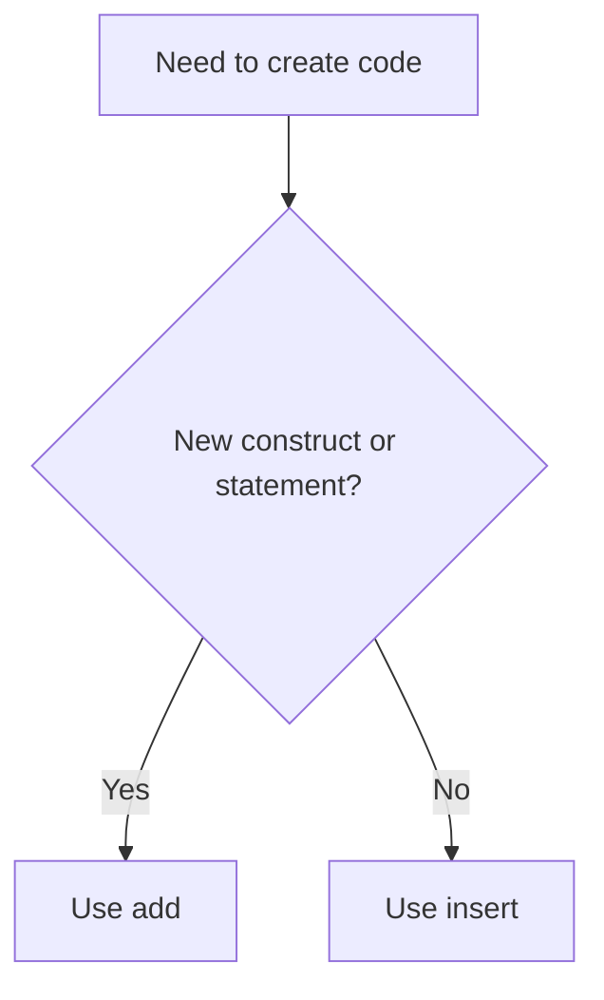

# Adding And Inserting Code

Arqon Maestro gives you two primary ways to create code:

- `add`
- `insert`

Use the right one and the system feels fast. Use the wrong one and you end up fighting cursor placement.

> Video placeholder: add vs insert side-by-side examples.

## `add`: Create Structured Code

Use `add` when you want Maestro to generate a new statement or construct in the logical place nearest the cursor.

Examples:

- `add function factorial`
- `add parameter number`
- `add if number equals zero`
- `add return 1`
- `add else`
- `add let value equals factorial of five`

## `insert`: Place Text At The Cursor

Use `insert` when the surrounding structure already exists and you want to place text inside it.

Examples:

- `insert plus name`
- `insert equals value plus one`
- `insert capital welcome to my page`

## Practical Rule

## Why `add` Feels Smarter

`add` often handles:

- statement boundaries
- indentation
- boilerplate
- punctuation
- common language formatting

That is why commands like `add function factorial` are more efficient than manually dictating braces, parentheses, and line breaks.

## Good Patterns

- create the skeleton with `add`
- refine details with `insert`
- use `change` for corrections
- use `type` when exact literal output matters more than structure
