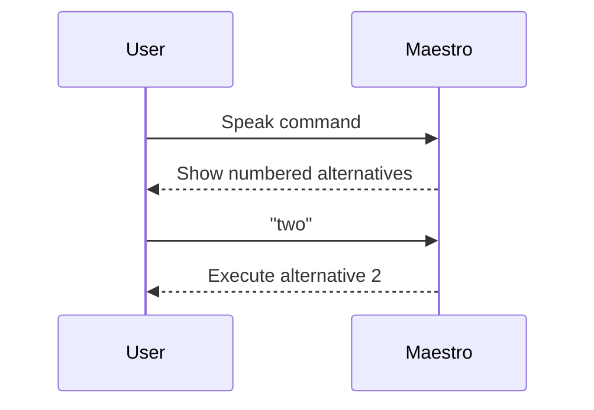

# Alternatives And Corrections

Arqon Maestro does not execute blindly. It surfaces multiple possible interpretations of what you said, then lets you choose the right one.

> Video placeholder: alternatives list and correction flow.

## How Alternatives Work

- Maestro shows a numbered list of possible commands.
- The first valid command usually runs automatically.
- You can choose another command by saying its number.

Examples:

- `two`
- `three`
- `use 2`

## Why This Matters

Alternatives are the safety layer between speech ambiguity and action execution.

They help when:

- a selector was misheard
- formatting was inferred incorrectly
- the wrong app element was targeted
- you want a different interpretation without re-speaking the whole command

## Correction Toolkit

Use these patterns first:

- `undo`
- say the numbered alternative
- restate with a more specific selector
- switch to `type` for exact text

## UI Signals

The alternatives window also indicates:

- partial interpretations still in progress
- highlighted executed command
- invalid or unusable alternatives

## Selection Flow

## Settings That Affect The Experience

`Settings > General` and `Settings > Advanced` expose controls for:

- compact UI
- auto-hiding alternatives
- maximum alternatives shown
- reversed ordering when the list appears above the window
- command wait time

Those settings matter if you want faster feedback or cleaner overlays.
