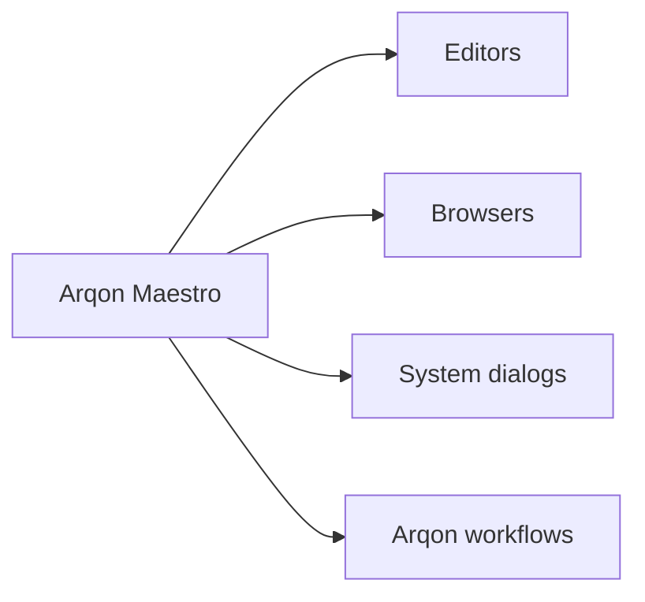

# Application Control

Arqon Maestro is not limited to code editing. It is also a voice control surface for browsers, windows, and general application flow across the Arqon ecosystem.

> Video placeholder: browser and system control.

## Focus Matters

Maestro routes commands to the application currently in the foreground. The active-app indicator shows what it believes it is controlling.

That means:

- focus the correct window first
- then issue the command

## Browser Commands

Examples:

- `focus chrome`
- `new tab`
- `close tab`
- `open stackoverflow dot com`
- `back`
- `forward`
- `reload`

## Clickable Overlays

For complex pages, Maestro can expose numbered overlays:

- `links`
- `inputs`

Then choose the target by speaking its number:

- `one`
- `two`

## Keyboard And Mouse Style Control

Examples:

- `press enter`
- `press escape`
- `click reverse a string in python`

## Ecosystem Role

This is where the Arqon pivot becomes clear: Maestro is not only a code dictation layer. It is a speech-driven control plane that can move between tools, surfaces, and windows.

## Related Pages

- [Getting Started](getting-started.md)
- [Revision Box and Text Input](revision-box-and-text-input.md)
- [In-App Tutorials](in-app-tutorials.md)
