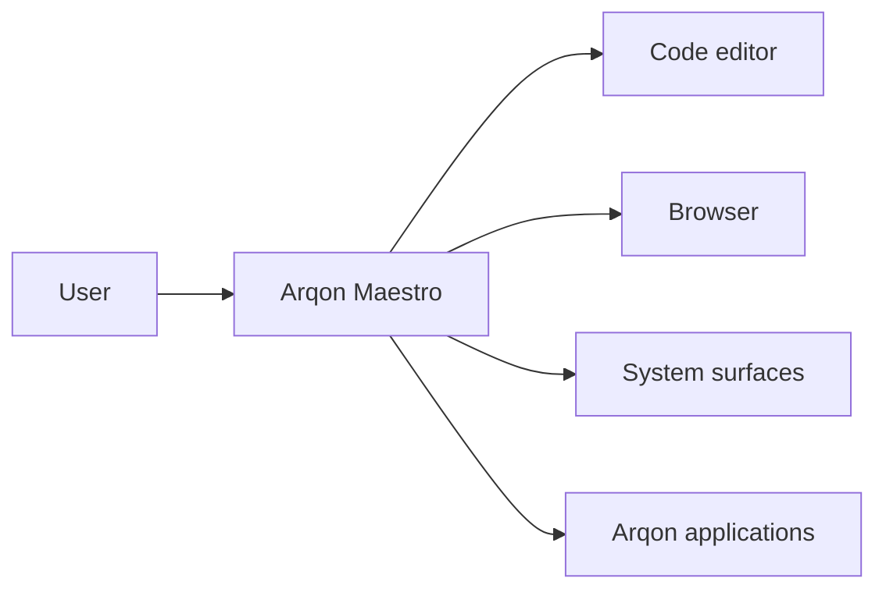

# Browser And System Control

Arqon Maestro is designed to move between code, browser surfaces, and general application workflows. This is a core part of the Arqon ecosystem pivot.

> Video placeholder: browser search, overlays, and system control.

## Browser Navigation

Examples:

- `focus chrome`
- `new tab`
- `close tab`
- `open stackoverflow dot com`
- `back`
- `forward`
- `reload`

## Page Interaction

When a page is dense, ask Maestro to expose numbered targets:

- `links`
- `inputs`

Then choose one:

- `one`
- `two`

## Typing And Submission

Examples:

- `type python reverse string`
- `press enter`

## Clicking By Visible Text

Examples:

- `click reverse a string in python`

## Why This Matters In Arqon

This is not just convenience. It is part of the control-plane model:

- move between tools
- retrieve context
- navigate reference material
- issue commands without breaking flow

## Control Surface Diagram

