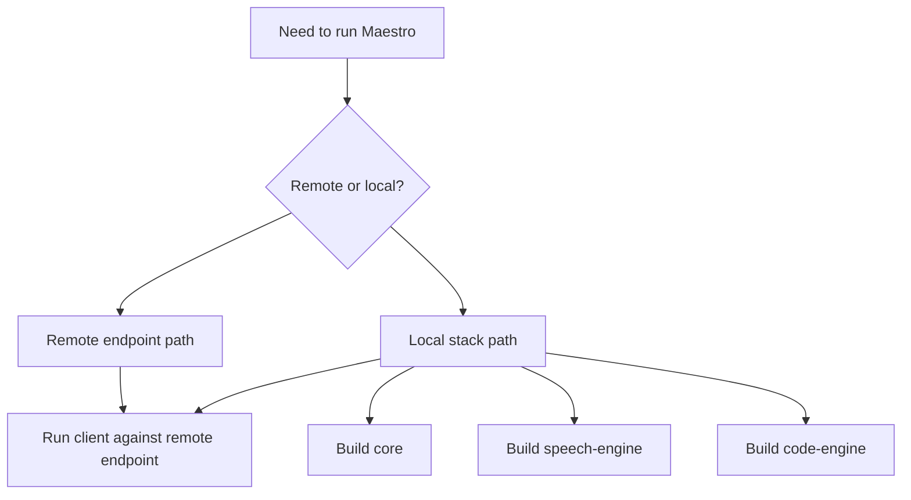

# Building Arqon Maestro

Arqon Maestro is built using the [Gradle](https://gradle.org) build system. We also have a few scripts useful for running various Arqon Maestro services.

## Build and Run Decision Flow

## Why This Matters

Most setup problems come from picking the wrong mode or assuming that `core` alone is enough for full local voice behavior.

## Client

To run the Arqon Maestro app, simply run:

    cd client
    ./bin/dev.py

This will run a local version of the client that uses Arqon Maestro Cloud as the backend.

If you'd instead like the client to connect to a specific endpoint (e.g., a local server you're running yourself), you can run:

    ENDPOINT=http://localhost:17200 ./bin/dev.py

## Service Setup

### Docker

We provide a Dockerfile and Docker Compose file that you can use to set up a Arqon Maestro environment.

#### Images

Docker images are available at [Docker Hub](https://hub.docker.com/u/novelbytelabs). We provide the following images:

* `novelbytelabs/ArqonMaestro`: Contains all of the dependencies needed to run Arqon Maestro as well as train models. (~30GB)
* `novelbytelabs/maestro-gpu`: Contains all of the dependencies needed to run Arqon Maestro as well as train models on a GPU. (~30GB)
* `novelbytelabs/maestro-minimal`: Contains only the dependencies needed to run Arqon Maestro. (~9GB)

If you don't intend to train any models, then you can use the `novelbytelabs/maestro-minimal` image, which is significantly smaller.

You can also build these images yourself.

For the standard image:

    docker build -f config/Dockerfile -t arqon-maestro .

For the GPU image:

    docker build -f config/Dockerfile -t maestro-gpu --build-arg DEVICE_TYPE=gpu .

For the minimal image:

    docker build -f config/Dockerfile -t maestro-minimal --build-arg BUILD_TYPE=minimal .

#### Compose

The provided Docker Compose file sets up ports and mount points to enable you to edit files on a host machine and run Arqon Maestro inside of a container.

To start Docker Compose, run:

    docker compose -f config/docker-compose.yaml up -d

By default, this will use the `novelbytelabs/ArqonMaestro` image. To use a different image, run:

    MAESTRO_IMAGE=novelbytelabs/maestro-minimal docker-compose -f config/docker-compose.yaml up -d

To get a shell in the running container, run:

    docker compose -f config/docker-compose.yaml exec maestro bash

To stop Docker Compose, run:

    docker compose -f config/docker-compose.yaml down --remove-orphans

### System

You can also install Arqon Maestro and its dependencies directly onto your system.

Arqon Maestro uses two canonical environment variables to describe where source code and dependencies live on the filesystem:

- `ARQON_MAESTRO_SOURCE_ROOT`: The location of the engine source tree.
- `ARQON_MAESTRO_LIBRARY_ROOT`: The location of engine dependencies and models.

Legacy `SERENADE_SOURCE_ROOT` and `SERENADE_LIBRARY_ROOT` are still accepted as compatibility fallbacks during the rebrand program.

If you're using a Mac, make sure you're running all of these commands in [Rosetta](https://support.apple.com/en-us/HT211861). Arqon Maestro currently only supports x86-64 architectures, and not arm64.

To install necessary system-wide dependencies onto your system, run:

    scripts/setup/setup-ubuntu.sh
    scripts/setup/setup-mac.sh

Then, to download and build Arqon Maestro libraries and models, run:

    scripts/setup/build-dependencies.sh

As with the Docker image, this will build all of the dependencies needed to run Arqon Maestro as well as train models. To build only the dependencies needed to run Arqon Maestro, you can instead run:

    scripts/setup/build-dependencies.sh --minimal

## Compiling Services

To compile all Arqon Maestro services, from the root directory, run:

    gradle installd

To compile an individual service, like `speech-engine`, run:

    gradle speech-engine:installd

## Running Services

To run all online Arqon Maestro services, you can use the provided script:

    scripts/<engine>/bin/run.py

To run a specific set of services, you can run:

    scripts/<engine>/bin/run.py --service speech-engine --service code-engine

## Running Tests

To run all of the Arqon Maestro tests:

    scripts/<engine>/bin/run.py --tests 'gradle test'

To run tests for a specific service:

    scripts/<engine>/bin/run.py --tests 'gradle core:test'

To run a specific set of tests:

    scripts/<engine>/bin/run.py --tests 'gradle core:test --tests *PythonTest.testAdd*'

To run tests with extra debug output:

    scripts/<engine>/bin/run.py --tests 'gradle core:test -i'

## Client Integration

If you'd like to build your own version Arqon Maestro Local to be used by the client, you can run:

    gradle installd
    gradle client:installServer

Then, when you run the client (following the instructions above) and use the Arqon Maestro Local endpoint, you'll be running the version that you built locally.

## Static Site

To make changes to the documentation site, you can run:

    cd web
    npm install
    npm run dev
