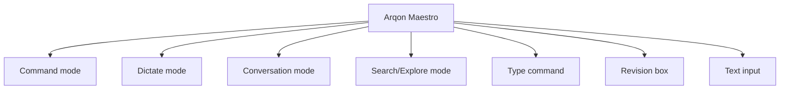

# Command Modes

Arqon Maestro is not a single flat interaction mode. It has multiple operating modes and bridge surfaces depending on whether you want structured commands, free dictation, conversational turns, structured search/exploration, exact text, or an intermediate editor.

> Video placeholder: switching between command mode, dictate mode, and bridge surfaces.

## Primary Modes

- `Command mode`
- `Dictate mode`
- `Conversation mode`
- `Search/Explore mode`
- `Type command workflow`
- `Revision box`
- `Text input`

## Command Mode

This is the default operating model:

- speak a structured command
- Maestro interprets it
- alternatives appear
- the best command executes

## Dictate Mode

The UI exposes a `Dictate` mode indicator. This is for text-first workflows where you want dictated output rather than a command-centric interaction.

Use it when:

- writing prose
- filling text fields
- working in apps without deep structural integration

## Conversation Mode

Conversation mode supports recipient-targeted dialogue turns while preserving lane safety boundaries.

Examples:

- `at nexus what do you think of this strategy`
- `at oracle what is the name of our calculator function`

Notes:

- conversation turns can target `Nexus`, local/remote LLMs, agents, or Oracle-style memory services
- conversation mode does not directly execute operating commands
- explicit control utterances still route through command mode (`switch mode`, `set recipient`, `execute`, `cancel`)

## Search/Explore Mode

Search/Explore mode is for finding and browsing with structured verbs, not direct actuation.

Examples:

- `search architecture docs for command lane`
- `find decision about conversation lane`
- `open the latest lane strategy doc`
- `compare this plan with the previous version`

## `type` As A Lower-Level Escape Hatch

Even in command mode, you can force exact output with `type`.

Example:

- `type output space equals space double quote plus message double quote`

## Bridge Surfaces

When the target app is not a full plugin-aware editor, Maestro can still work through:

- [Revision Box and Text Input](revision-box-and-text-input.md)

## Mode Map

## Settings That Affect Modes

Look in `Settings > Advanced` for:

- automatic revision box behavior
- toggle text input shortcut
- compact UI behavior
- command wait time
- speech and silence strictness
