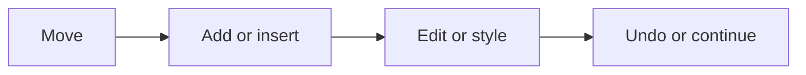

# Common Commands

This page covers the commands most people use first when operating Arqon Maestro day to day.

> Video placeholder: common editing and navigation commands.

## Navigation

- `line 10`
- `go to line 2`
- `go to deposit`
- `start of file`
- `end of function`
- `next line`
- `previous tab`

## Adding Code

- `add function factorial`
- `add parameter number`
- `add if number equals zero`
- `add return 1`
- `add else`
- `add let value equals factorial of five`

## Inserting At The Cursor

- `insert equals value plus one`
- `insert plus name`
- `insert capital welcome to my page`

## Editing Existing Code

- `change word to withdraw`
- `change next plus to minus`
- `change say hello to print greeting`
- `delete line`
- `delete second parameter`
- `undo`

## Copy And Paste

- `copy method`
- `paste`
- `end of method paste`

## Styling And Formatting

- `style file`
- `add all caps min balance equals negative 100`
- `add let snake my second string equals double quotes`
- `add let pascal my third string`

## Browser And System Control

- `focus chrome`
- `new tab`
- `open stackoverflow dot com`
- `links`
- `inputs`
- `click reverse a string in python`
- `press enter`

## Practical Pattern

## Related Pages

- [How Commands Work](how-commands-work.md)
- [Alternatives and Corrections](alternatives-and-corrections.md)
- [Application Control](application-control.md)
