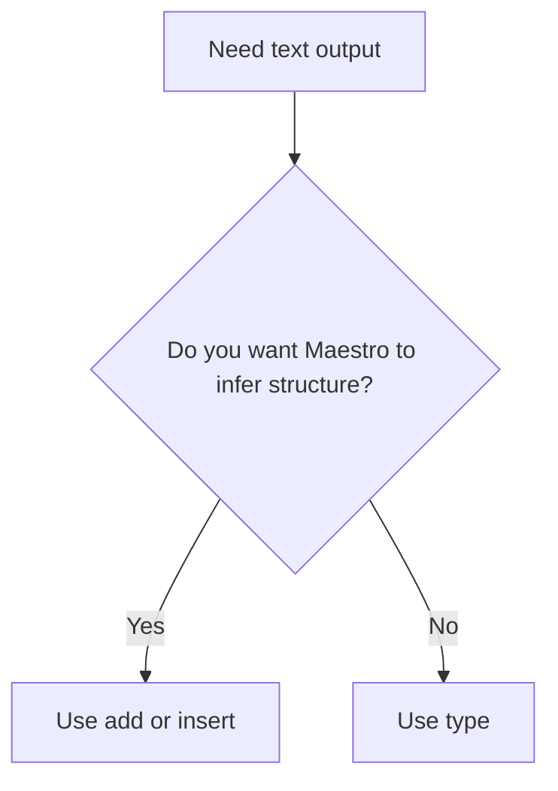

# Dictation And Raw Text

Arqon Maestro is strongest when it can infer structure for you, but sometimes you need exact literal output. This is where raw text workflows matter.

> Video placeholder: structured commands vs literal text entry.

## Three Ways To Produce Text

1. `add` commands
2. `insert` commands
3. `type` commands

## Structured Text: `add`

Use `add` when you want Maestro to place a new statement or construct in a logical location and format it for the current language.

Examples:

- `add let value equals five`
- `add function say hello`
- `add const callback equals lambda of response`

## Cursor-Level Text: `insert`

Use `insert` when the structure already exists and you want to place text exactly at the current cursor.

Examples:

- `insert plus name`
- `insert equals value plus one`
- `insert capital welcome to my page`

## Literal Text: `type`

Use `type` when you want full control over spacing, symbols, or exact output.

Example:

```text
type output space equals space double quote plus message double quote
```

This is the lower-level mode. It is useful when you do not want Maestro to reinterpret formatting on your behalf.

## Formatting Controls

You can explicitly request casing and formatting styles while staying in command mode.

Examples:

- `all caps`
- `camel`
- `pascal`
- `snake`

## Escaping Symbol Names

If you want the literal word instead of the symbol, use `escape`.

Example:

- `add camel value escape plus equals zero`

## Decision Rule



## Where This Matters Most

- punctuation-heavy code
- symbols inside strings
- browser search boxes
- apps without a plugin
- revision-box workflows
