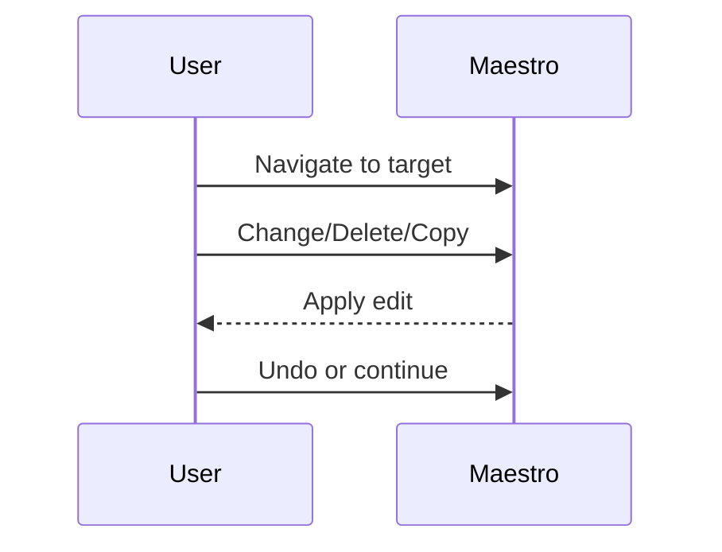

# Editing And Refactoring

Once you can place the cursor reliably, most day-to-day work becomes editing existing material instead of creating new material.

> Video placeholder: editing, replacing, and refactoring with voice.

## Deleting

Examples:

- `delete line`
- `delete second parameter`

Deletion works best when the selector is clear and local.

## Changing

Use `change` when you want to replace existing text or symbols.

Examples:

- `change word to withdraw`
- `change next plus to minus`
- `change say hello to print greeting`

## Copy And Paste

Examples:

- `copy method`
- `paste`
- `end of method paste`

This is one of the highest-leverage workflows because it combines structure-aware selection with command chaining.

## Undo

If the command was wrong, say:

- `undo`

This should be the first recovery move before you attempt a more complex correction.

## Editing Loop

## Refactoring Mindset

Use voice refactoring effectively by working in small steps:

1. navigate to the target
2. rename or delete one thing
3. validate
4. continue

That is more reliable than trying to encode a large conceptual rewrite in one utterance.
