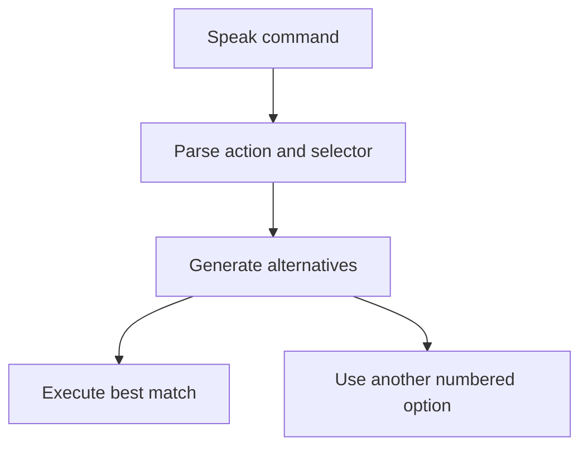

# How Commands Work

Most Arqon Maestro commands are built from two parts:

- an `action`
- a `selector`

> Video placeholder: command anatomy and alternatives walkthrough.

## Core Pattern

```text
<action> <selector>
```

Examples:

- `go to line 10`
- `delete word`
- `copy method`
- `change word to withdraw`
- `add function factorial`

## Actions

Actions describe what you want to do.

Common actions:

- `go to`
- `add`
- `insert`
- `delete`
- `change`
- `copy`
- `paste`
- `press`
- `open`
- `click`
- `focus`

## Selectors

Selectors describe the thing you want to act on.

Common selectors:

- `line`
- `word`
- `function`
- `method`
- `class`
- `parameter`
- `file`
- `tab`
- specific text like `deposit`

## Default Navigation Behavior

Navigation is common enough that many selectors can stand on their own.

Examples:

- `line 2`
- `second method`
- `end of function`
- `start of file`

In those cases, Maestro generally treats the command like a `go to` request.

## Chaining

You can combine commands when the sequence is unambiguous.

Example:

- `end of method paste`

That first navigates, then pastes.

## Command Flow



## When To Use `add` vs `insert`

- `add`: create a new construct or statement in the logical place
- `insert`: place text directly at the cursor

Examples:

- `add function factorial`
- `insert plus name`

## When To Use `change`

Use `change` when something already exists and you want to replace it.

Examples:

- `change word to withdraw`
- `change next plus to minus`
- `change say hello to print greeting`

## When To Drop Lower

If Maestro’s structured formatting is not what you want, use [Dictation and Raw Text](dictation-and-raw-text.md).
