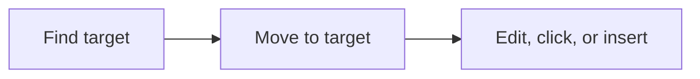

# Navigation And Selection

Voice control becomes usable only when navigation is predictable. Arqon Maestro relies on selectors, positional language, and visible text to move quickly through code and UI surfaces.

> Video placeholder: cursor movement and selector-based navigation.

## Line And Structure Navigation

Examples:

- `line 2`
- `go to line 10`
- `start of file`
- `end of function`
- `second method`

## Text-Based Navigation

You can also navigate to visible text.

Examples:

- `go to deposit`
- `click reverse a string in python`

This matters when line numbers are less useful than nearby symbols or words.

## Default Selector Navigation

Because navigation is frequent, a selector alone is often interpreted as a movement command.

Examples:

- `second method`
- `line 2`

## Selection Strategy

If a target is ambiguous:

- add position: `second method`
- add text: `go to deposit`
- add structure: `delete second parameter`

## Browser Selection

For dense interfaces, Maestro can label interactable elements with overlays.

Commands:

- `links`
- `inputs`

Then choose the target by number:

- `one`
- `two`
- `three`

## Navigation Flow

## Related Pages

- [How Commands Work](how-commands-work.md)
- [Selectors Reference](../reference/selectors.md)
- [Application Control](application-control.md)
