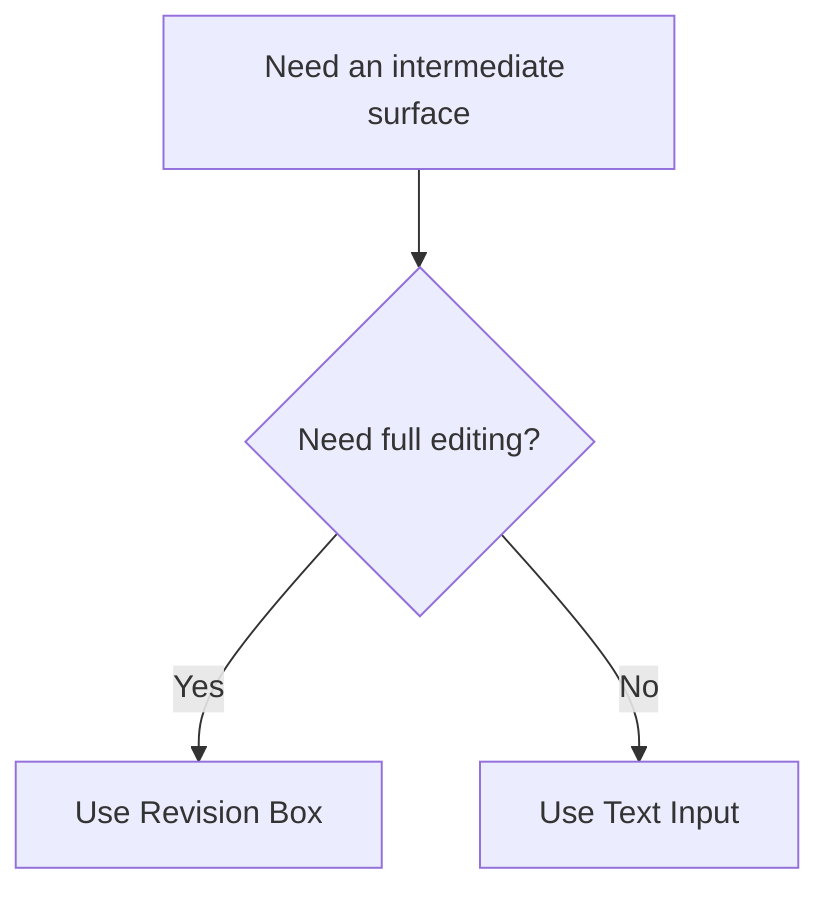

# Revision Box And Text Input

Arqon Maestro includes two bridge surfaces for moving text between windows and applications:

- the `Revision Box`
- the `Text Input` popup

These are especially useful when you are working outside a full editor integration.

> Video placeholder: revision box and text input bridge workflow.

## Revision Box

The Revision Box is a dedicated popup editor that lets you use Maestro’s editing commands even when the target app does not have a plugin.

It supports two modes:

- `Text`
- `Code`

## What The Revision Box Is For

- drafting text before sending it
- editing code without a plugin
- bridging content between windows
- controlling final insertion explicitly

## Revision Box Commands

When you are done, you can say:

- `close` to copy the contents to the active application
- `send` to copy the contents to the active application and press enter
- `copy` to copy the contents to the clipboard
- `cancel` to close the window and discard the content

## Text Input Popup

The Text Input popup is a lightweight field for typing directly into Maestro, then submitting that text as a request with alternatives.

Behavior:

- `Enter` submits the request
- `Esc` hides the popup
- submitted text can still produce alternatives

The shortcut for this popup is configured in `Settings > Advanced > Toggle text input`.

## When To Use Which

## Automatic Revision Box Behavior

In `Settings > Advanced`, you can enable automatic revision-box behavior for applications without a plugin.

That makes Maestro more usable as a general ecosystem control layer instead of only an editor-bound tool.
