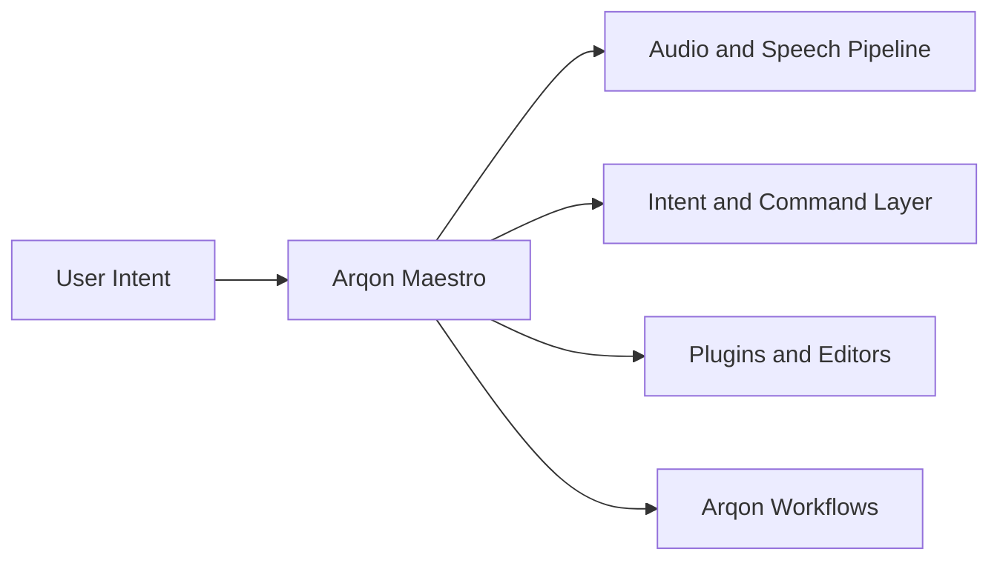

# Arqon Maestro Docs

Arqon Maestro is the voice-first control layer for the Arqon ecosystem.

These docs exist to explain what Maestro is, how it fits into Arqon, what parts of the system are working today, and where the remaining modernization effort is focused.

## What Maestro Is

Arqon Maestro provides a natural-language interface for:

- coding
- navigation
- tool control
- workflow execution
- voice-driven interaction across Arqon systems

It is part of a broader ecosystem design in which voice acts as a practical control plane.

## What This Documentation Covers

- the current architectural direction
- major technical decisions
- modernization status by subsystem
- the role of Maestro inside the Arqon ecosystem

## Start Here

- [Maestro Master Plan](overview/maestro-master-plan.md): canonical roadmap for short-, mid-, and long-term direction
- [Getting Started](guides/getting-started.md): launch Maestro and issue your first commands
- [How Commands Work](guides/how-commands-work.md): understand action, selector, alternatives, and chaining
- [Revision Box and Text Input](guides/revision-box-and-text-input.md): use bridge surfaces between apps
- [Decision Log](decision-log.md): key decisions and rationale
- [Modernization Matrix](modernization-matrix.md): current status of major modules and priorities
- [Maestro In Arqon](overview/ecosystem.md): how Maestro fits the larger ecosystem

## Current Focus

The current work in this repository is centered on:

- short-term transition toward a new operator-facing desktop shell
- extracting shell and runtime boundaries that support Tauri migration
- making two-way voice interaction a flagship product experience
- continuing modernization without overinvesting in legacy shell assumptions

## Documentation Shape

- `Overview`: ecosystem framing and system purpose
- `Guides`: setup and operational entry points
- `Reference`: selectors, formatting, symbols, and usage patterns
- `Architecture`: runtime design and request flow
- `Models`: training and engine internals
- `Operations`: configuration and troubleshooting
- `Development`: extension and implementation guidance
