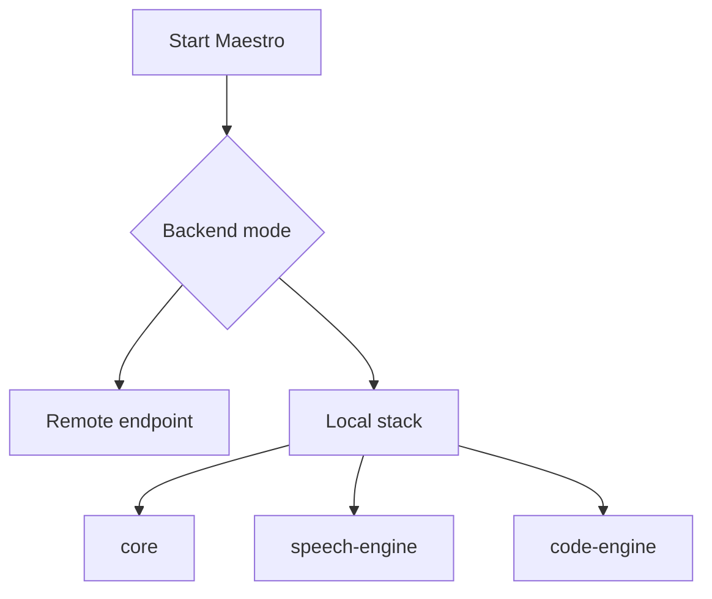

# Configuration

This page summarizes the configuration surfaces that matter most when running Arqon Maestro.

## Main Configuration Areas

- endpoint selection
- local vs remote backend behavior
- microphone selection
- logging
- plugin/editor connectivity

## Runtime Modes

## Important Inputs

- system settings file for active endpoint and token
- user settings file for local preferences and UI behavior
- editor/plugin installation state
- local service availability when using local mode

## Operational Guidance

- prefer the remote path when you need the fastest way to validate the client
- use local mode only when the full local stack is available
- verify microphone input before debugging higher layers
- treat logging and endpoint selection as first checks when diagnosing failures

## Related Docs

- [Building](../guides/building.md)
- [Request Lifecycle](../architecture/request-lifecycle.md)
- [Troubleshooting Map](troubleshooting-map.md)
