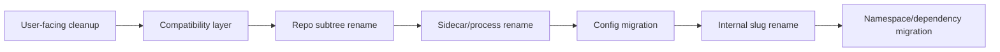

# Rebrand Program

This page is the published progress tracker for the Arqon Maestro full rebrand.

The detailed migration playbook lives at the repo root in `LEGACY_INTERNAL_RENAME_TODO.md`.

This page is the simpler operational dashboard for watching progress in the docs site.

> Video placeholder: rebrand program overview and progress review.

## Program Goal

Complete the migration from inherited `serenade` naming to a coherent `Arqon Maestro` identity across:

- docs
- UI
- config
- repo layout
- process names
- internal slugs
- namespace and dependency identity

## Phase Tracker

| Phase | Name | Risk | Status | Exit Condition |
|---|---|---|---|---|
| 0 | Freeze Scope | Low | `planned` | baseline captured and scope discipline active |
| 1 | User-Facing Cleanup | Low | `planned` | no inherited branding in user-visible docs and UI |
| 2 | Arqon-First Compatibility Layer | Medium | `planned` | Arqon paths/vars are canonical with legacy fallback |
| 3 | Repo Subtree Rename | Medium | `planned` | `serenade/` renamed and path references repaired |
| 4 | Sidecar and Runtime Process Identity | High | `planned` | sidecar/process rename complete without silent failures |
| 5 | Config Storage and Logs Migration | Medium | `planned` | `.arqon` is primary live storage |
| 6 | Safe Internal Slug Rename | Medium | `planned` | remaining safe internal `serenade` names removed |
| 7 | Namespace and Dependency Migration | High | `planned` | deep technical identity migration complete |

## Current Focus

The current focus is:

- preparing the program for phase-based execution
- keeping the plan updated in both source and published docs
- refusing to mix unrelated changes into rebrand phases

## Program Records

Keep these three records updated together:

- `Decision Log`: architectural and compatibility decisions
- `Gotcha Registry`: repeatable traps and migration hazards
- `Rebrand Program`: current phase status and hard-close expectations

## Phase Rules

1. complete one phase at a time
2. verify before moving on
3. close each phase with a hard-close pack
4. do not delete compatibility shims early
5. treat runtime identity changes separately from visible branding changes

## Hard-Close Pack Requirements

Every completed phase must record:

- scope completed
- files changed
- breaking changes introduced
- compatibility shims added or removed
- verification performed
- residual risks
- rollback point
- next phase entry criteria

Use the published template here:

- [Phase Closeout Template](phase-closeout-template.md)

## Status Legend

- `planned`: not started
- `in_progress`: active work
- `blocked`: cannot continue safely yet
- `completed`: hard-close pack finished
- `rolled_back`: phase reverted or partially undone

## Risk Map

## Next Update Rule

Whenever a phase changes state:

- update this page
- update the decision log if a critical decision was made
- update the gotcha registry if a new trap was discovered
- update the detailed strategy document
- create or update the phase closeout record
