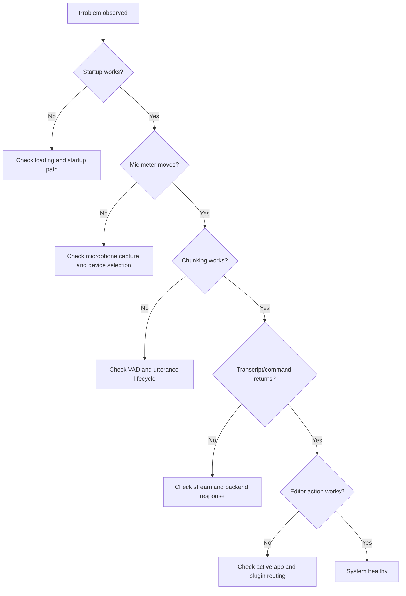

# Troubleshooting Map

Use this page as the top-level decision tree when Arqon Maestro is not behaving correctly.

## Failure Layers

### Startup

Symptoms:

- permanent loading state
- missing controls
- local services never become ready

Primary references:

- [Building](../guides/building.md)
- [Request Lifecycle](../architecture/request-lifecycle.md)

### Audio Capture

Symptoms:

- no meter movement
- no chunk start
- no input activity

Primary references:

- local microphone diagnostics
- client audio implementation

### Streaming and Backend

Symptoms:

- chunk start but no results
- repeated partial behavior
- no final response

Primary references:

- [Request Lifecycle](../architecture/request-lifecycle.md)
- [Model Architecture](../models/model-architecture.md)

### Editor and Tool Routing

Symptoms:

- transcripts appear but no action applies
- wrong app context
- plugin appears disconnected

Primary references:

- active app detection
- plugin routing path

## Principle

Always debug from lower layers to higher layers:

1. startup
2. microphone
3. chunking
4. stream/backend
5. editor/tool execution
