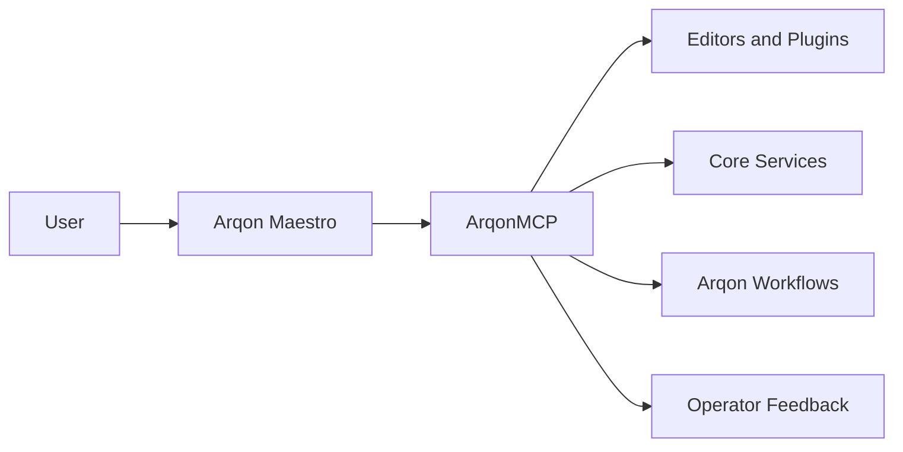
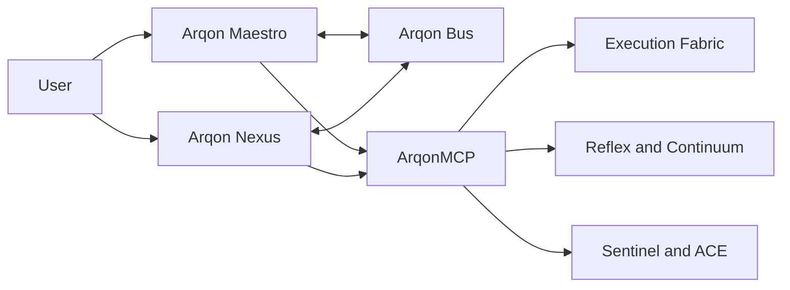

# Maestro In Arqon

Arqon Maestro is the voice-native operating layer of the Arqon ecosystem.

For the canonical roadmap that turns this identity into short-, mid-, and long-term execution waves, see the [Maestro Master Plan](maestro-master-plan.md).

It is not a voice assistant and it is not just a speech UI. It is the layer that turns spoken intent into governed operating action across editors, tools, desktop surfaces, and Bus-connected services.

## Ecosystem Role

Maestro gives Arqon a common pattern for:

- speech capture
- turn-taking and interruption
- spoken operating grammar
- intent binding
- governed routing
- tool, editor, and system execution

## What It Makes Possible

- voice-guided code editing
- realtime command and control without constant context switching
- voice-native operation across multiple Arqon surfaces
- a reusable substrate for future voice-native Arqon systems
- a spoken interface to governed execution rather than a voice wrapper around chat

## Maestro As VOS

The strongest architectural reading is:

- `Arqon` is the AGOrg
- `Arqon Maestro` is an AGO whose identity is the Voice Operating System

Maestro should own:

- voice input and voice output
- wake, barge-in, stop, cancel, and turn-taking
- spoken operating grammar
- dictation versus command mode separation
- handoff into the governed Arqon execution substrate

Maestro should not try to become a generic personal assistant.

Its identity is narrower and stronger:

`Maestro is how Arqon is spoken to.`

## Maestro And Nexus

If Arqon Nexus emerges as the intelligent personal assistant of the ecosystem, the cleanest model is:

- `Maestro = the spoken operating system`
- `Nexus = the intelligent personal assistant`

These should be treated as sibling AGOs, not as one system collapsing into the other.

The healthiest relationship is:

- Maestro owns the voice-operating hot path
- Nexus owns long-horizon assistance, personal context, and agentic guidance
- both ride the Arqon Bus as co-processors
- both expose and consume capability through ArqonMCP

That means:

- Maestro can exist without Nexus
- Nexus can speak and listen through Maestro without owning it
- Nexus should not swallow Maestro's deterministic operating authority

## Co-Processor Model

The strongest concrete model is:

In this model:

- Maestro is the embodiment and operating layer
- Nexus is the assistant and contextual intelligence layer
- Arqon Bus is the shared event spine
- ArqonMCP is the shared command and capability fabric

## Division Of Responsibility

Maestro should dominate:

- wake
- stop
- cancel
- undo
- dictation
- spoken coding commands
- direct app and tool control
- low-latency execution

Nexus should dominate:

- planning
- reminders
- contextual assistance
- personal preference continuity
- long-horizon task support
- coaching and summarization
- proactive suggestions

The clean rule is:

`Nexus proposes. Maestro executes when the action is voice, OS, or tool facing.`

## Why This Is Strategic

Without a shared voice-operating layer, every Arqon tool would have to invent its own speech capture, command routing, turn logic, and execution handoff.

Maestro centralizes that work into one system that can be improved once and reused broadly.

That is why it is better understood as a Voice Operating System than as a feature.
