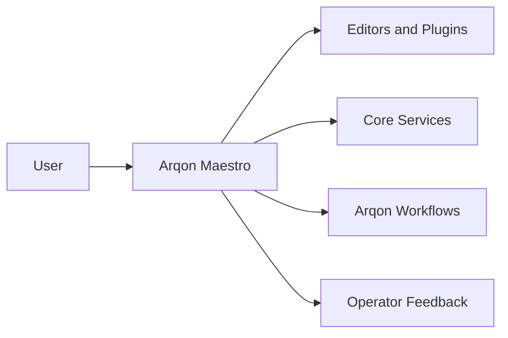

# Maestro In Arqon

Arqon Maestro is the voice-first control layer for the Arqon ecosystem.

It is the system that translates spoken intent into context-aware actions across editors, tools, and workflows. That makes it more than a UI surface. It is an interaction layer shared across the ecosystem.

## Ecosystem Role

Maestro gives Arqon a common pattern for:

- speech capture
- transcript resolution
- intent interpretation
- context-aware routing
- tool and editor execution

## What It Makes Possible

- voice-guided code editing
- workflow execution without constant context switching
- natural-language control across multiple Arqon surfaces
- a reusable foundation for future voice-native Arqon systems

## Why This Is Strategic

Without a shared interaction layer, every Arqon tool would have to invent its own voice model, command routing, and context handling. Maestro centralizes that work into one system that can be improved once and reused broadly.
