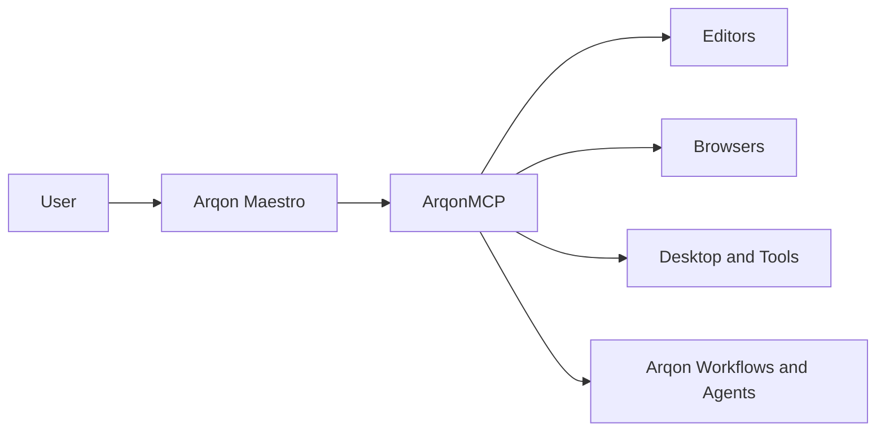
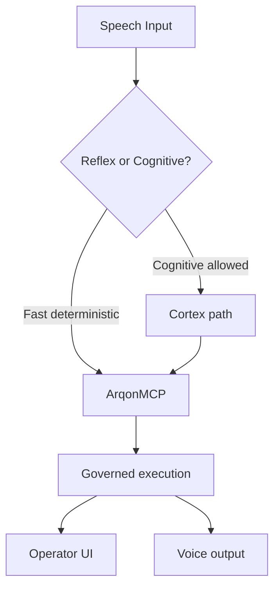
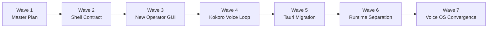

# Maestro Master Plan

This document is the canonical forward-looking roadmap for Arqon Maestro.

Its purpose is to unify the current system reality, the active transition work, and the long-term Voice OS target into one plan aligned with the Arqon ecosystem.

When documents disagree, use this precedence:

1. code and command-output evidence
2. closeout and evidence docs
3. bounded implementation plans
4. this master plan for strategic direction and sequencing

## Core Identity

Arqon Maestro is the **Voice Operating System** AGO for Arqon.

It should not evolve into a generic voice assistant. It should remain the system that turns spoken intent into governed operating action across:

- editors
- browsers
- desktop surfaces
- tools
- Bus-connected services
- future Arqon execution surfaces

The clean ecosystem boundary is:

- Maestro hears, speaks, routes, and operates
- ArqonMCP is the command and capability fabric
- Nexus, if it emerges, remains a sibling assistant AGO rather than swallowing Maestro



## Current Reality

The current repository already proves several important things:

- the desktop app is currently Electron-based
- the desktop UI already includes a React renderer
- the legacy local voice path through `core`, `speech-engine`, and `code-engine` still exists and works
- Arqon Bus integration, address-first routing work, integrity gates, and control-plane coordination already exist in partial or validated form
- the Chrome extension is a working browser control surface
- modernization Waves A-E are complete
- Wave F, the bounded data-plane modernization track, is active

The current product is therefore not hypothetical. It is a working voice-control system with a legacy center of gravity that now needs to transition toward the Voice OS architecture.

## Strategic Thesis

The target architecture is not:

```text
voice stack -> tools
```

It is:

```text
voice ingress plane -> ArqonMCP -> governed execution fabric -> speech / UI response
```

The durable architectural commitments are:

- deterministic execution before agentic escalation
- reflex lane and cognitive lane as separate classes of work
- local-first hot path
- fail-closed integrity for consequential actions
- shell as host, not brainstem
- swappable shell, STT, and TTS
- multi-agent voice identity as a first-class concern



## Roadmap In Waves

The roadmap is organized into seven waves. The first four waves are near-term transition work. The middle waves complete the shell migration and runtime separation. The final wave completes the Voice OS convergence.

### Wave 1: Master Plan And Alignment

Unify the roadmap into one canonical Maestro plan and lock product identity.

Brief summary:

- establish Maestro as the Voice Operating System for Arqon
- reconcile current docs, ambitions, and future architecture into one roadmap
- define truth-source order so strategy does not outrun evidence
- lock the ecosystem boundary: Maestro feeds ArqonMCP and does not become a generic assistant

#### Wave 1 Status

`completed (hard-close)`

Wave 1 published this master plan, aligned the top-level docs around it, and hard-closed the product-identity and roadmap boundary for the next stage of work.

#### Wave 1 Locked Decisions

The following decisions are now treated as locked unless a later explicit decision log entry changes them:

- Maestro is the Voice Operating System AGO for Arqon
- Maestro must not collapse into a generic personal assistant
- Maestro feeds ArqonMCP rather than building a parallel execution fabric
- Electron is a temporary compatibility shell, not the long-term product shell
- Tauri is the intended shell target
- the inherited `core`, `speech-engine`, and `code-engine` stack is compatibility-only for the transition
- the new operator-facing GUI is a top short-term priority
- Kokoro-backed two-way interaction is a flagship short-term milestone

#### Wave 1 Deliverables

- this master plan as the canonical roadmap
- top-level docs updated to point to the master plan
- product identity language aligned around Maestro as the Voice Operating System
- short-, mid-, and long-term direction expressed as seven waves
- the immediate near-term posture made explicit: new GUI first, Electron temporary, Tauri next
- [Wave 1 Evidence](../operations/maestro-master-plan-wave-1-evidence.md)
- [Wave 1 Closeout](../operations/maestro-master-plan-wave-1-closeout.md)

#### Wave 1 Exit Criteria

Wave 1 is complete when all of these are true:

- the master plan is present in the docs and navigation
- top-level docs do not contradict the master plan on identity or direction
- Maestro is consistently described as the voice-native operating layer / Voice Operating System
- the roadmap clearly distinguishes current reality from target architecture
- the short-term plan clearly prioritizes:
  - shell/runtime boundary extraction
  - the new operator GUI
  - Kokoro-backed two-way interaction
  - temporary Electron compatibility rather than deep shell hardening

Wave 1 is now hard-closed for the current cycle.

#### Wave 1 Out Of Scope

Wave 1 does not yet implement:

- the shell contract itself
- the new GUI itself
- the Tauri shell itself
- runtime service extraction beyond what is needed for documentation clarity

### Wave 2: Shell Contract And Operator Model

Define the boundary that the new GUI will depend on.

Brief summary:

- extract a shell/runtime contract from the current Electron app
- define the operator-facing state model: listening, transcript, command state, active app, runtime health, TTS state, and mode
- isolate the minimum shell actions: start and stop, mode changes, settings, history, and runtime status
- make GUI work Tauri-ready before serious UI implementation begins

#### Wave 2 Status

`completed (hard-close)`

Wave 2 introduced a renderer shell contract, moved renderer IPC usage behind that contract, and established the operator-facing model boundary that the next GUI work should depend on.

#### Wave 2 Locked Decisions

The following decisions are now treated as locked unless a later explicit decision log entry changes them:

- the renderer must not depend directly on raw Electron IPC outside the shell adapter
- the current Electron shell remains the active compatibility host during the transition
- the renderer shell contract is the portability seam for future Tauri migration
- operator-facing state and actions should be expressed as shell-facing UI concerns rather than Electron event details
- title bar and window actions should route through the shell contract rather than renderer-owned Electron assumptions

#### Wave 2 Deliverables

- a concrete renderer shell contract under `maestro/client/src/renderer/shell`
- the Electron-backed shell adapter as the only renderer module using direct `ipcRenderer`
- renderer pages and components moved onto the shell API for:
  - listening and chunk-manager control
  - settings and settings-page routing
  - tutorials and NUX flows
  - language switching
  - text input submission
  - mini-mode sizing
  - window state actions
  - local endpoint controls
  - dictate-mode toggling
- [Renderer Shell Contract](../development/renderer-shell-contract.md)
- [Wave 2 Evidence](../operations/maestro-master-plan-wave-2-evidence.md)
- [Wave 2 Closeout](../operations/maestro-master-plan-wave-2-closeout.md)

#### Wave 2 Exit Criteria

Wave 2 is complete when all of these are true:

- raw `ipcRenderer` usage is isolated to the shell adapter layer
- renderer UI components talk to a shell-facing interface rather than Electron directly
- the operator model exposes the current live GUI concerns without inventing fake runtime states
- the current Electron-hosted renderer still uses a compatibility-safe path through the new shell contract
- the next wave can build the GUI on top of this contract rather than coupling new UI work to Electron

Wave 2 is now hard-closed for the current cycle.

#### Wave 2 Out Of Scope

Wave 2 does not yet implement:

- transcript and TTS playback state beyond existing live state exposure
- the Tauri shell itself
- runtime-service extraction beyond the renderer boundary
- the full Wave 3 operator GUI redesign

### Wave 3: New Operator GUI

Build the new primary desktop GUI as the product-facing Maestro shell.

Brief summary:

- design and implement the new operator SPA
- replace the current mini-mode-first feel with a modern main shell
- make the UI clearly show voice state, command state, target/app state, and recent activity
- keep Electron only as a temporary compatibility host if needed

### Wave 4: Two-Way Voice Loop With Kokoro

Make Maestro feel alive and exciting through visible and audible interaction.

Brief summary:

- make Kokoro a flagship short-term experience, not a hidden subsystem
- support speaking to Maestro and hearing it respond back clearly
- surface transcript, interpretation, execution, and spoken-response flow in the GUI
- turn the desktop shell into the first compelling demonstration of Maestro as a Voice OS

### Wave 5: Tauri Migration

Move the new desktop shell from Electron into Tauri.

Brief summary:

- keep the same installed desktop app concept and user experience
- replace the shell technology, not the product identity
- migrate windowing, tray, settings, and IPC hosting into Tauri
- ensure the GUI and runtime contract survive the shell swap with minimal redesign

### Wave 6: Runtime Separation And Transitional Core Reduction

Shift Maestro away from the inherited architecture being the center of gravity.

Brief summary:

- keep the legacy `core`, `speech-engine`, and `code-engine` stack only as a compatibility bridge
- extract hot-path services and runtime contracts around audio, turn-taking, voice ingress, routing, and TTS
- make the shell thin and move runtime-critical logic out of it
- begin centering voice ingress around structured envelopes and governed execution seams

### Wave 7: Voice OS Convergence

Complete the long-term transition to the Arqon-aligned Voice OS architecture.

Brief summary:

- converge on the target service model from the VOS reference architecture
- formalize reflex lane vs cognitive lane routing
- make ArqonMCP the command fabric and governance boundary
- complete the move toward swappable shell, STT, TTS, executor, memory, and multi-agent voice identity
- position Maestro as the reusable spoken operating substrate of the Arqon ecosystem

## Grouping By Horizon

### Short-Term

- Wave 1: Master Plan And Alignment
- Wave 2: Shell Contract And Operator Model
- Wave 3: New Operator GUI
- Wave 4: Two-Way Voice Loop With Kokoro

### Mid-Term

- Wave 5: Tauri Migration
- Wave 6: Runtime Separation And Transitional Core Reduction

### Long-Term

- Wave 7: Voice OS Convergence



## Near-Term Direction

The immediate near-term product direction is:

- build the new primary operator-facing GUI
- make two-way voice interaction a flagship experience
- keep Electron only as a compatibility shell while the new surface lands
- extract a shell/runtime boundary that can survive the move to Tauri

This means the short-term focus is not additional deep hardening of the inherited Electron-era product shell.

It is:

- enough continuity and safety to keep the current product usable
- enough contract extraction to avoid redesigning the GUI later
- enough product polish to make the new shell worth using daily

## Immediate Next Step

The next execution wave after Wave 1 is Wave 2: Shell Contract And Operator Model.

Wave 2 should define the stable shell-facing interface for:

- listening and mode state
- transcript and interpretation state
- command and result history
- runtime health and connection state
- TTS and spoken-response state
- the minimum shell actions needed by the new operator GUI

That shell contract is the gate between roadmap alignment and productive GUI implementation.

## Guardrails

The roadmap should preserve these constraints:

- no full rewrite for architectural purity
- no deep investment in Electron as a long-term shell
- no shell migration that rewrites voice runtime contracts
- no Maestro drift into generic assistant behavior
- no parallel execution fabric beside ArqonMCP
- no roadmap claims that outrun repo evidence

## Default Assumptions

This master plan currently assumes:

- the new GUI is a top short-term priority
- Kokoro-backed two-way interaction is a flagship short-term milestone
- Electron is a temporary compatibility shell
- Tauri is the intended shell target
- the inherited runtime stack is preserved for continuity and migration only, not deep long-term hardening

## Crosswalk To Existing Docs

This master plan does not replace the detailed source documents it draws from.

- [Maestro In Arqon](ecosystem.md): product identity and ecosystem role
- [Arqon Ecosystem Technotes](arqon-ecosystem-technotes.md): broader ecosystem alignment
- [Ultimate VOS Reference Architecture](../architecture/ultimate-vos-reference-architecture.md): target-state architecture
- [Voice Plane Implementation Plan](../voice_plane_implementation_plan.md): proven voice-plane foundations
- [Modernization Matrix](../modernization-matrix.md): current modernization status and prior wave tracking
- [Chrome Extension Tech Note](../extensions/chrome/TECH_NOTE.md): browser execution surface and operator model
