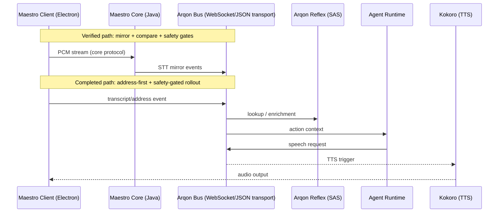

# Voice Plane Implementation Plan

> **IMPORTANT**: This document was out of sync with actual completion status. All 5 gates were hard-closed on 2026-03-10 as documented in `docs/operations/phase-e-evidence.md`. This document has been updated to reflect actual completion status.

Maestro is the interaction layer for Arqon, providing full-duplex speech input/output with measurable latency, safety gates, and rollback-first operations.

## Truth Source Order

When artifacts disagree, use this precedence:

1. **Code + command output evidence**
2. **Closeout/evidence docs** (`docs/operations/*closeout.md`, `*evidence.md`, `walkthrough.md`)
3. **This implementation plan**

No item in this plan may override code reality or command evidence.

## Environment Constraints (Frozen)

- **Runtime**: `conda run -n helios-gpu-118` / `/home/irbsurfer/miniconda3/envs/helios-gpu-118/bin/python`
- **Rust**: `1.82` (pinned)
- **Protobuf**: `4.25.8`
- **Protoc**: `25.8`
- **Policy**: no environment upgrades in this workstream.

## Current Status: ALL GATES HARD-CLOSED ✅

**Completion Date**: 2026-03-10

All 5 gates have been successfully completed with full evidence documentation. See:
- [`docs/operations/phase-e-evidence.md`](/home/irbsurfer/Projects/arqon/ArqonMaestro/docs/operations/phase-e-evidence.md)
- [`docs/operations/phase-e-closeout.md`](/home/irbsurfer/Projects/arqon/ArqonMaestro/docs/operations/phase-e-closeout.md)

### Gate Completion Summary

| Gate | Status | Completion Date | Evidence |
|------|--------|-----------------|----------|
| Gate 1: Comparator Confidence Baseline | ✅ HARD-CLOSED | 2026-03-10 | phase-e-evidence.md |
| Gate 2: Address-First Pivot | ✅ HARD-CLOSED | 2026-03-10 | phase-e-evidence.md |
| Gate 3: Voice Output & Replay | ✅ HARD-CLOSED | 2026-03-10 | phase-e-evidence.md |
| Gate 4: Integrity Handshake | ✅ HARD-CLOSED | 2026-03-10 | phase-e-evidence.md |
| Gate 5: Control-Plane Coordinator | ✅ HARD-CLOSED | 2026-03-10 | phase-e-evidence.md |

### Runtime Safety Defaults (Verified)

- `arqon_bus_enabled`: `false`
- `arqon_bus_shadow_mode`: `true`
- `arqon_bus_cutover_enabled`: `false`
- `arqon_bus_traffic_percentage`: `0`
- `arqon_bus_current_stage`: `"shadow"`

## Architecture Narrative

## Gate Details (Completed)

### Gate 1: Comparator Confidence Baseline ✅

**Status**: HARD-CLOSED (2026-03-10)

**Evidence**:
- Build: `npm run build:main` - exit 0
- Regression: `npx ts-node test-soak.ts` - 10/10 tests passed
- Comparator: Runtime-computed report with mismatch categories

**Key Results**:
- `transcript_match_rate`: 0.33
- `command_match_rate`: 0.5
- `transcript_mismatch`: 2 examples
- `command_mismatch`: 1 example

**Decision Log**: ADM-029

### Gate 2: Address-First Pivot (CFH + AddrId) ✅

**Status**: HARD-CLOSED (2026-03-10)

**Evidence**:
- CFH Parity: `npx ts-node src/main/stt/cfh-parity.ts` - 19/19 exact matches
- Both paths co-exist: `stt.address.query` + `stt.audio.append`

**Key Results**:
- TypeScript CFH matches Rust reflexifier output
- Address-first path wired into live execution

**Decision Log**: ADM-029

### Gate 3: Voice Output and Replay Controls ✅

**Status**: HARD-CLOSED (2026-03-10)

**Evidence**:
- Build: `npm run build:main` - exit 0
- Regression: `ARQON_SOAK_PORT=9103 npx ts-node test-soak.ts` - 14/14 tests passed
- Replay smoke: `npx ts-node test-replay-smoke.ts` - idempotency verified
- Rollback: `npx ts-node test-rollback-gate3.ts` - bus disable isolates voice output

**Key Results**:
- Non-blocking audio playback via aplay
- Replay deduplication working
- Rollback isolation verified

**Decision Log**: ADM-030, ADM-031

### Gate 4: Integrity Handshake (ACE/Anchor) ✅

**Status**: HARD-CLOSED (2026-03-10)

**Evidence**:
- Integration: `npx ts-node test-integrity-smoke.ts` - 4/4 checks passed

**Key Results**:
- `integrity_allow`: ✅
- `integrity_block`: ✅
- `integrity_policy_block`: ✅
- `integrity_default_deny`: ✅ (fail-closed)

**Decision Log**: ADM-032

### Gate 5: Control-Plane Coordinator (SpacetimeDB) ✅

**Status**: HARD-CLOSED (2026-03-10)

**Evidence**:
- Coordinator tests: `npx ts-node src/main/stt/control-plane-coordinator.test.ts` - 4/4 passed
- Smoke: `npx ts-node test-control-plane-smoke.ts` - verified
- Rollback: `npx ts-node test-control-plane-rollback.ts` - verified

**Key Results**:
- Per-agent FIFO + fair-share round-robin
- Idempotency dedupe
- Fail-closed when coordinator unavailable
- Rollback knob preserves Gate 4 behavior

**Decision Log**: ADM-033

### Gate 5 Residual Risks

1. SpacetimeDB integration validated with coordinator contract semantics; production cluster soak and failover drills remain follow-on operational work.
2. Queue fairness and retry behavior validated at test scale; sustained high-contention tuning remains an ops task.

## Future/Research

Roadmap topics remain out of immediate implementation scope unless promoted into an execution gate with explicit evidence requirements:

- Lattice proposal loop
- O(0) skill execution path
- broad HPO tuning loops
- advanced cortex/omega orchestration
- Gate 6 Kokoro Firecracker sidecar operational hard-close

## Rollback Procedure

To rollback to pre-Voice-Plane state:

1. Set `arqon_bus_traffic_percentage = 0`
2. Keep `arqon_bus_cutover_enabled = false`
3. Leave `arqon_bus_enabled = false` to fully disable bus path

## Required Reviewer Questions (Post-Closeout)

1. ✅ What is proven in production-like conditions vs mock-only?
2. ✅ What is the guaranteed rollback path in under 1 minute?
3. ✅ Which evidence directly counters overclaim risk?
4. ✅ Are defaults still conservative at merge time?
5. ✅ Are residual risks explicit and owned?

All questions answered in phase-e-evidence.md.

## Definition of Done (Evidence-Based)

All four pillars satisfied for Gates 1-5:

1. ✅ **Implementation**: no placeholders or stubs in migration-critical paths
2. ✅ **Verification**: executable tests with realistic payloads and session IDs
3. ✅ **Documentation**: updated operation docs aligned with code defaults
4. ✅ **Evidence**: command outputs, telemetry excerpts, and rollback proof

---

**Last Updated**: 2026-03-10
**Status**: Gates 1-5 hard-closed; Gate 6 in progress (Firecracker-only Kokoro)
