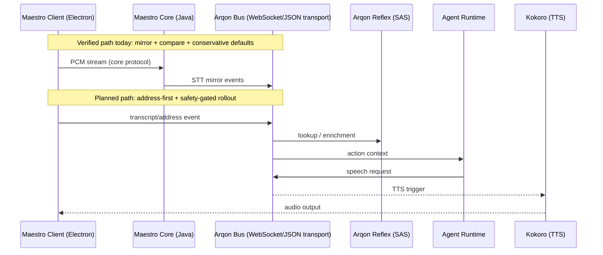

Maestro is the interaction layer for Arqon, providing full-duplex speech input/output with measurable latency, safety gates, and rollback-first operations.

## Truth Source Order

When artifacts disagree, use this precedence:

1. **Code + command output evidence**
2. **Closeout/evidence docs** (`docs/operations/*closeout.md`, `*evidence.md`, `walkthrough.md`)
3. **This implementation plan**

No item in this plan may override code reality or command evidence.

## Environment Constraints (Frozen)

- **Runtime**: `conda run -n helios-gpu-118` / `/home/irbsurfer/miniconda3/envs/helios-gpu-118/bin/python`
- **Rust**: `1.82` (pinned)
- **Protobuf**: `4.25.8`
- **Protoc**: `25.8`
- **Policy**: no environment upgrades in this workstream.

## Current Verified

- STT migration recovery build gate is green (`npm run build:main`).
- Regression harness exists and runs via `npx ts-node test-soak.ts`.
- Conservative defaults are in place (`bus disabled`, `shadow enabled`, `cutover disabled`, `traffic=0`, stage `shadow`).
- Stage promotion requires explicit manual approval in settings/router.
- Evidence docs for Phase E hard-close exist:
  - `docs/operations/phase-e-closeout.md`
  - `docs/operations/phase-e-evidence.md`
  - `docs/operations/walkthrough.md`

## Architecture Narrative (Vision)

Latency language in this plan is target-SLO based (P95/P99), not “zero latency”.

## Next Implementable (Execution Gates)

### Gate 1: Comparator Confidence Baseline

- **Entry criteria**
  - build is green
  - conservative defaults remain in code
- **Deliverables**
  - comparator report with transcript and command match rates
  - mismatch categories with counts and examples
  - command comparison metrics are computed from runtime observations (no fixed success constants)
- **Required commands**
  - `npm run build:main`
  - `npx ts-node test-soak.ts`
- **Hard fail conditions**
  - any red build
  - mock-only pass reported as production validation
  - missing mismatch evidence
  - comparator report contains placeholder or synthetic pass values for command parity
- **Exit evidence**
  - update `docs/operations/phase-e-evidence.md` with command outputs and timestamps
  - include a Gate 1 artifact block for each required command:
    - `command`
    - `timestamp`
    - `exit_code`
    - `key_output`
  - include comparator report excerpt showing:
    - `transcript_match_rate`
    - `command_match_rate` (or explicit `null` with `commands_compared=0`)
    - mismatch category counts + at least one concrete mismatch example per non-zero category
  - include Decision Log entry path and rollback proof path

### Gate 2: Address-First Pivot (CFH + AddrId)

- **Entry criteria**
  - Gate 1 complete with evidence
- **Deliverables**
  - TypeScript CFH implementation that matches Rust reflexifier output
  - envelope support for `addr_id` while preserving existing mirror path
  - client-side SAS precheck with debounce/throttle
  - precheck path actively emits `stt.address.query` via `publishAddressQuery` in runtime flow
- **References**
  - `../ArqonReflex/crates/arqon_core/src/reflexifier.rs`
  - `../ArqonReflex/crates/arqon_core/src/table.rs`
  - `../ArqonMaestro/maestro/client/src/main/stt/envelopes.ts`
- **Required commands**
  - `npm run build:main`
  - parity fixture command(s) proving TS/Rust CFH equality on test corpus
  - `npx ts-node src/main/stt/cfh-parity.ts`
  - `npx ts-node test-soak.ts`
- **Hard fail conditions**
  - any CFH mismatch without fallback behavior
  - breaking existing `stt.audio.append` mirror before cutover proof
  - parity script validates only TS-local expectations and does not compare against Rust-produced expectations
  - address-first path exists in API surface but is not wired into live precheck execution
- **Exit evidence**
  - fixture parity report + updated evidence doc
  - include Gate 2 artifact block for each required command:
    - `command`
    - `timestamp`
    - `exit_code`
    - `key_output`
  - include explicit parity statement with corpus size and result (example: `19/19 exact 1024-bit matches`)
  - include proof that both paths co-exist during pivot:
    - `stt.address.query` emission evidence
    - `stt.audio.append` mirror still functioning
  - include Decision Log entry path and rollback proof path

### Gate 1 + Gate 2 Hard-Close Checklist (Mandatory)

A hard-close declaration for Gate 1 or Gate 2 is valid only when all items below are true:

1. Every required command has an artifact block in the mandatory template.
2. Evidence includes concrete mismatch examples, not only aggregate pass/fail text.
3. No placeholder pass logic remains in migration-critical analytics/reporting paths.
4. Decision Log entry path is published and linked from the evidence pack.
5. Rollback path is explicitly proven with command-level evidence.
6. Documentation claims are strictly bounded to what command artifacts prove.

### Gate 3: Voice Output and Replay Controls

- **Entry criteria**
  - Gate 2 complete with evidence
- **Deliverables**
  - listener path for speech request event
  - replay handling on startup
  - non-blocking audio output validation
- **Required commands**
  - build + harness + targeted replay smoke
- **Hard fail conditions**
  - blocking TTS path
  - replay/startup deadlock
- **Exit evidence**
  - telemetry snippets and startup replay proof

### Gate 4: Integrity Handshake (ACE/Anchor)

- **Entry criteria**
  - Gate 3 complete with evidence
- **Deliverables**
  - constitutive gate integration for transcript/action review
  - blocked-action UX and semantic failure signal
  - witness execution and decision records
- **Required commands**
  - integration test command(s) for allow/block cases
- **Hard fail conditions**
  - bypass path around integrity checks
  - no rollback from blocked or uncertain states
- **Exit evidence**
  - allow/block evidence pack and decision log entry

## Future/Research

Roadmap topics remain out of immediate implementation scope unless promoted into an execution gate with explicit evidence requirements:

- Lattice proposal loop
- O(0) skill execution path
- broad HPO tuning loops
- advanced cortex/omega orchestration

## AI Execution Contract (Mandatory)

For every gate, AI output must include:

- **Evidence Pack path**
- **Decision Log entry path**
- **Rollback proof**
- **Residual risk list**

### Mandatory Artifact Template

- `command`: exact command run
- `timestamp`: ISO 8601
- `exit_code`: integer
- `key_output`: minimal lines proving result

No gate is complete without this artifact block.

## Anti-Corner-Cutting Rules

1. No placeholder pass logic.
2. No doc claim without command output.
3. No phase completion while build/test is red.
4. No bus-primary default flips without signed gate evidence.
5. No mock-only success used to justify production GO.

## Stop-Work Triggers

Stop immediately and open a blocker if any of these occur:

- docs contradict code defaults
- build fails
- claim has no artifact
- defaults increase blast radius without approval
- rollout step proceeds without rollback validation

## Required Reviewer Questions Before Closeout

1. What is proven in production-like conditions vs mock-only?
2. What is the guaranteed rollback path in under 1 minute?
3. Which evidence directly counters overclaim risk?
4. Are defaults still conservative at merge time?
5. Are residual risks explicit and owned?

## Definition of Done (Evidence-Based)

A gate is complete only when all four pillars are satisfied:

1. **Implementation**: no placeholders or stubs in migration-critical paths.
2. **Verification**: executable tests with realistic payloads and session IDs.
3. **Documentation**: updated operation docs aligned with code defaults.
4. **Evidence**: command outputs, telemetry excerpts, and rollback proof.
