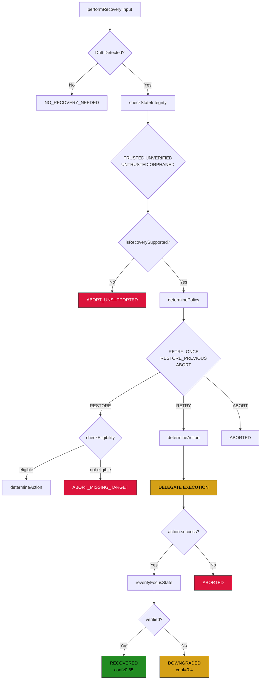
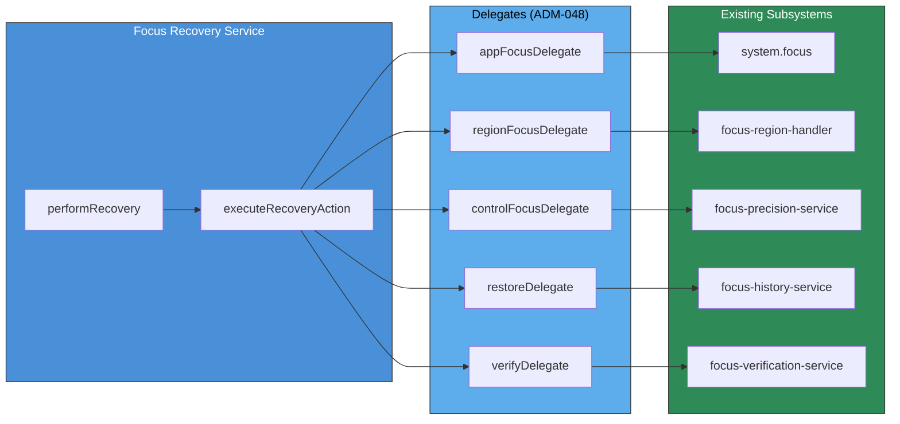

# Focus Project Charter v0.1

**Version:** 0.2  
**Status:** COMPLETE  
**Branch:** `feature/focus-architecture-v2`  
**Last Updated:** 2026-03-17

---

## 1. Header and Purpose

### 1.1 Document Title
Focus Project Charter v0.1

### 1.2 Purpose

This charter establishes governance, defines canonical terminology, and sets explicit boundaries for the Focus Project—the initiative to implement a layered, robust focus management system for the Arqon Maestro voice operating system.

The Focus Project addresses the fundamental challenge of reliably transferring input focus between entities in a multi-application, multi-window computing environment. By implementing a layered architecture, we ensure that focus transfers are verifiable, recoverable, and extensible.

### 1.3 Scope

This charter governs:
- The implementation of focus management layers (Layer 2 through Layer 8)
- The definition of focus-related terminology across the codebase
- The acceptance criteria for progressing through Focus Project milestones (FP-0 through FP-5)
- The governance of decisions affecting the focus system

---

## 2. Governance

### 2.1 FP-0 Owners and Stakeholders

| Role | Responsibility |
|------|----------------|
| **FP-0 Lead** | Maintains this charter, coordinates FP-0 deliverables, arbitrates terminology disputes |
| **Architecture Owner** | Approves layer boundaries, validates architectural consistency |
| **Implementation Lead** | Owns the current implementation in `maestro/client/src/main/` |
| **Review Committee** | Three senior engineers required for breaking changes to lower layers |

**Initial Stakeholders:**
- Focus Architecture Team
- Maestro Core Maintainers
- Voice UI Interaction Designers

### 2.2 Decision-Making Process

1. **Terminology Changes**: FP-0 Lead has final authority; must update this charter within 48 hours of change
2. **Layer Boundary Changes**: Require Architecture Owner approval and RFC to review committee
3. **Breaking Changes to Lower Layers**: Require FP-x approval (see Section 8)
4. **Deferred Item Re-evaluation**: Can be proposed at any FP-x review; requires 2/3 majority of Review Committee

### 2.3 Review Cadence

| Meeting | Frequency | Purpose |
|---------|-----------|---------|
| FP Standup | Weekly | Progress check, blocker identification |
| FP Review | Bi-weekly | Accept/reject FP-x deliverables |
| Governance Sync | Monthly | Charter updates, policy review |

---

## 3. Canonical Terminology List

This section defines the authoritative terminology for all focus-related concepts in the Maestro codebase. All documentation, code comments, and APIs must use these terms with these precise meanings.

### 3.1 Core Focus Terms

| Term | Definition |
|------|------------|
| **Focus Transfer** | The operation of moving input focus from one entity to another. A focus transfer is initiated by a user command or system event and results in a target entity receiving input capability. |
| **Application Focus (Layer 2)** | Focus at the application level. When an application has Layer 2 focus, it is the active application in the operating system and receives keyboard input by default. |
| **Window Focus (Layer 3)** | Focus at the window level within an application. When a window has Layer 3 focus, it is the active window within its application and receives input within that application's window stack. |

### 3.2 Deferred Layers (NOT YET IMPLEMENTED)

| Term | Layer | Definition |
|------|-------|------------|
| **Region** | Layer 4 | Focus within a specific region of a window (e.g., sidebar, content area, toolbar). Enables targeting focus to functional subdivisions within a single window. **FP-3A implements canonical model for VS Code and Chrome.** |
| **Control** | Layer 5 | Focus on a specific UI control within a region (e.g., a button, text field, dropdown). Enables targeting individual interactive elements. |
| **Item** | Layer 6 | Focus on items within controls (e.g., list items, grid rows, tree nodes). Enables targeting specific data elements within list-based or grid-based controls. |
| **Caret** | Layer 7 | Text caret positioning within text controls. Enables precise character-level focus for text editing operations. |
| **Semantic Routing** | Layer 8 | Route focus transfers based on meaning rather than structure. Uses ML models or heuristics to determine the most appropriate focus target given user intent. |

### 3.3 Supporting Concepts

| Term | Definition |
|------|------------|
| **Source of Truth** | The authoritative system that maintains the definitive record of current focus state. The Source of Truth may be the operating system, the application, or Maestro's internal state, depending on the layer and verification strategy. |
| **Confidence Score** | A probability value (0.0 to 1.0) indicating the likelihood that a focus transfer succeeded. Higher scores indicate higher confidence; threshold values determine whether verification or recovery is required. |

---

## 4. Current Implementation Boundary (Layers 2-3)

The following components are currently implemented and constitute the baseline for FP-0. These layers are stable and ready for FP-1 work to build upon.

### 4.1 Implemented Components

| Component | Location | Layer | Description |
|-----------|----------|-------|-------------|
| Application Focus | [`maestro/client/src/main/driver/stub.ts`](maestro/client/src/main/driver/stub.ts) | Layer 2 | Detects and manages focus at the application level |
| Window Focus | [`maestro/client/src/main/driver/stub.ts`](maestro/client/src/main/driver/stub.ts) | Layer 3 | Detects and manages focus at the window level within applications |
| Basic Transfer | [`maestro/client/src/main/execute/executor.ts`](maestro/client/src/main/execute/executor.ts) | 2-3 | Executes focus transfer operations between applications and windows |
| Basic History | [`maestro/client/src/main/runtime/focus-history-service.ts`](maestro/client/src/main/runtime/focus-history-service.ts) | 2-3 | Maintains a rolling history of focus transitions for navigation |
| Basic Post-Transfer Refresh | [`maestro/client/src/main/execute/system.ts`](maestro/client/src/main/execute/system.ts) | 2-3 | Refreshes focus state after transfer to verify success |

### 4.2 Implementation Notes

- The current implementation uses stub drivers in `stub.ts` for focus detection
- The history service provides basic last-N tracking without persistence
- Verification is minimal—post-transfer refresh confirms the target received focus but does not compute confidence scores

---

## 5. Deferred Items List

The following items are **explicitly out of scope** for FP-1 and must not be implemented until the FP-1 acceptance criteria are met and approved. These represent higher-layer focus capabilities that require the foundation established in FP-1.

### 5.1 Explicitly Deferred (NOT YET IMPLEMENTED)

| Item | Layer | Rationale for Deferral |
|------|-------|------------------------|
| **Region Focus** | Layer 4 | **FP-3A COMPLETE**: Canonical model implemented for VS Code and Chrome. |
| **Control Focus** | Layer 5 | Requires UI element introspection that is not yet available |
| **Item Focus** | Layer 6 | Requires list/grid enumeration capabilities |
| **Caret Positioning** | Layer 7 | Requires text-specific focus detection |
| **Semantic Routing** | Layer 8 | Requires ML model integration and training data |
| **Modal Policy** | N/A | **FP-7 PROPOSED**: Handle modals/popups that steal focus. Detecting and managing modal dialogs that intercept focus. |
| **Modal Policy** | N/A | Requires understanding of focus constraints across layers |
| **Recovery Engine** | N/A | **FP-5A/5B COMPLETE**: Implemented as policy-driven orchestrator with honest telemetry. See Section 8.

### 5.2 Out-of-Scope Declaration

> **IMPORTANT**: Teams working on FP-0 and FP-1 must not implement any items from this deferred list. Attempting to implement deferred items before the foundational layers are stable will result in architectural inconsistency and technical debt.

---

## 6. FP-1 Acceptance Criteria

FP-0 closes when all of the following acceptance criteria are met. These criteria define the requirements for **FP-1 Milestone A** (Verified Focus Core).

### 6.1 Acceptance Criteria Overview

| ID | Criterion | Description |
|----|-----------|-------------|
| **FP-1.1** | Verification Step After Focus Transfer | Implement a post-transfer verification step that confirms focus arrived at the intended target |
| **FP-1.2** | Source-of-Truth Classification | Classify and track which system (OS, application, Maestro) is the Source of Truth for focus state at each layer |
| **FP-1.3** | Expanded History Model | Extend the basic history service to include timestamps, transfer success/failure status, and layer information |
| **FP-1.4** | Coarse Confidence Scoring | Implement confidence scoring that distinguishes high-confidence transfers from uncertain transfers |

### 6.2 Detailed Criteria

#### FP-1.1: Verification Step After Focus Transfer

**Requirement**: After any focus transfer, the system must verify that focus arrived at the intended target.

**Acceptance Tests**:
- [x] Transfer to application A results in Application Focus on A
- [x] Transfer to window B in application A results in Window Focus on B
- [x] Failed verification triggers appropriate error handling
- [x] Verification latency is under 500ms for 90th percentile transfers

#### FP-1.2: Source-of-Truth Classification

**Requirement**: The system must classify and track the Source of Truth for focus state.

**Acceptance Tests**:
- [x] Each focus state query returns the identified Source of Truth
- [x] Source of Truth can be: Operating System, Application, or Maestro
- [x] Classification is logged for audit purposes
- [x] Discrepancies between expected and actual Source of Truth are flagged

#### FP-1.3: Expanded History Model

**Requirement**: The history service must track rich metadata about focus transitions.

**Acceptance Tests**:
- [x] History entries include timestamp (ISO 8601)
- [x] History entries include success/failure status
- [x] History entries include layer information (2 or 3)
- [x] History is queryable by time range, application, and layer
- [x] History supports at least 100 entries in memory

#### FP-1.4: Coarse Confidence Scoring

**Requirement**: The system must compute confidence scores for focus transfers.

**Acceptance Tests**:
- [x] Confidence scores are in range [0.0, 1.0]
- [x] High-confidence transfers (score >= 0.8) do not require user confirmation
- [x] Low-confidence transfers (score < 0.8) trigger verification or recovery
- [x] Confidence score computation is deterministic for same-state transfers

---

## 7. Architecture Principles

The following principles govern the evolution of the Focus Project and must be followed by all contributors.

### 7.1 Layered Implementation

**Principle**: Focus layers must be implemented sequentially. No skipping layers.

**Rationale**: Each layer depends on the stability of lower layers. Skipping layers creates architectural fragility and makes debugging focus issues extremely difficult.

**Implication**: Layer 4 cannot begin until Layer 3 is stable and FP-1 is complete.

### 7.2 Stability Requirement

**Principle**: Each layer must be stable before moving to the next.

**Definition of Stability**:
- All acceptance criteria for the current FP-x are met
- No critical or high-severity bugs are open
- Code review sign-off from Architecture Owner

### 7.3 Breaking Change Governance

**Principle**: Breaking changes to lower layers require FP-x approval.

**Process**:
1. RFC document describing the breaking change
2. Impact assessment covering all dependent layers
3. Review Committee votes (2/3 majority required)
4. FP-x lead approval
5. Migration path documented

**Lower Layers**: Layers 2-3 (currently implemented)  
**Higher Layers**: Layers 4-8 (deferred)

---

## 8. Focus Recovery Architecture (FP-5A/5B)

The Focus Project includes a bounded recovery system for handling focus failures. Recovery follows a policy-driven orchestrator pattern (ADM-048).

### 8.1 Recovery Flow



### 8.2 Delegation Model (ADM-048)

Recovery **does NOT call xdotool directly**. Instead, it delegates to existing subsystems:



### 8.3 Recovery Result Statuses

| Status | Description | Confidence |
|--------|-------------|------------|
| NO_RECOVERY_NEEDED | No drift detected | 1.0 |
| RECOVERED_BY_RETRY | Retry succeeded + verified | ≥ 0.85 |
| RECOVERED_BY_RESTORE | Restore succeeded + verified | 0.7 - 0.85 |
| DOWNGRADED | Action succeeded but verification failed | 0.4 |
| ABORTED_UNSAFE_RECOVERY | Aborted - unsafe or unsupported | 0.2 |
| ABORTED_UNTRUSTED_STATE | Aborted - state integrity untrusted | 0.2 |
| ABORTED_MISSING_TARGET | Aborted - target missing or restore ineligible | 0.2 |

---

## 9. Modal Policy (FP-7)

Modal Policy handles modals and popups that can steal focus after a focus transfer. When an app gains focus, modals dialogs may intercept focus, requiring detection and handling.

### 9.1 Modal Policy Scope

| Capability | Description |
|------------|-------------|
| **Modal Detection** | Detect when a modal/popup steals focus after app gains focus |
| **Modal Classification** | Classify modals by type (dialog, alert, popup, context menu) |
| **Modal Dismissal** | Dismiss modals to restore intended focus path |
| **Focus Steal Prevention** | Prevent modals from intercepting focus during transfers |

### 9.2 Modal Detection Strategies

| Strategy | Description |
|----------|---------|
| Window Title Analysis | Detect "Modal", "Dialog", "Alert" in window titles |
| Window Class Matching | Match against known modal window classes |
| Focus Timestamp Analysis | Detect rapid focus changes suggesting modal steal |
| UI Element Detection | Visual/OCR detection of modal overlays |

### 9.3 Modal Policy Actions

| Action | Trigger | Result |
|--------|---------|--------|
| DISMISS_MODAL | Modal detected blocking target | Close/dismiss modal, retry focus |
| WAIT_FOR_MODAL | Modal expected (e.g., after save) | Wait for modal to clear |
| REPORT_MODAL | Modal detected, cannot dismiss | Report modal presence to user |
| BYPASS_MODAL | Modal is informational only | Proceed with focus anyway |

### 9.4 FP-7 Acceptance Criteria

| ID | Criterion | Description |
|----|-----------|-------------|
| FP-7.1 | Modal Detection | Detect when a modal steals focus after app focus |
| FP-7.2 | Modal Classification | Classify modal type for appropriate handling |
| FP-7.3 | Auto-Dismiss | Automatically dismiss common modal types |
| FP-7.4 | Graceful Degradation | Report modal presence when cannot dismiss |

**Acceptance Tests**:
- [ ] Focus transfer to app with modal results in modal detection
- [ ] Modal classification correctly identifies dialog/alert/popup
- [ ] Auto-dismiss closes simple modals (e.g., save dialogs)
- [ ] Un-dismissible modals reported to user without blocking

---

## 10. Referential Intent (FP-7)

Referential Intent enables Maestro to understand and resolve deictic references like "this", "that", "it", and "here" based on contextual analysis of the user's current workspace state.

### 10.1 FP-7A: Referential Intent Foundations

| Capability | Description |
|------------|-------------|
| **Pronoun Resolution** | Resolve "this", "that", "it" to specific targets in the focus stack |
| **Deictic Location** | Resolve "here" to current context (editor, terminal, browser) |
| **Context Window** | Maintain temporal context for referential disambiguation |
| **Intent Classification** | Classify referential intent vs. literal command intent |

**Acceptance Criteria**:
- [ ] "switch to this" resolves to the most recently focused application
- [ ] "go back to that" navigates to second-most-recent focus target
- [ ] "open it here" resolves "it" to context-appropriate target
- [ ] Confidence scoring for referential resolution ≥ 0.85

**Reference**: [Maestro Referential Intent v0.1](maestro-referential-intent-v0.1.md)

### 10.2 FP-7B: Referential Hardening + Disambiguation

| Capability | Description |
|------------|-------------|
| **Hardening Rules** | Prevent focus drift during referential commands |
| **Disambiguation UI** | Present choices when referent is ambiguous |
| **Fallback Resolution** | Graceful degradation when referent cannot be resolved |
| **Learning Model** | Improve resolution based on user correction patterns |

**Acceptance Criteria**:
- [ ] Ambiguous references trigger disambiguation prompt
- [ ] User corrections feed back into resolution model
- [ ] Hardening prevents focus hijacking during resolution
- [ ] Fallback to explicit command when resolution fails

---

## 11. Modal Awareness + Restore (FP-8)

Modal Awareness extends beyond simple modal detection to comprehensive understanding and handling of dialogs, overlays, and popup contexts that intercept focus.

### 11.1 FP-8A: Modal Awareness

| Capability | Description |
|------------|-------------|
| **Dialog Detection** | Detect modal dialogs, modeless dialogs, and overlays |
| **Overlay Recognition** | Identify semi-transparent overlays and focus-capturing layers |
| **Popup Context** | Track popup windows, context menus, and tooltips |
| **Z-Order Analysis** | Analyze window stacking order for focus interception |

**Detection Strategies**:
| Strategy | Description |
|----------|---------|
| Window Attribute Analysis | Inspect window properties (type, style, transient_for) |
| Focus Timestamp Sequencing | Detect rapid focus events indicating modal behavior |
| UI Framework Hooks | Integrate with GTK, Qt, Win32 modal notification systems |
| Visual Region Detection | Computer vision for overlay detection |

**Acceptance Criteria**:
- [ ] Detect modal dialogs within 200ms of focus interception
- [ ] Classify modal type (dialog/overlay/popup/tooltip) with ≥ 0.90 accuracy
- [ ] Track modal lifecycle (open, interact, dismiss)
- [ ] Handle nested modals correctly

**Reference**: [Maestro Modal Awareness v0.1](maestro-modal-awareness-v0.1.md)

### 11.2 FP-8B: Modal Interaction + Restore

| Capability | Description |
|------------|-------------|
| **Modal Dismissal** | Close/dismiss modals via keyboard, API, or UI automation |
| **Focus Restoration** | Restore focus to pre-modal target after dismissal |
| **Modal Waiting** | Wait for expected modals (save, confirm) during operations |
| **Interaction Pipeline** | Execute commands through modal dialogs when needed |

**Modal Handling Actions**:
| Action | Trigger | Result |
|--------|---------|--------|
| DISMISS | Modal blocks target | Close modal, restore focus |
| WAIT | Expected modal (save dialog) | Pause operation until modal clears |
| INTERACT | Command targets modal content | Execute within modal context |
| BYPASS | Non-blocking modal | Proceed with original target |
| REPORT | Unhandled modal | Notify user, log for analysis |

**Acceptance Criteria**:
- [ ] Auto-dismiss common modals (OK, Cancel, Close buttons)
- [ ] Restore focus to pre-modal target within 300ms of dismissal
- [ ] Handle modal during active voice command gracefully
- [ ] Maintain focus stack integrity through modal lifecycle

---

## 12. Surface Expansion (FP-9)

Surface Expansion unifies focus control across all computing surfaces: IDE, browser, terminal, and system-level interfaces.

### 12.1 Surface Model

| Surface | Focus Layer | Detection Method |
|---------|-------------|-------------------|
| **IDE** | Language Server Protocol, editor APIs | VS Code API, JetBrains platform |
| **Browser** | DOM focus, accessibility tree | Chrome DevTools Protocol, ARIA |
| **Terminal** | TTY focus, pane/window | Terminal emulator APIs, OSC sequence |
| **System** | Window manager, compositor | X11/Wayland, Window Manager APIs |

### 12.2 Unified Control API

| Capability | Description |
|------------|-------------|
| **Surface Abstraction** | Uniform interface across all surface types |
| **Hot-Switching** | Seamless focus transfer between surfaces |
| **State Synchronization** | Maintain coherent focus state across surfaces |
| **Cross-Surface History** | Unified navigation history spanning surfaces |

**Acceptance Criteria**:
- [ ] "switch to browser" transfers focus from IDE to browser
- [ ] "go back" navigates across surface boundaries
- [ ] Focus verification works consistently across all surfaces
- [ ] Recovery actions execute on correct surface

**Reference**: [Maestro Surface Expansion v0.1](maestro-surface-expansion-v0.1.md)

### 12.3 Surface-Specific Handlers

| Surface | Handler | Capabilities |
|---------|---------|--------------|
| IDE | `IdeFocusHandler` | Editor focus, sidebar, panel, terminal tabs |
| Browser | `BrowserFocusHandler` | Tab focus, address bar, dev tools, extensions |
| Terminal | `TerminalFocusHandler` | Pane focus, scrollback, command input |
| System | `SystemFocusHandler` | Application switcher, desktop, notification area |

---

## 13. Language/System Integration (FP-10)

FP-10 represents the culmination of the Focus Project: a unified VOS runtime model that integrates focus management with precision targeting, error recovery, intelligent routing, and grammatical parsing.

### 13.1 Unified Runtime Model

```
┌─────────────────────────────────────────────────────────────────┐
│                    VOS RUNTIME MODEL                            │
├─────────────────────────────────────────────────────────────────┤
│  ┌──────────────┐  ┌──────────────┐  ┌──────────────┐          │
│  │   FOCUS      │  │  PRECISION   │  │   RECOVERY   │          │
│  │   LAYERS     │──│  TARGETING   │──│    ENGINE    │          │
│  │   (2-8)      │  │   (FP-3)     │  │   (FP-5)     │          │
│  └──────────────┘  └──────────────┘  └──────────────┘          │
│         │                 │                  │                 │
│         └─────────────────┼──────────────────┘                 │
│                           ▼                                    │
│                  ┌──────────────┐                              │
│                  │   ROUTING    │                              │
│                  │   LAYER      │                              │
│                  └──────────────┘                              │
│                           │                                    │
│                           ▼                                    │
│                  ┌──────────────┐                              │
│                  │   GRAMMAR    │                              │
│                  │   PARSER     │                              │
│                  └──────────────┘                              │
└─────────────────────────────────────────────────────────────────┘
```

### 13.2 Integration Points

| Component | Integration | Description |
|-----------|-------------|-------------|
| **Focus + Precision** | Layer 3 → Layer 5 | Precision targeting builds on window focus |
| **Focus + Recovery** | All layers | Recovery acts as cross-layer safety net |
| **Focus + Routing** | All layers | Routing determines optimal focus target |
| **Focus + Grammar** | All layers | Grammar interprets focus-related commands |
| **Precision + Recovery** | Layers 3-5 | Precision failures trigger recovery |
| **Routing + Grammar** | Parser → Router | Semantic parse routes to appropriate handler |

### 13.3 FP-10 Acceptance Criteria

| ID | Criterion | Description |
|----|-----------|-------------|
| FP-10.1 | Unified State | Single source of truth for focus state across all layers |
| FP-10.2 | Cross-Layer Recovery | Recovery works seamlessly across layer boundaries |
| FP-10.3 | Grammar Integration | Focus commands parsed with full semantic understanding |
| FP-10.4 | Routing Intelligence | Focus routing uses context, history, and user preference |
| FP-10.5 | Surface Unification | Focus control consistent across IDE, browser, terminal |

**Acceptance Tests**:
- [ ] "open settings in the sidebar then go to terminal" executes across surfaces
- [ ] Focus failure at any layer triggers appropriate recovery
- [ ] Grammar parser correctly interprets complex focus commands
- [ ] Routing considers user preferences and historical patterns
- [ ] All surfaces respond to focus commands with consistent latency

**Reference**: [Maestro Language/System Integration v0.1](maestro-language-system-integration-v0.1.md)

---

## 14. Revision History

| Version | Date | Author | Changes |
|---------|------|--------|---------|
| 0.1 | 2026-03-15 | FP-0 Lead | Initial charter draft |
| 0.2 | 2026-03-17 | FP-0 Lead | Added Focus Recovery Architecture diagrams (FP-5A/5B) |
| 0.3 | 2026-03-17 | FP-0 Lead | **COMPLETE**: FP-1, FP-3A, FP-5A/5B all verified. Recovery Truthfulness Tests pass. |
| 0.4 | 2026-03-17 | FP-0 Lead | Added FP-7 Modal Policy for handling modals/popups that steal focus. |
| 0.5 | 2026-03-18 | FP-0 Lead | Added FP-7 Referential Intent, FP-8 Modal Awareness + Restore, FP-9 Surface Expansion, FP-10 Language/System Integration. |

---

## 9. References

- [Maestro Focus Phase Handoff](maestro-focus-phase-handoff.md)
- [Maestro Executor Architecture](maestro-executor-architecture.md)
- [Maestro Referential Intent v0.1](maestro-referential-intent-v0.1.md)
- [Maestro Modal Awareness v0.1](maestro-modal-awareness-v0.1.md)
- [Maestro Surface Expansion v0.1](maestro-surface-expansion-v0.1.md)
- [Maestro Language/System Integration v0.1](maestro-language-system-integration-v0.1.md)
