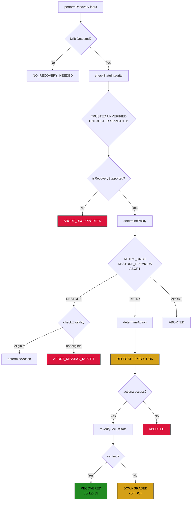
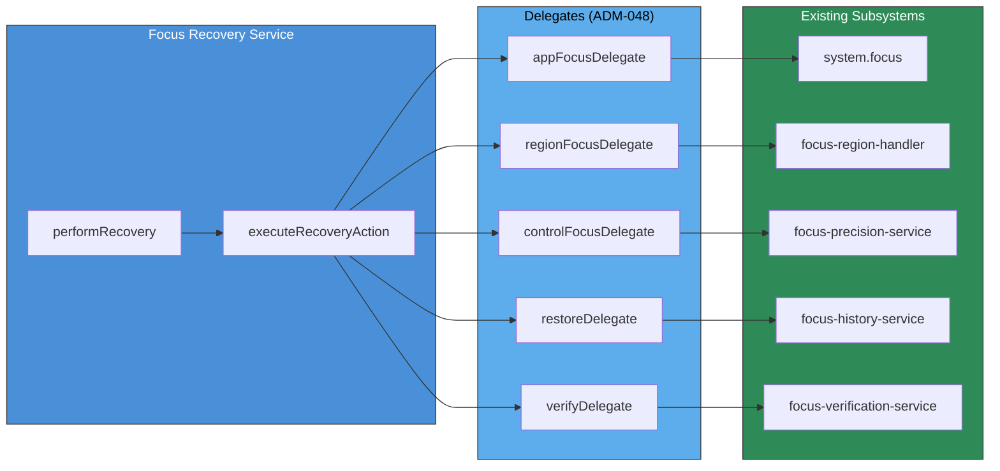

# Focus Recovery Technical Documentation

## Executive Summary

Focus Recovery (FP-5A/5B) provides bounded recovery capabilities for common focus failures in Arqon Maestro. When focus state diverges from expected state, the recovery system detects this drift and attempts appropriate recovery actions through a policy-driven orchestrator.

**Key Principles:**
- Recovery is an **orchestrator, NOT a driver** (ADM-048)
- Bounded recovery: maximum 1 retry per failure
- Real re-verification after every recovery action (GOTCHA-033)
- User-safe abort messages

---

## Architecture Overview

### Core Components

The Focus Recovery system consists of three primary files working in concert:

| File | Purpose | Key Responsibility |
|------|---------|-------------------|
| [`focus-recovery-service.ts`](maestro/client/src/main/runtime/focus-recovery-service.ts) | Main orchestrator | Coordinates recovery flow, delegates to subsystems |
| [`focus-recovery-analyzer.ts`](maestro/client/src/main/runtime/focus-recovery-analyzer.ts) | Drift detection | Detects when focus diverges from expected state |
| [`focus-recovery-policy.ts`](maestro/client/src/main/runtime/focus-recovery-policy.ts) | Policy engine | Determines retry vs abort, recovery actions |

### Supporting Services

| File | Purpose |
|------|---------|
| [`focus-verification-service.ts`](maestro/client/src/main/runtime/focus-verification-service.ts) | Re-verifies focus after recovery |
| [`focus-post-validator.ts`](maestro/client/src/main/runtime/focus-post-validator.ts) | Validates postconditions |
| [`focus-history-service.ts`](maestro/client/src/main/runtime/focus-history-service.ts) | Tracks recovery rate, stores verified states |
| [`focus-failure-modes.ts`](maestro/client/src/main/runtime/focus-failure-modes.ts) | Documents failure types with strategies |
| [`focus-failure-analyzer.ts`](maestro/client/src/main/runtime/focus-failure-analyzer.ts) | Analyzes failures, suggests recovery |

---

## Recovery Flow Diagram



**Caption:** Complete Focus Recovery Flow - shows drift detection, integrity checks, policy determination, delegate execution, and re-verification paths.

---

## Delegation Model (ADM-048)

Recovery **does NOT call xdotool directly**. Instead, it delegates to existing subsystems:



**Caption:** Recovery delegates to existing subsystems rather than directly calling xdotool, maintaining proper abstraction boundaries.

---

## Supported Recovery Targets

Recovery is limited to already-supported surfaces:

| Surface | Application | Recovery Actions Available |
|---------|-------------|---------------------------|
| VS Code Editor | VS Code | refocus_app, refocus_region |
| VS Code Terminal | VS Code | refocus_app, refocus_region |
| Chrome Address Bar | Chrome | refocus_app, refocus_control |
| Chrome Page | Chrome | refocus_app |
| System Terminal | gnome-terminal | refocus_app |

---

## Recovery Reasons and Policies

| Reason | Policy | Description |
|--------|--------|-------------|
| APP_MISMATCH | RETRY_ONCE | Target app not focused |
| WINDOW_MISMATCH | RETRY_ONCE | Target window not focused |
| REGION_MISMATCH | RETRY_ONCE | Target region not focused |
| CONTROL_MISMATCH | RETRY_ONCE | Target control not focused |
| CARET_MISSING | ABORT | Caret position lost |
| AMBIGUITY_ESCALATED | ABORT | Ambiguity increased |
| TARGET_GONE | RESTORE_PREVIOUS | Target no longer exists |
| PRECISION_GUARD_BLOCKED | ABORT | Precision guard blocked |
| SAFETY_GATE_BLOCKED | ABORT | Safety gate blocked |
| UNVERIFIED_STATE | ABORT | State integrity untrusted |

---

## Recovery Actions

| Action | Description | Delegate |
|--------|-------------|----------|
| REFOCUS_APP | Refocus the target application | appFocusDelegate → system.focus() |
| REFOCUS_REGION | Refocus a specific region | regionFocusDelegate → focus-region-handler |
| REFOCUS_CONTROL | Refocus a specific control | controlFocusDelegate → focus-precision-service |
| RESTORE_PREVIOUS | Restore previous verified state | restoreDelegate → focus-history-service |
| ABORT | Do not attempt recovery | N/A |

---

## Result Statuses (FP-5B)

| Status | Description | Confidence |
|--------|-------------|------------|
| NO_RECOVERY_NEEDED | No drift detected | 1.0 |
| RECOVERED_BY_RETRY | Retry succeeded + verified | ≥ 0.85 |
| RECOVERED_BY_RESTORE | Restore succeeded + verified | 0.7 - 0.85 |
| DOWNGRADED | Action succeeded but verification failed | 0.4 |
| ABORTED_UNSAFE_RECOVERY | Aborted - unsafe or unsupported | 0.2 |
| ABORTED_UNTRUSTED_STATE | Aborted - state integrity untrusted | 0.2 |
| ABORTED_MISSING_TARGET | Aborted - target missing or restore ineligible | 0.2 |

---

## State Integrity Status

The analyzer checks state integrity before attempting recovery:

| Status | Description | Action |
|--------|-------------|--------|
| TRUSTED | State is trustworthy | Proceed with recovery |
| UNVERIFIED | State verification pending | Abort |
| UNTRUSTED | State integrity compromised | Abort |
| ORPHANED | Focus state orphaned | Abort |

---

## Restoration Eligibility

Before RESTORE_PREVIOUS policy executes, eligibility is checked:

| Criterion | Requirement |
|-----------|-------------|
| Previous state exists | Must have a stored verified state |
| Timestamp | Within acceptable time window |
| Confidence | Previous state had adequate confidence |
| Application valid | Target application still available |

---

## GOTCHAs Addressed

The recovery system addresses three critical GOTCHAs:

### GOTCHA-032: Recovery Service Direct Xdotool Bypass
**Problem:** Recovery was calling xdotool directly, violating abstraction boundaries.

**Solution:** Recovery now delegates to existing subsystems via configured delegates.

### GOTCHA-033: Fake Recovery Re-Verification
**Problem:** Recovery was claiming success without actual re-verification.

**Solution:** Re-verification is mandatory after every recovery action using `focus-verification-service`.

### GOTCHA-034: Recovery Service Isolation Violation
**Problem:** Recovery was directly accessing history service internals.

**Solution:** Recovery delegates restore operations to `focus-history-service` via `restoreDelegate`.

---

## Executor Integration

Recovery is wired in [`executor.ts`](maestro/client/src/main/execute/executor.ts) (lines 228-298):

```typescript
// Initialize focus recovery service (FP-5A/5B)
this.focusRecoveryService = new FocusRecoveryService();

// Wire up delegates for recovery orchestrator (ADM-048)
this.focusRecoveryService.setAppFocusDelegate(async (app: string): Promise<boolean> => {
  await this.system.focus(app);
  return true;
});

this.focusRecoveryService.setRegionFocusDelegate(async (app: string, region: string): Promise<boolean> => {
  const result = await this.regionHandler.executeRegionTransfer(target, {});
  return result.success;
});

this.focusRecoveryService.setVerifyDelegate(async (): Promise<{ verified: boolean; state: FocusState | null }> => {
  const state = await this.focusVerificationService.queryCurrentFocus();
  return { verified: state !== null, state };
});
```

---

## Testing Scenarios

### Test 1: Target Missing
**Scenario:** `focus chrome` with Chrome closed

**Expected Result:** ABORTED_UNSAFE_RECOVERY or DOWNGRADED
- Recovery should NOT claim successful recovery
- Should abort with user-safe message

### Test 2: Region Mismatch
**Scenario:** Expected terminal region, actual is editor

**Expected Result:** REFOCUS_REGION action → verified success or safe failure
- Recovery should attempt to refocus the correct region
- Re-verification should confirm success or report failure

### Test 3: Restore Path
**Scenario:** Create trusted previous state, invalidate current target

**Expected Result:** RESTORE_PREVIOUS only if eligibility passes
- Must pass `checkRestorationEligibility()`
- Then re-verify focus state

---

## Boundaries (DO NOT DO)

Recovery explicitly does NOT do:
- Full semantic referent resolution
- "this / that / it" routing
- General modal intelligence
- Universal recovery across all apps
- Autonomous multi-step recovery loops
- Call xdotool directly (violates ADM-048)

---

## References

### Primary Documents
- [Focus Recovery Plan](maestro-focus-recovery-plan.md) - Architecture specification
- [Focus Recovery v0.1](maestro-focus-recovery-v0.1.md) - Implementation details
- [Focus Project Charter](focus-project-charter.md) - Project requirements
- [Focus Implementation Progress](maestro-implementation-progress.md) - Phase tracking

### Related Documents
- [Executor Architecture](maestro-executor-architecture.md) - Integration context
- [Focus Verification](focus-verification-service.ts) - Verification service
- [Focus Pre-Validator](focus-pre-validator.ts) - Pre-validation
- [Focus Post-Validator](focus-post-validator.ts) - Post-validation
- [Focus Safety Monitor](focus-safety-monitor.ts) - Safety invariants

---

## Version History

| Version | Date | Changes |
|---------|------|---------|
| 1.0 | 2026-03-17 | Initial comprehensive documentation |

---

*This document is part of the Arqon Maestro technical documentation suite.*
