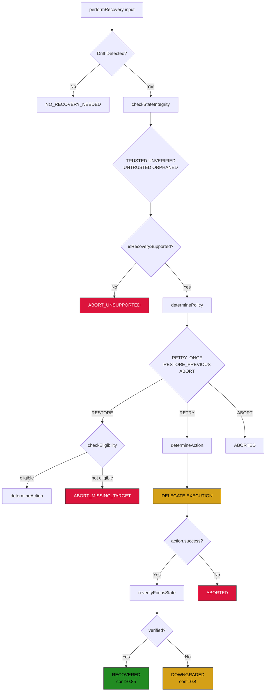
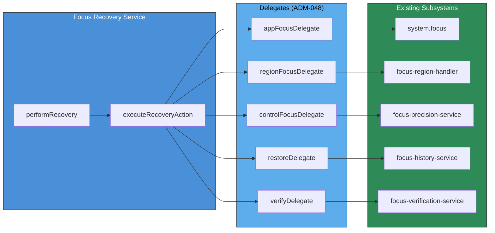

# Maestro Recovery Service - Real Implementation Plan v0.2

> **Status**: IMPLEMENTING
> **Last Updated**: 2026-03-17
> **ADM Reference**: ADM-048, ADM-049

## Prime thesis

**Recovery is not a driver. Recovery is a policy-driven state-repair orchestrator.**

It should:

* inspect expected vs actual state
* classify the mismatch
* decide whether retry, restore, or abort is appropriate
* invoke the correct existing subsystem
* re-verify the result
* stop after bounded attempts
* emit complete telemetry

It should **not** directly become a second `xdotool` layer.

---

## Implementation Status

### Completed

- [x] Recovery reason taxonomy with PRECISION_GUARD_BLOCKED, SAFETY_GATE_BLOCKED
- [x] Delegate interfaces for subsystem injection
- [x] Removed direct xdotool calls from executeRecoveryAction
- [x] Added actual re-verification after recovery (fixes GOTCHA-033)
- [x] Added GOTCHAs to registry: GOTCHA-032, GOTCHA-033, GOTCHA-034
- [x] Wired up delegates in executor (app-focus, region-focus, restore, verify, control-focus)
- [x] Split into 3 layers: analyzer, policy, service
- [x] Normalize target names in verification (console → gnome-terminal)

### Pending

- [x] Full end-to-end recovery flow testing with actual focus failures

---

# What recovery should do

Recovery has six duties:

1. **detect drift**
2. **classify the reason**
3. **check trust/integrity**
4. **choose a bounded recovery policy**
5. **delegate the repair through existing services**
6. **re-verify and record outcome**

That is the real shape.

---

# What recovery should NOT do

Do not let the recovery service:

* directly hardcode desktop control logic as its main job
* duplicate `system.focus()` logic
* duplicate region handler logic
* guess indefinitely
* retry more than once by default
* bypass safety or precision guards
* restore stale state without validation
* silently "succeed" when the final state is still unverified

If it does those things, it is not recovery. It is uncontrolled fallback.

---

# Core design

## Recovery is three layers

### 1. Recovery Analyzer

Determines:

* what was expected
* what actually happened
* why they differ
* whether the state is trustworthy enough to recover from

### 2. Recovery Planner

Chooses:

* retry current target
* restore previous verified target
* refocus app
* refocus region
* refocus control
* abort

### 3. Recovery Executor

Delegates the chosen action to the correct existing subsystem:

* app/window focus layer
* region handler
* precision/control service
* history restore path

Then re-verifies.

This is the correct separation.

---

# Required inputs

A real recovery decision must have these inputs.

## 1. Expected target

The target the system intended to reach.

Examples:

* application target
* region target
* control target
* insertion target

## 2. Actual verified state

The most recent known real focus state.

Examples:

* app
* window
* region
* control
* caret/editable state if relevant

## 3. Verification result

Why the original action is considered failed or degraded.

## 4. Command context

What command triggered this.

Examples:

* focus command
* insertion-class command
* routed action
* destructive vs non-destructive

## 5. Precision state

Needed for:

* caret missing
* no editable target
* wrong control
* selection mismatch

## 6. History / prior verified state

Needed for safe restore.

## 7. State integrity result

Whether prior verified state is:

* trusted
* stale
* expired
* untrusted

---

# Recovery reason taxonomy

The recovery layer should reason using explicit failure classes.

Minimum taxonomy:

* `APP_MISMATCH`
* `WINDOW_MISMATCH`
* `REGION_MISMATCH`
* `CONTROL_MISMATCH`
* `CARET_MISSING`
* `TARGET_GONE`
* `AMBIGUITY_ESCALATED`
* `UNVERIFIED_STATE`
* `PRECISION_GUARD_BLOCKED`
* `SAFETY_GATE_BLOCKED`

Important:
Some of these are **recoverable**, some are **abort-only**.

For example:

* `CARET_MISSING` should usually abort unless you later implement a verified caret-recovery path
* `SAFETY_GATE_BLOCKED` should not trigger aggressive recovery
* `UNVERIFIED_STATE` is a trust problem, not an ordinary mismatch

---

# Recovery policies

The planner should choose from a small bounded policy set.

## Policy types

* `RETRY_ONCE`
* `RESTORE_PREVIOUS`
* `ABORT`
* `DOWNGRADE_AND_STOP`

### Examples

#### APP_MISMATCH

Policy: `RETRY_ONCE`

#### REGION_MISMATCH

Policy: `RETRY_ONCE`

#### CONTROL_MISMATCH

Policy: `RETRY_ONCE`

#### TARGET_GONE

Policy: `RESTORE_PREVIOUS` or `ABORT`

#### CARET_MISSING

Policy: `ABORT`

#### AMBIGUITY_ESCALATED

Policy: `ABORT`

#### UNVERIFIED_STATE

Policy: `ABORT` or `DOWNGRADE_AND_STOP`

Do not let every failure become retry.

---

# Recovery actions

Actions must be explicit and delegated.

## Allowed recovery actions

* `REFOCUS_APP`
* `REFOCUS_WINDOW`
* `REFOCUS_REGION`
* `REFOCUS_CONTROL`
* `RESTORE_PREVIOUS`
* `ABORT`

Important:
These are **logical actions**, not shell commands.

The recovery service should not say:
"REFOCUS_APP = xdotool …"

Instead it should say:
"REFOCUS_APP = invoke the existing app focus subsystem with the expected application target."

That is the difference between architecture and spaghetti.

---

# Delegation model

This is one of the most important points.

## Recovery should call existing services

### For app/window mismatch

Delegate to:

* `system.focus(...)`
* or the already existing application/window transfer path

### For region mismatch

Delegate to:

* `focus-region-handler`

### For control/caret issues

Delegate to:

* `focus-precision-service`
* or abort if no verified recovery path exists

### For restore

Delegate to:

* `focus-history-service`
* but only after integrity validation

## Recovery service must not own raw xdotool behavior

Raw driver logic belongs below recovery, not inside it.

If recovery directly shells out to xdotool, it is collapsing abstraction boundaries.

---

# State integrity and restore safety

This is mandatory.

Before `RESTORE_PREVIOUS`, recovery must check:

* does prior state exist
* is it recent enough
* is its confidence acceptable
* is it still supported
* can it be re-verified after restore

If not, restore must abort.

A good rule is:

* trusted → eligible
* stale → maybe eligible, degraded
* expired → usually ineligible
* untrusted → ineligible

And after restore:

* **re-verification is required**

No re-verification = no successful recovery.

---

# Recovery flow

This is the actual lifecycle.

## Step 1 — Detect recovery need

Input:

* expected target
* actual verification result

If no mismatch:

* no recovery

## Step 2 — Analyze failure

Produce:

* reason taxonomy
* integrity status
* recoverability
* recommended policy

## Step 3 — Plan recovery

Choose one bounded action.

Examples:

* retry app focus
* retry region transfer
* restore previous verified target
* abort

## Step 4 — Execute delegated repair

Call the appropriate subsystem.

## Step 5 — Re-verify

Must verify:

* target reached?
* precision state acceptable?
* final state trustworthy?

## Step 6 — Emit final outcome

Possible final outcomes:

* `RECOVERED_BY_RETRY`
* `RECOVERED_BY_RESTORE`
* `ABORTED_UNTRUSTED_STATE`
* `ABORTED_MISSING_TARGET`
* `ABORTED_UNSAFE_RECOVERY`

This should already look familiar from your stronger FP-5A/B design direction.

---

## Recovery Flow Diagram



## Delegation Model Diagram (ADM-048)



---

# Required telemetry

Recovery needs full inspectability.

## Minimum telemetry shape

* `driftDetected`
* `reason`
* `policy`
* `action`
* `integrityStatus`
* `restorationValidated`
* `attempts`
* `result`
* `finalConfidence`
* `finalStateReverified`
* `userSafeMessage`
* `startTimestamp`
* `endTimestamp`

Also track whether the final outcome came from:

* retry
* restore
* abort

This needs to be obvious.

---

# Required service boundaries

Tell your AI to implement recovery in these pieces.

## 1. `focus-recovery-analyzer.ts`

Responsibilities:

* compare expected vs actual
* classify reason
* compute recoverability
* check integrity

## 2. `focus-recovery-policy.ts`

Responsibilities:

* map reasons to allowed policies/actions
* enforce max-attempt rules
* define abort-only cases

## 3. `focus-recovery-service.ts`

Responsibilities:

* orchestrate analyzer + policy + executor
* call existing services
* re-verify
* emit telemetry

## 4. Possibly `focus-recovery-types.ts`

Shared enums/interfaces:

* `RecoveryReason`
* `RecoveryPolicy`
* `RecoveryAction`
* `RecoveryResultStatus`
* `RecoveryTelemetry`
* `RecoveryPlan`
* `StateIntegrityStatus`

If you want fewer files, at least keep these concepts separate in code.

---

# Executor integration

The executor should not just do:

* verify failed
* call recovery
* recovery does xdotool
* done

Instead:

## Executor should:

1. execute normal path
2. run verification
3. if verification failed or degraded, create recovery context
4. call `focusRecoveryService.recover(context)`
5. use returned telemetry/result
6. continue only if final recovered state is verified and safe

This preserves layering.

---

# Example recovery scenarios

## Scenario A — App mismatch

Expected:

* Chrome app focus

Actual:

* VS Code active

Recovery:

* reason = `APP_MISMATCH`
* policy = `RETRY_ONCE`
* action = `REFOCUS_APP`
* delegate to app focus subsystem
* re-verify Chrome active
* emit `RECOVERED_BY_RETRY` or abort

## Scenario B — Region mismatch

Expected:

* VS Code terminal

Actual:

* VS Code editor

Recovery:

* reason = `REGION_MISMATCH`
* policy = `RETRY_ONCE`
* action = `REFOCUS_REGION`
* delegate to region handler
* re-verify terminal region
* emit result

## Scenario C — Caret missing

Expected:

* insertion target in editor

Actual:

* no caret present

Recovery:

* reason = `CARET_MISSING`
* policy = `ABORT`
* no blind focus trick
* emit user-safe message:

  * "Caret not verified in editor; insertion aborted."

## Scenario D — Target gone

Expected:

* previous Chrome tab/address bar context

Actual:

* target no longer exists

Recovery:

* reason = `TARGET_GONE`
* policy = `RESTORE_PREVIOUS` only if prior state trusted
* validate restore candidate
* delegate restore
* re-verify
* otherwise abort

---

# Minimum acceptance criteria

A real implementation should not be considered done until these are true:

## A. It never loops infinitely

Maximum one retry by default.

## B. It never restores blindly

Restore requires integrity + validation.

## C. It never bypasses precision/safety

Recovery is bounded by those layers.

## D. It re-verifies after every recovery action

No re-verify, no success.

## E. It distinguishes retry vs restore vs abort in telemetry

Operational clarity required.

## F. It uses existing subsystems for app/region/control movement

No direct shell-driven architectural collapse.

---

# Recovery Outcome Truthfulness Table

This table defines when each recovery result counts as success vs degraded success vs abort, based on intended vs verified levels.

## Recovery Result Classification

| Intended Level | Verified Level | Degraded | Classification | Result Status |
|----------------|----------------|----------|----------------|---------------|
| app | app | false | Full success | RECOVERED_BY_RETRY |
| app | none | true | Failed | ABORTED_* |
| region | region | false | Full success | RECOVERED_BY_RETRY |
| region | app | true | Degraded success | RECOVERED_BY_RETRY (with degraded=true) |
| region | none | true | Failed | ABORTED_* |
| control | control | false | Full success | RECOVERED_BY_RETRY |
| control | region | true | Degraded success | RECOVERED_BY_RETRY (with degraded=true) |
| control | app | true | Degraded success | RECOVERED_BY_RETRY (with degraded=true) |
| control | none | true | Failed | ABORTED_* |
| restore (full) | app+region+control | false | Full success | RECOVERED_BY_RESTORE |
| restore (full) | app+region | true | Partial restore | RECOVERED_BY_RESTORE (with degraded=true, restoreDepth=APP_REGION) |
| restore (full) | app only | true | Partial restore | RECOVERED_BY_RESTORE (with degraded=true, restoreDepth=APP_ONLY) |
| restore (full) | none | true | Failed | ABORTED_MISSING_TARGET |

## Result Statuses Defined

| Status | Description | When Used |
|--------|-------------|-----------|
| RECOVERED_BY_RETRY | Retry succeeded + verified | Intended level = verified level, degraded=false |
| RECOVERED_BY_RESTORE | Restore succeeded + verified | Restore achieved verified level, degraded may be true/false |
| DOWNGRADED | Action succeeded but verification failed | Attempt succeeded but final verification failed |
| ABORTED_UNTRUSTED_STATE | State integrity untrusted | Cannot trust current or prior state |
| ABORTED_MISSING_TARGET | Target missing or restore ineligible | Prior target no longer exists |
| ABORTED_UNSAFE_RECOVERY | Surface unsupported or unsafe | Recovery would be unreliable |

## Telemetry Fields for Truthfulness

| Field | Purpose | Example Values |
|-------|---------|----------------|
| intendedTarget | What we tried to recover | {app: "vscode", region: "terminal"} |
| verifiedLevel | Deepest level actually verified | "app" / "region" / "control" / "none" |
| degraded | Verified < intended | true / false |
| restoreDepth | For restore: actual depth | APP_ONLY / APP_REGION / APP_REGION_CONTROL |
| controlRecoveryLevel | For control: actual level | CONTROL_VERIFIED / DOWNGRADED_TO_REGION / DOWNGRADED_TO_APP / UNSUPPORTED |

## Honesty Rules

1. **Never report success if final verification fails** — DOWNGRADED or ABORTED, never RECOVERED_*
2. **Never report deeper recovery than verified** — If region failed, report app only
3. **Never report non-degraded when verified < intended** — Always set degraded=true when verification is shallower than intent
4. **Never trust delegate claims over verification** — Verification is the source of truth

---

# Honesty Principles (FP-5C)

The following principles ensure recovery never overclaims its achievements:

## Rule 1: Label by Verified Level, Not Intended Level

**Never label recovery by what it intended to recover. Label recovery by the deepest level it actually re-verified.**

* Intended control restore, verified only app → `app-level degraded recovery`
* Intended prior-state restore, verified app+region → `partial restore`
* Intended full restore, verified nothing → `abort`

## Rule 2: Restore Depth Must Be Explicit

Restore results must include `restoreDepth`:

* `APP_ONLY` — only the application was restored
* `APP_REGION` — app + region restored
* `APP_REGION_CONTROL` — app + region + control restored

## Rule 3: Control Recovery Must Be Capability-Gated

Control recovery results must include `recoveryLevel`:

* `CONTROL_VERIFIED` — control-level focus achieved and verified
* `DOWNGRADED_TO_REGION` — control failed, region-level fallback
* `DOWNGRADED_TO_APP` — control failed, app-level fallback
* `UNSUPPORTED` — surface does not support control recovery

## Rule 4: Telemetry Must Track Three Dimensions

Every recovery attempt must record:

1. **Intended target** — what we tried to recover (app/region/control)
2. **Verified level** — what was actually verified (app/region/control/none)
3. **Degraded** — whether verified level < intended level

---

# Layered Restore Implementation

## Current Behavior (Honest Label)

The current `restoreDelegate` is implemented as **app restore only**:

* Restores application focus
* Does NOT automatically restore region
* Does NOT automatically restore control

This is honestly labeled as `restore_application_only` in telemetry.

## Better Implementation: Layered Restore Pipeline

### Restore Level 1 — Application

Try to restore the app first.

### Restore Level 2 — Region

If prior state had a supported region, restore the region next.

### Restore Level 3 — Control

If prior state had a supported control, restore the control next.

### Restore Level 4 — Precision State

Do **not** overclaim this yet unless you can actually verify caret/editable state after restore.

## Restore Flow

**app → verify → region → verify → control → verify**

Stop at the highest level you can actually verify.

## RestoreResult Interface

```typescript
interface RestoreResult {
  appRestored: boolean;
  regionRestored: boolean;
  controlRestored: boolean;
  finalVerified: boolean;
  restoreDepth: RecoveryDepth;  // APP_ONLY | APP_REGION | APP_REGION_CONTROL | NONE
  degraded: boolean;  // true if restoreDepth < intended
  details: {
    app?: string;
    region?: string;
    control?: string;
    verificationFailedAt?: string;
  };
}
```

---

# Capability-Gated Control Recovery

## Current Behavior (Honest Label)

The current `controlFocusDelegate` falls back to `system.focus(app)` when control recovery fails.

This is honestly labeled as `control_recovery_degraded_to_app_focus` in telemetry.

## Better Implementation: Capability-Gated Recovery

### Step 1 — Control-Capability Check

Can this app/surface/control actually be recovered at control level?

### Step 2 — Verified Control Recovery

If yes:

* Attempt control focus
* Verify control focus
* Otherwise downgrade or abort

## ControlRecoveryResult Interface

```typescript
interface ControlRecoveryResult {
  supported: boolean;  // Can this surface support control recovery?
  attemptedControlFocus: boolean;
  controlVerified: boolean;
  recoveryLevel: ControlRecoveryLevel;
  // CONTROL_VERIFIED | DOWNGRADED_TO_REGION | DOWNGRADED_TO_APP | UNSUPPORTED | NONE
  downgraded: boolean;
  details: string;
}
```

## Gotchas Addressed

### Gotcha 1 — App restore can create false confidence

You may restore the app successfully while still landing in wrong region/control.

**Solution:** Verify after each layer, track `restoreDepth` honestly.

### Gotcha 2 — Region restore may not be stable after app restore

Sometimes app focus returns, but a modal/popup steals the next focus moment.

**Solution:** Re-verify after each restore stage.

### Gotcha 3 — Stored prior state may be semantically stale

A state can be temporally fresh but semantically invalid (tab closed, panel disappeared).

**Solution:** Semantic validation in addition to temporal validation.

### Gotcha 4 — Restore must not become "go anywhere" mechanism

**Solution:** Bounded to known supported surfaces/layers/verified transitions.

### Gotcha 5 — Region-first restore without app verification is dangerous

**Solution:** Never attempt region/control restore until app restoration is verified.

---

# Recovery Telemetry (Enhanced)

Every recovery attempt now records:

```typescript
interface RecoveryTelemetry {
  // Basic fields
  driftDetected: boolean;
  reason: RecoveryReason | null;
  action: RecoveryAction | null;
  policy: RecoveryPolicy | null;
  result: RecoveryResultStatus;
  finalConfidence: number;
  attempts: RecoveryAttempt[];

  // New: Honesty fields
  intendedTarget: {
    app?: string;
    region?: string;
    control?: string;
  };
  verifiedLevel: "app" | "region" | "control" | "none";
  degraded: boolean;  // true if verified < intended

  // For restore: actual depth achieved
  restoreDepth?: RecoveryDepth;

  // For control recovery: actual level achieved
  controlRecoveryLevel?: ControlRecoveryLevel;
}
```
